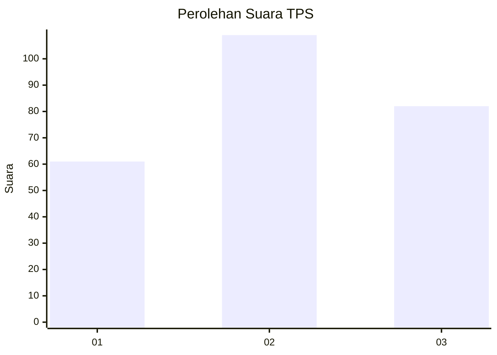
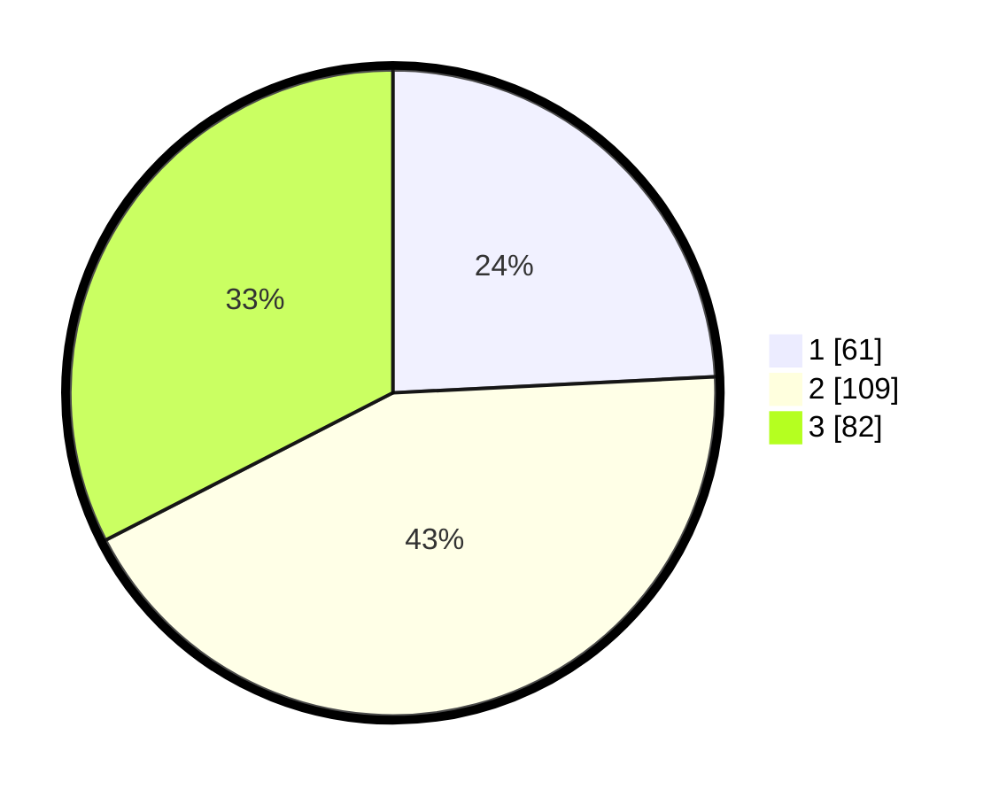

# Hasil

## Grafik

## Tabel

| No. | Nama Paslon    | Suara | Suara (raw) | Persentase |
|:--- |:-------------- | -----:| -----------:| ----------:|
| 1   | ANIES MUHAIMIN | 61    | [61][p-1]   | 24,21      |
| 2   | PRABOWO GIBRAN | 109   | [109][p-2]  | 43,25      |
| 3   | GANJAR MAHFUD  | 82    | [82][p-3]   | 32,54      |

[p-1]: https://github.com/gigit-pemilu/pemilu-2024-34-di-yogyakarta/blob/main/pilpres/hitung-suara/sub/34-di-yogyakarta/sub/02-bantul/sub/12-banguntapan/sub/2001-baturetno/sub/002-tps/sub/paslon-1.txt
[p-2]: https://github.com/gigit-pemilu/pemilu-2024-34-di-yogyakarta/blob/main/pilpres/hitung-suara/sub/34-di-yogyakarta/sub/02-bantul/sub/12-banguntapan/sub/2001-baturetno/sub/002-tps/sub/paslon-2.txt
[p-3]: https://github.com/gigit-pemilu/pemilu-2024-34-di-yogyakarta/blob/main/pilpres/hitung-suara/sub/34-di-yogyakarta/sub/02-bantul/sub/12-banguntapan/sub/2001-baturetno/sub/002-tps/sub/paslon-3.txt

## Foto C Plano

https://sirekap-obj-formc.kpu.go.id/d49e/pemilu/ppwp/34/02/12/20/01/3402122001002-20240214-194629--0a20b7e3-de27-4c10-9dcf-e642fb332a34.jpg

https://sirekap-obj-formc.kpu.go.id/d49e/pemilu/ppwp/34/02/12/20/01/3402122001002-20240214-194703--f03400d8-8034-48b1-bcba-019fc51436fd.jpg

https://sirekap-obj-formc.kpu.go.id/d49e/pemilu/ppwp/34/02/12/20/01/3402122001002-20240214-194745--79eb7861-5c83-488c-8ec6-965857baf420.jpg

## Metadata

| Key        | Value               |
| ---------- | ------------------- |
| Time Stamp | 2024-02-15 20:00:44 |

## DATA PEMILIH TETAP

Jumlah pemilih dalam DPT: **288**.
 * L: **138**.
 * P: **150**.

## DATA PENGGUNA HAK PILIH

Jumlah pengguna hak pilih dalam DPT: **252**.
 * L: **118**.
 * P: **134**.

Jumlah pengguna hak pilih dalam DPTb: **2**.
 * L: **1**.
 * P: **1**.

Jumlah pengguna hak pilih dalam DPK: **6**.
 * L: **4**.
 * P: **2**.

Jumlah pengguna hak pilih: **260**.
 * L: **123**.
 * P: **137**.

## JUMLAH SUARA SAH DAN TIDAK SAH

JUMLAH SELURUH SUARA SAH: **252**.

JUMLAH SUARA TIDAK SAH: **8**.

JUMLAH SELURUH SUARA SAH DAN SUARA TIDAK SAH: **260**.

