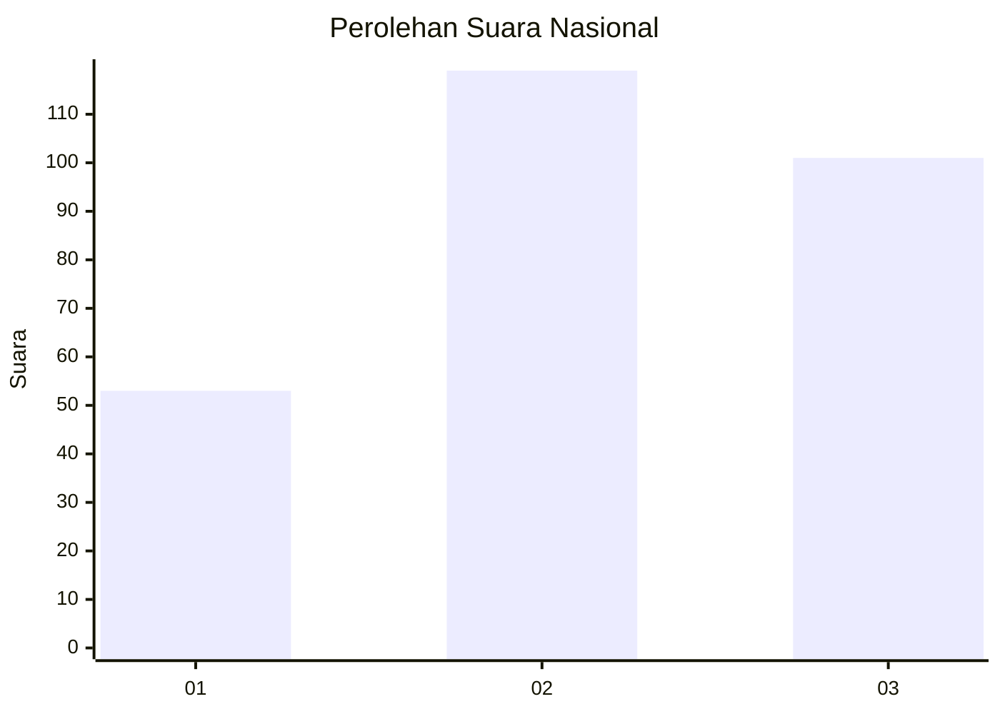
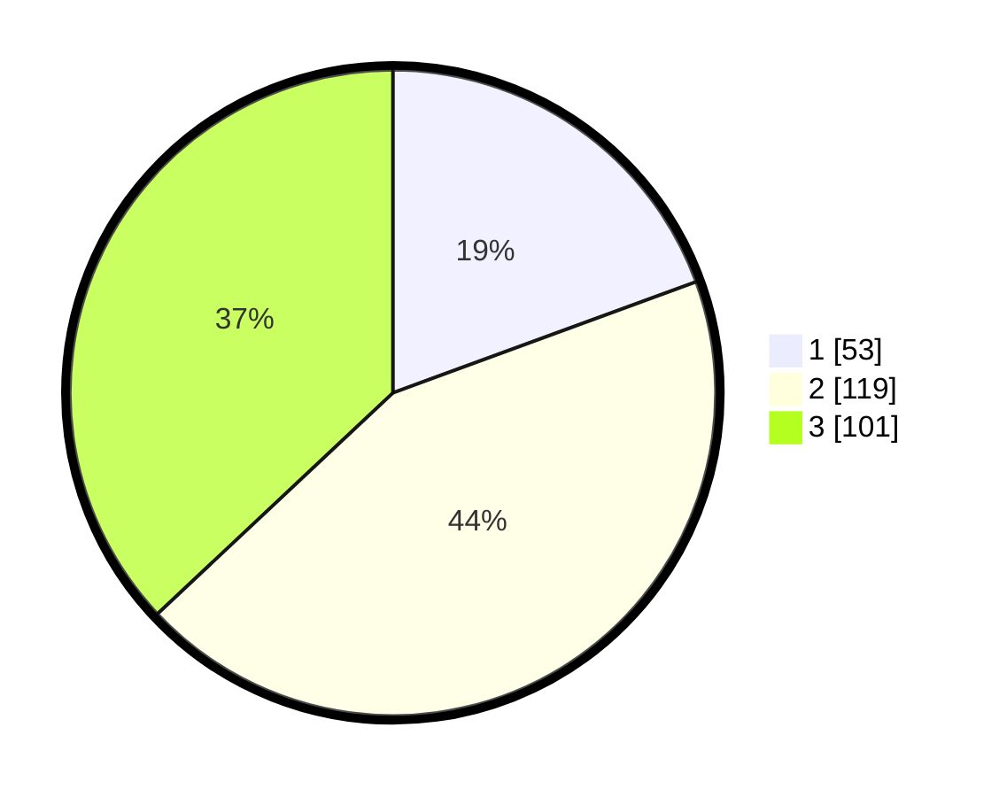

# Hasil

## Grafik

## Tabel

| No. | Nama Paslon    | Suara | Suara (raw) | Persentase |
|:--- |:-------------- | -----:| -----------:| ----------:|
| 1   | ANIES MUHAIMIN | 53    | [53][p-1]   | 19,41      |
| 2   | PRABOWO GIBRAN | 119   | [119][p-2]  | 43,59      |
| 3   | GANJAR MAHFUD  | 101   | [101][p-3]  | 37,00      |

[p-1]: https://github.com/gigit-pemilu/pemilu-2024/blob/main/pilpres/hitung-suara/sub/34-di-yogyakarta/sub/02-bantul/sub/12-banguntapan/sub/2001-baturetno/sub/003-tps/sub/paslon-1.txt
[p-2]: https://github.com/gigit-pemilu/pemilu-2024/blob/main/pilpres/hitung-suara/sub/34-di-yogyakarta/sub/02-bantul/sub/12-banguntapan/sub/2001-baturetno/sub/003-tps/sub/paslon-2.txt
[p-3]: https://github.com/gigit-pemilu/pemilu-2024/blob/main/pilpres/hitung-suara/sub/34-di-yogyakarta/sub/02-bantul/sub/12-banguntapan/sub/2001-baturetno/sub/003-tps/sub/paslon-3.txt

## Foto C Plano

https://sirekap-obj-formc.kpu.go.id/33db/pemilu/ppwp/34/02/12/20/01/3402122001003-20240214-160101--6a5fd418-ea53-4820-977f-1cbb3ada3b2a.jpg

https://sirekap-obj-formc.kpu.go.id/33db/pemilu/ppwp/34/02/12/20/01/3402122001003-20240214-160133--0d51338f-269c-46fb-9aeb-a835cad3bd1c.jpg

https://sirekap-obj-formc.kpu.go.id/33db/pemilu/ppwp/34/02/12/20/01/3402122001003-20240216-153336--3e719b8f-e695-40e9-9dd3-9a83a34a3491.jpg

## Metadata

| Key        | Value               |
| ---------- | ------------------- |
| Time Stamp | 2024-02-16 16:25:10 |

## DATA PEMILIH TETAP

Jumlah pemilih dalam DPT: **298**.
 * L: **148**.
 * P: **150**.

## DATA PENGGUNA HAK PILIH

Jumlah pengguna hak pilih dalam DPT: **277**.
 * L: **137**.
 * P: **140**.

Jumlah pengguna hak pilih dalam DPTb: **2**.
 * L: **0**.
 * P: **2**.

Jumlah pengguna hak pilih dalam DPK: **1**.
 * L: **0**.
 * P: **1**.

Jumlah pengguna hak pilih: **280**.
 * L: **137**.
 * P: **143**.

## JUMLAH SUARA SAH DAN TIDAK SAH

JUMLAH SELURUH SUARA SAH: **273**.

JUMLAH SUARA TIDAK SAH: **7**.

JUMLAH SELURUH SUARA SAH DAN SUARA TIDAK SAH: **280**.

