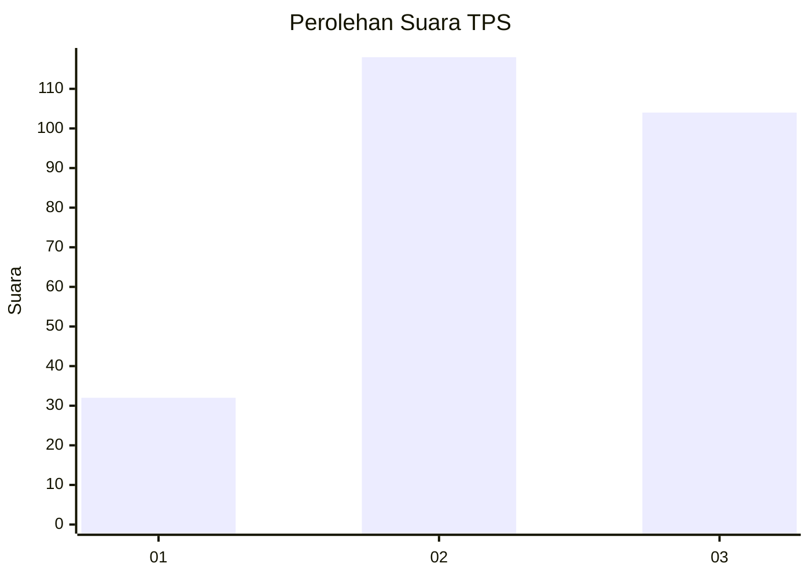
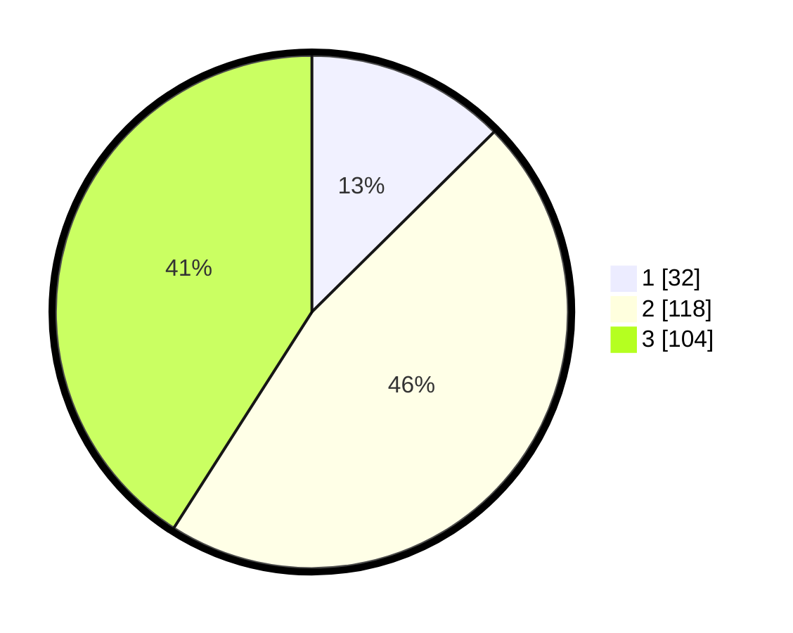

# Hasil

## Grafik

## Tabel

| No. | Nama Paslon    | Suara | Suara (raw) | Persentase |
|:--- |:-------------- | -----:| -----------:| ----------:|
| 1   | ANIES MUHAIMIN | 32    | [32][p-1]   | 12,60      |
| 2   | PRABOWO GIBRAN | 118   | [118][p-2]  | 46,46      |
| 3   | GANJAR MAHFUD  | 104   | [104][p-3]  | 40,94      |

[p-1]: https://github.com/gigit-pemilu/pemilu-2024-34-di-yogyakarta/blob/main/pilpres/hitung-suara/sub/34-di-yogyakarta/sub/02-bantul/sub/12-banguntapan/sub/2001-baturetno/sub/004-tps/sub/paslon-1.txt
[p-2]: https://github.com/gigit-pemilu/pemilu-2024-34-di-yogyakarta/blob/main/pilpres/hitung-suara/sub/34-di-yogyakarta/sub/02-bantul/sub/12-banguntapan/sub/2001-baturetno/sub/004-tps/sub/paslon-2.txt
[p-3]: https://github.com/gigit-pemilu/pemilu-2024-34-di-yogyakarta/blob/main/pilpres/hitung-suara/sub/34-di-yogyakarta/sub/02-bantul/sub/12-banguntapan/sub/2001-baturetno/sub/004-tps/sub/paslon-3.txt

## Foto C Plano

https://sirekap-obj-formc.kpu.go.id/997c/pemilu/ppwp/34/02/12/20/01/3402122001004-20240217-111538--097a6457-f500-4e71-b49d-29f7e2ccd9d5.jpg

https://sirekap-obj-formc.kpu.go.id/997c/pemilu/ppwp/34/02/12/20/01/3402122001004-20240214-190356--a7025162-fa69-4f84-9b1e-7f6e193054a9.jpg

https://sirekap-obj-formc.kpu.go.id/997c/pemilu/ppwp/34/02/12/20/01/3402122001004-20240217-111539--173f1ce8-b0cb-4393-a0b9-b3fa3c9f592b.jpg

## Metadata

| Key        | Value               |
| ---------- | ------------------- |
| Time Stamp | 2024-02-17 11:30:03 |

## DATA PEMILIH TETAP

Jumlah pemilih dalam DPT: **293**.
 * L: **145**.
 * P: **148**.

## DATA PENGGUNA HAK PILIH

Jumlah pengguna hak pilih dalam DPT: **256**.
 * L: **124**.
 * P: **132**.

Jumlah pengguna hak pilih dalam DPTb: **5**.
 * L: **1**.
 * P: **4**.

Jumlah pengguna hak pilih dalam DPK: **3**.
 * L: **1**.
 * P: **2**.

Jumlah pengguna hak pilih: **264**.
 * L: **126**.
 * P: **138**.

## JUMLAH SUARA SAH DAN TIDAK SAH

JUMLAH SELURUH SUARA SAH: **254**.

JUMLAH SUARA TIDAK SAH: **10**.

JUMLAH SELURUH SUARA SAH DAN SUARA TIDAK SAH: **264**.

