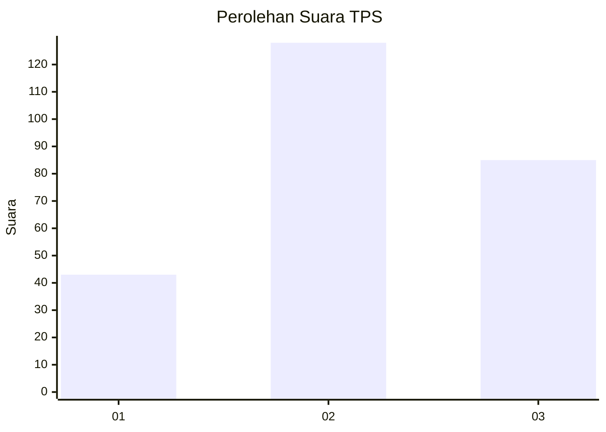
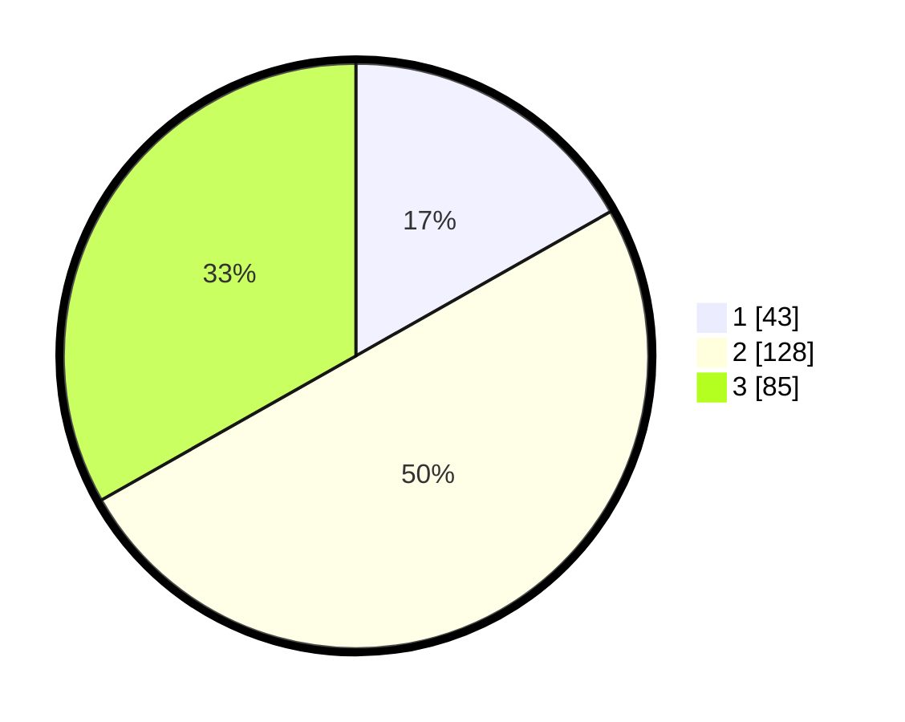

# Hasil

## Grafik

## Tabel

| No. | Nama Paslon    | Suara | Suara (raw) | Persentase |
|:--- |:-------------- | -----:| -----------:| ----------:|
| 1   | ANIES MUHAIMIN | 43    | [43][p-1]   | 16,80      |
| 2   | PRABOWO GIBRAN | 128   | [128][p-2]  | 50,00      |
| 3   | GANJAR MAHFUD  | 85    | [85][p-3]   | 33,20      |

[p-1]: https://github.com/gigit-pemilu/pemilu-2024-34-di-yogyakarta/blob/main/pilpres/hitung-suara/sub/34-di-yogyakarta/sub/02-bantul/sub/12-banguntapan/sub/2001-baturetno/sub/005-tps/sub/paslon-1.txt
[p-2]: https://github.com/gigit-pemilu/pemilu-2024-34-di-yogyakarta/blob/main/pilpres/hitung-suara/sub/34-di-yogyakarta/sub/02-bantul/sub/12-banguntapan/sub/2001-baturetno/sub/005-tps/sub/paslon-2.txt
[p-3]: https://github.com/gigit-pemilu/pemilu-2024-34-di-yogyakarta/blob/main/pilpres/hitung-suara/sub/34-di-yogyakarta/sub/02-bantul/sub/12-banguntapan/sub/2001-baturetno/sub/005-tps/sub/paslon-3.txt

## Foto C Plano

https://sirekap-obj-formc.kpu.go.id/86a9/pemilu/ppwp/34/02/12/20/01/3402122001005-20240214-232627--d4b46ed0-d9bb-46c7-bbf6-63222fe55ec7.jpg

https://sirekap-obj-formc.kpu.go.id/86a9/pemilu/ppwp/34/02/12/20/01/3402122001005-20240214-232915--257ec4a6-c32b-4e29-9d84-544f8a9da760.jpg

https://sirekap-obj-formc.kpu.go.id/86a9/pemilu/ppwp/34/02/12/20/01/3402122001005-20240214-233202--b179f329-a025-4cf2-a9b6-a2de1293dc9f.jpg

## Metadata

| Key        | Value               |
| ---------- | ------------------- |
| Time Stamp | 2024-02-24 22:31:28 |

