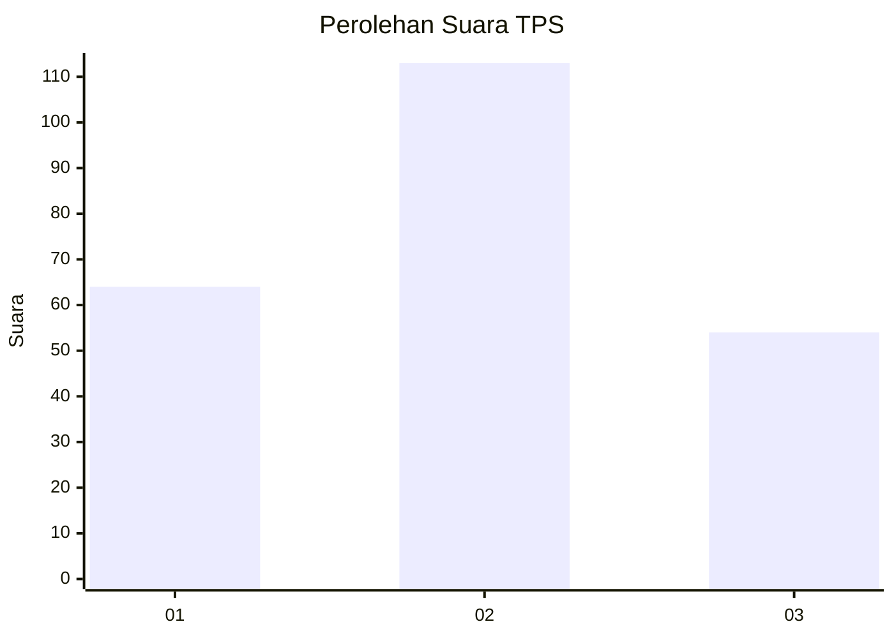
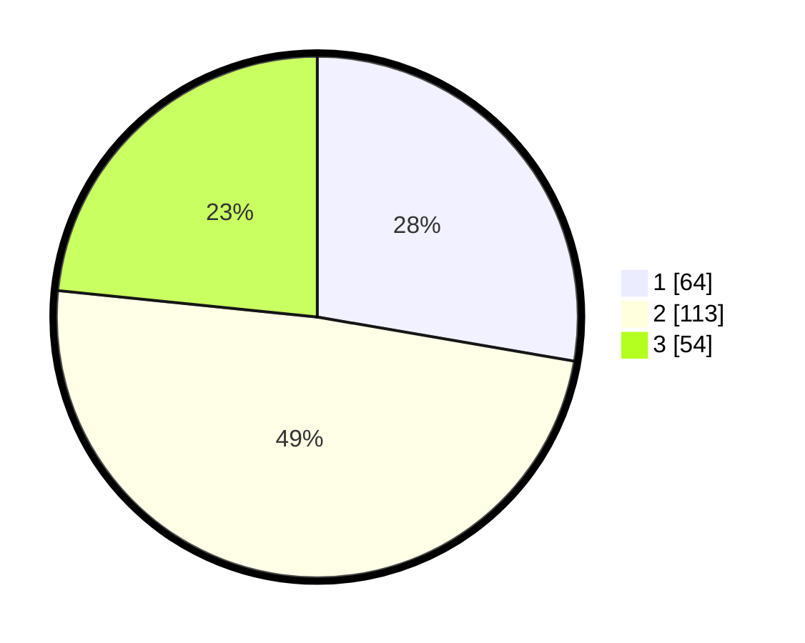

# Hasil

## Grafik

## Tabel

| No. | Nama Paslon    | Suara | Suara (raw) | Persentase |
|:--- |:-------------- | -----:| -----------:| ----------:|
| 1   | ANIES MUHAIMIN | 64    | [64][p-1]   | 27,71      |
| 2   | PRABOWO GIBRAN | 113   | [113][p-2]  | 48,92      |
| 3   | GANJAR MAHFUD  | 54    | [54][p-3]   | 23,38      |

[p-1]: https://github.com/gigit-pemilu/pemilu-2024-34-di-yogyakarta/blob/main/pilpres/hitung-suara/sub/34-di-yogyakarta/sub/02-bantul/sub/12-banguntapan/sub/2001-baturetno/sub/006-tps/sub/paslon-1.txt
[p-2]: https://github.com/gigit-pemilu/pemilu-2024-34-di-yogyakarta/blob/main/pilpres/hitung-suara/sub/34-di-yogyakarta/sub/02-bantul/sub/12-banguntapan/sub/2001-baturetno/sub/006-tps/sub/paslon-2.txt
[p-3]: https://github.com/gigit-pemilu/pemilu-2024-34-di-yogyakarta/blob/main/pilpres/hitung-suara/sub/34-di-yogyakarta/sub/02-bantul/sub/12-banguntapan/sub/2001-baturetno/sub/006-tps/sub/paslon-3.txt

## Foto C Plano

https://sirekap-obj-formc.kpu.go.id/3292/pemilu/ppwp/34/02/12/20/01/3402122001006-20240214-224632--5be992e0-46c9-4912-830f-34cb56a19c5b.jpg

https://sirekap-obj-formc.kpu.go.id/3292/pemilu/ppwp/34/02/12/20/01/3402122001006-20240214-224831--489a9a05-5ab5-4f70-bd4b-3843e416b711.jpg

https://sirekap-obj-formc.kpu.go.id/3292/pemilu/ppwp/34/02/12/20/01/3402122001006-20240214-225015--a420cfeb-c016-409f-97f4-bb224e114490.jpg

## Metadata

| Key        | Value               |
| ---------- | ------------------- |
| Time Stamp | 2024-02-15 04:00:24 |

