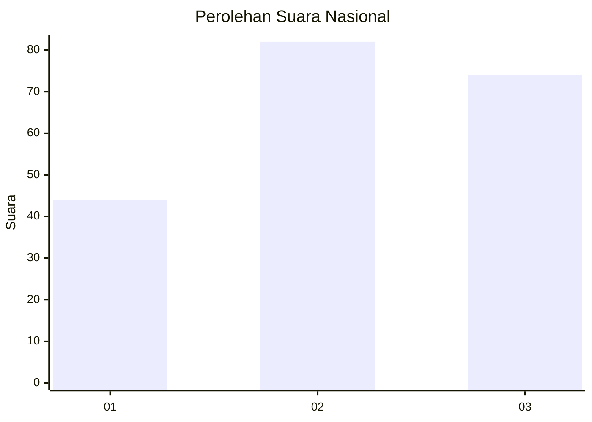
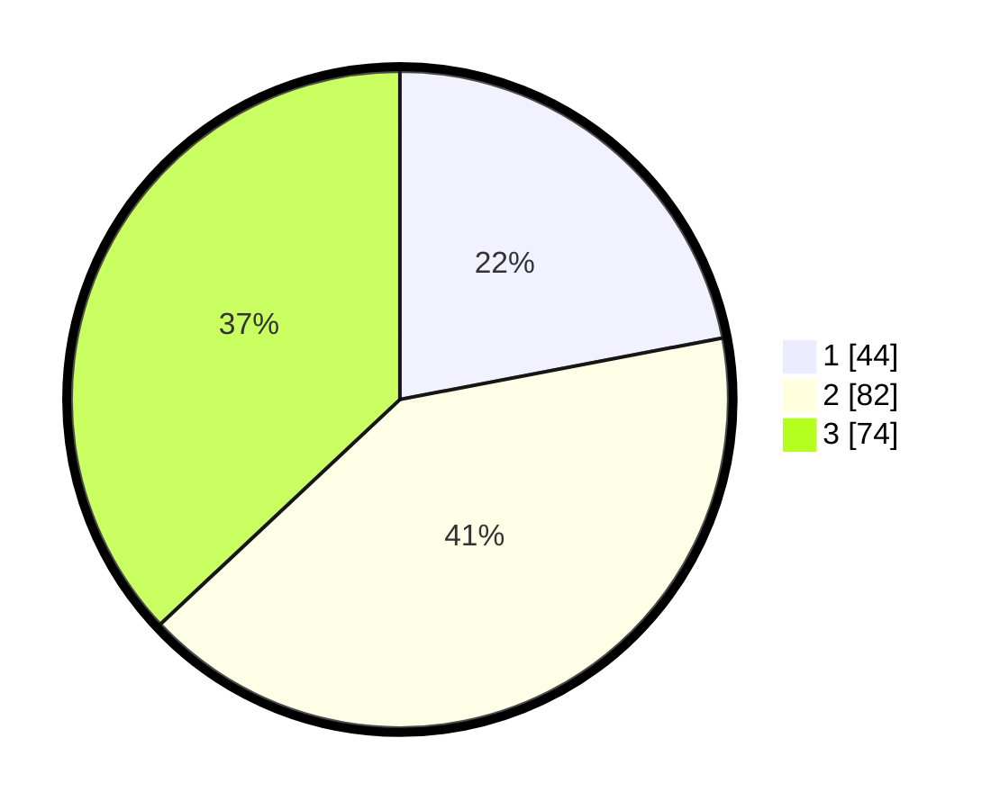

# Hasil

## Grafik

## Tabel

| No. | Nama Paslon    | Suara | Suara (raw) | Persentase |
|:--- |:-------------- | -----:| -----------:| ----------:|
| 1   | ANIES MUHAIMIN | 44    | [44][p-1]   | 22,00      |
| 2   | PRABOWO GIBRAN | 82    | [82][p-2]   | 41,00      |
| 3   | GANJAR MAHFUD  | 74    | [74][p-3]   | 37,00      |

[p-1]: https://github.com/gigit-pemilu/pemilu-2024/blob/main/pilpres/hitung-suara/sub/34-di-yogyakarta/sub/02-bantul/sub/12-banguntapan/sub/2001-baturetno/sub/007-tps/sub/paslon-1.txt
[p-2]: https://github.com/gigit-pemilu/pemilu-2024/blob/main/pilpres/hitung-suara/sub/34-di-yogyakarta/sub/02-bantul/sub/12-banguntapan/sub/2001-baturetno/sub/007-tps/sub/paslon-2.txt
[p-3]: https://github.com/gigit-pemilu/pemilu-2024/blob/main/pilpres/hitung-suara/sub/34-di-yogyakarta/sub/02-bantul/sub/12-banguntapan/sub/2001-baturetno/sub/007-tps/sub/paslon-3.txt

## Foto C Plano

https://sirekap-obj-formc.kpu.go.id/0223/pemilu/ppwp/34/02/12/20/01/3402122001007-20240214-234928--7e0e752c-4ad3-4505-b939-58f5230ceab5.jpg

https://sirekap-obj-formc.kpu.go.id/0223/pemilu/ppwp/34/02/12/20/01/3402122001007-20240214-235025--44a78773-3d5a-43c3-bfed-91680b2a1418.jpg

https://sirekap-obj-formc.kpu.go.id/0223/pemilu/ppwp/34/02/12/20/01/3402122001007-20240214-235119--2d9c95e2-907a-4201-a8e0-87cfb1a26f06.jpg

## Metadata

| Key        | Value               |
| ---------- | ------------------- |
| Time Stamp | 2024-02-24 22:31:28 |

