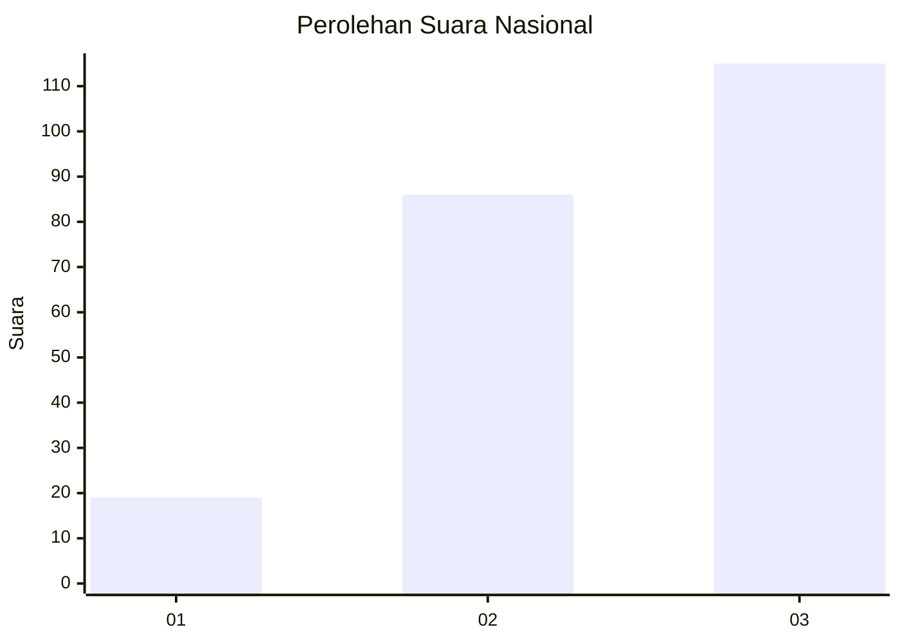
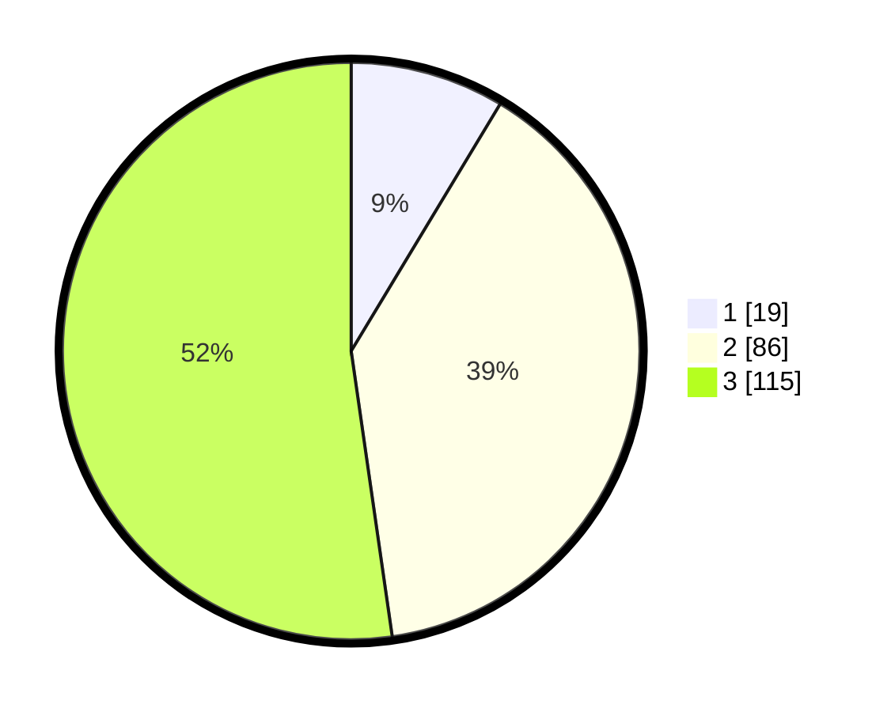

# Hasil

## Grafik

## Tabel

| No. | Nama Paslon    | Suara | Suara (raw) | Persentase |
|:--- |:-------------- | -----:| -----------:| ----------:|
| 1   | ANIES MUHAIMIN | 19    | [19][p-1]   | 8,64       |
| 2   | PRABOWO GIBRAN | 86    | [86][p-2]   | 39,09      |
| 3   | GANJAR MAHFUD  | 115   | [115][p-3]  | 52,27      |

[p-1]: https://github.com/gigit-pemilu/pemilu-2024/blob/main/pilpres/hitung-suara/sub/34-di-yogyakarta/sub/02-bantul/sub/12-banguntapan/sub/2001-baturetno/sub/013-tps/sub/paslon-1.txt
[p-2]: https://github.com/gigit-pemilu/pemilu-2024/blob/main/pilpres/hitung-suara/sub/34-di-yogyakarta/sub/02-bantul/sub/12-banguntapan/sub/2001-baturetno/sub/013-tps/sub/paslon-2.txt
[p-3]: https://github.com/gigit-pemilu/pemilu-2024/blob/main/pilpres/hitung-suara/sub/34-di-yogyakarta/sub/02-bantul/sub/12-banguntapan/sub/2001-baturetno/sub/013-tps/sub/paslon-3.txt

## Foto C Plano

https://sirekap-obj-formc.kpu.go.id/133e/pemilu/ppwp/34/02/12/20/01/3402122001013-20240214-193410--6f87f7f9-736b-4f8d-a94f-30bb1e8fbcdc.jpg

https://sirekap-obj-formc.kpu.go.id/133e/pemilu/ppwp/34/02/12/20/01/3402122001013-20240214-192013--d1a32c7d-7ce5-42cd-bafb-d1bee0d6f20a.jpg

https://sirekap-obj-formc.kpu.go.id/133e/pemilu/ppwp/34/02/12/20/01/3402122001013-20240214-213654--10c60670-9c41-46f1-9b8a-55665340dd4e.jpg

## Metadata

| Key        | Value               |
| ---------- | ------------------- |
| Time Stamp | 2024-02-14 21:46:01 |

