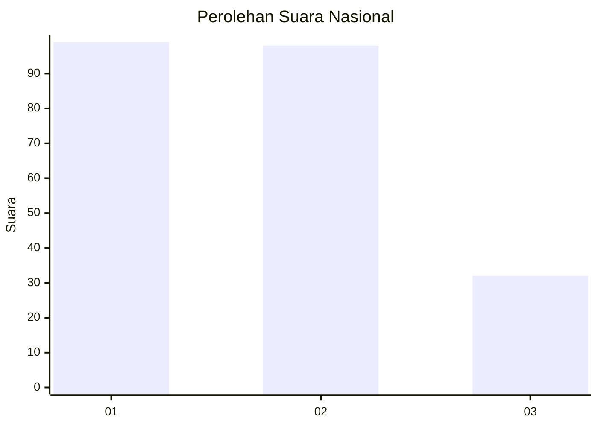
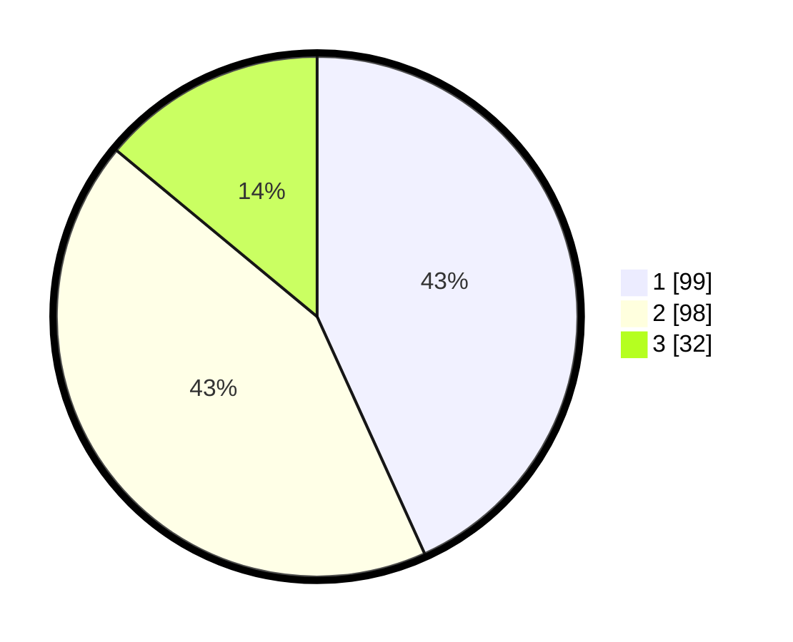

# Hasil

## Grafik

## Tabel

| No. | Nama Paslon    | Suara | Suara (raw) | Persentase |
|:--- |:-------------- | -----:| -----------:| ----------:|
| 1   | ANIES MUHAIMIN | 99    | [99][p-1]   | 43,23      |
| 2   | PRABOWO GIBRAN | 98    | [98][p-2]   | 42,79      |
| 3   | GANJAR MAHFUD  | 32    | [32][p-3]   | 13,97      |

[p-1]: https://github.com/gigit-pemilu/pemilu-2024/blob/main/pilpres/hitung-suara/sub/34-di-yogyakarta/sub/02-bantul/sub/12-banguntapan/sub/2001-baturetno/sub/021-tps/sub/paslon-1.txt
[p-2]: https://github.com/gigit-pemilu/pemilu-2024/blob/main/pilpres/hitung-suara/sub/34-di-yogyakarta/sub/02-bantul/sub/12-banguntapan/sub/2001-baturetno/sub/021-tps/sub/paslon-2.txt
[p-3]: https://github.com/gigit-pemilu/pemilu-2024/blob/main/pilpres/hitung-suara/sub/34-di-yogyakarta/sub/02-bantul/sub/12-banguntapan/sub/2001-baturetno/sub/021-tps/sub/paslon-3.txt

## Foto C Plano

https://sirekap-obj-formc.kpu.go.id/2994/pemilu/ppwp/34/02/12/20/01/3402122001021-20240214-235931--03a00ee6-07d6-464a-bc57-e15431d9e822.jpg

https://sirekap-obj-formc.kpu.go.id/2994/pemilu/ppwp/34/02/12/20/01/3402122001021-20240215-000046--6c50c75d-2bf6-4a3b-b72f-5cb0cadc6c48.jpg

https://sirekap-obj-formc.kpu.go.id/2994/pemilu/ppwp/34/02/12/20/01/3402122001021-20240215-000245--10909ff9-9c4d-4e68-9bf4-70676144cccb.jpg

## Metadata

| Key        | Value               |
| ---------- | ------------------- |
| Time Stamp | 2024-02-25 14:00:00 |

