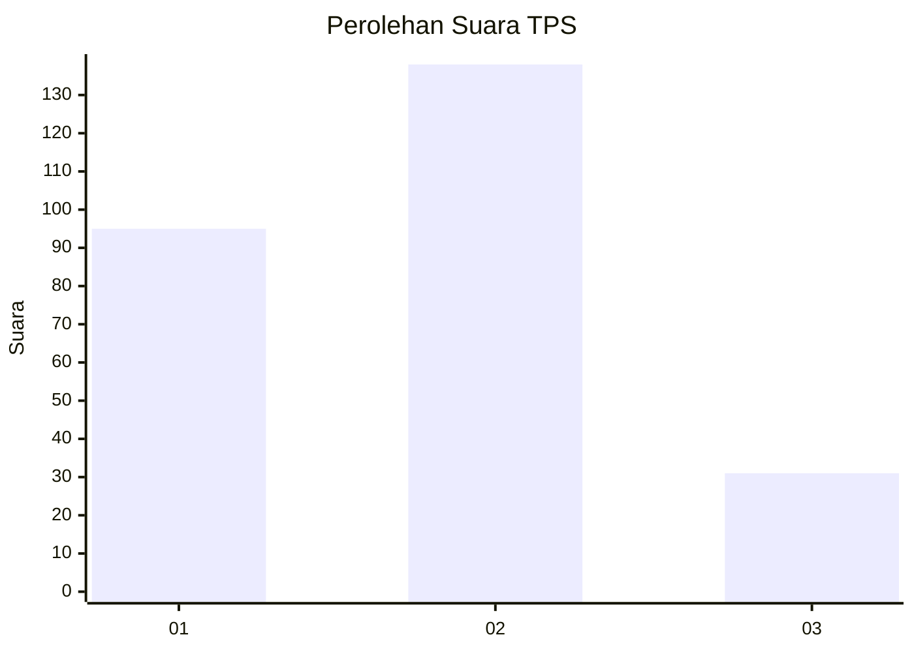
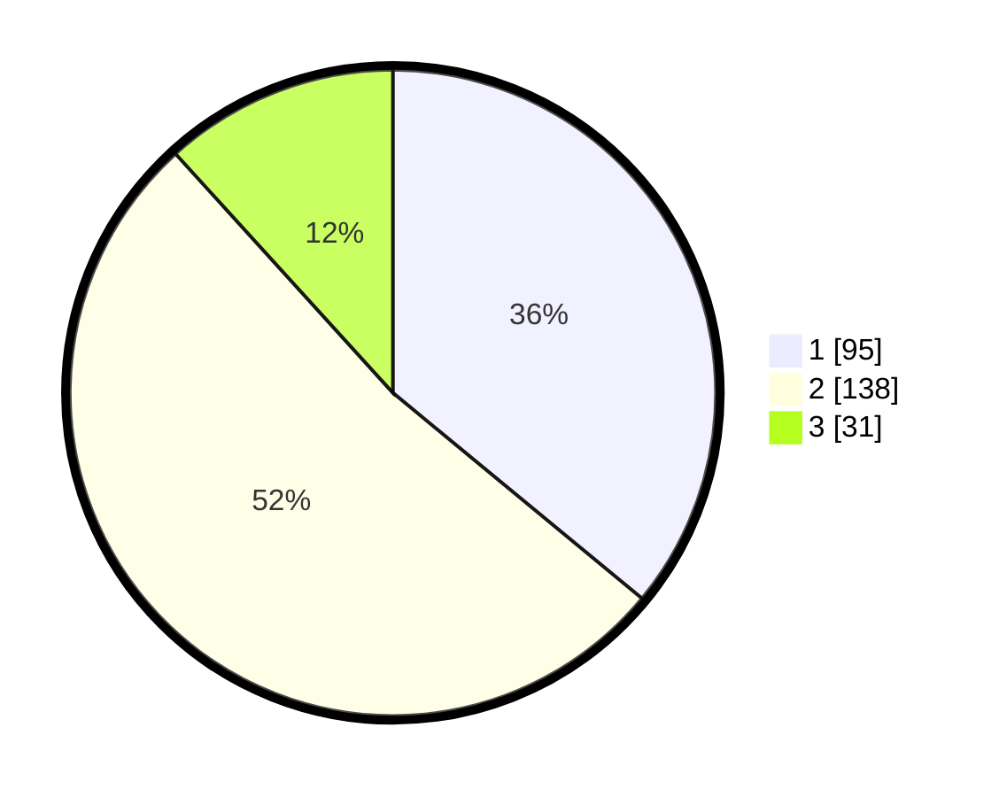

# Hasil

## Grafik

## Tabel

| No. | Nama Paslon    | Suara | Suara (raw) | Persentase |
|:--- |:-------------- | -----:| -----------:| ----------:|
| 1   | ANIES MUHAIMIN | 95    | [95][p-1]   | 35,98      |
| 2   | PRABOWO GIBRAN | 138   | [138][p-2]  | 52,27      |
| 3   | GANJAR MAHFUD  | 31    | [31][p-3]   | 11,74      |

[p-1]: https://github.com/gigit-pemilu/pemilu-2024-34-di-yogyakarta/blob/main/pilpres/hitung-suara/sub/34-di-yogyakarta/sub/02-bantul/sub/12-banguntapan/sub/2001-baturetno/sub/022-tps/sub/paslon-1.txt
[p-2]: https://github.com/gigit-pemilu/pemilu-2024-34-di-yogyakarta/blob/main/pilpres/hitung-suara/sub/34-di-yogyakarta/sub/02-bantul/sub/12-banguntapan/sub/2001-baturetno/sub/022-tps/sub/paslon-2.txt
[p-3]: https://github.com/gigit-pemilu/pemilu-2024-34-di-yogyakarta/blob/main/pilpres/hitung-suara/sub/34-di-yogyakarta/sub/02-bantul/sub/12-banguntapan/sub/2001-baturetno/sub/022-tps/sub/paslon-3.txt

## Foto C Plano

https://sirekap-obj-formc.kpu.go.id/e107/pemilu/ppwp/34/02/12/20/01/3402122001022-20240214-195028--3e8cbfa4-cb03-4357-89bf-c99d7c5bd87c.jpg

https://sirekap-obj-formc.kpu.go.id/e107/pemilu/ppwp/34/02/12/20/01/3402122001022-20240214-195125--65a9eae6-e784-426e-8450-5eadb4eaea75.jpg

## Metadata

| Key        | Value               |
| ---------- | ------------------- |
| Time Stamp | 2024-02-25 15:00:00 |

