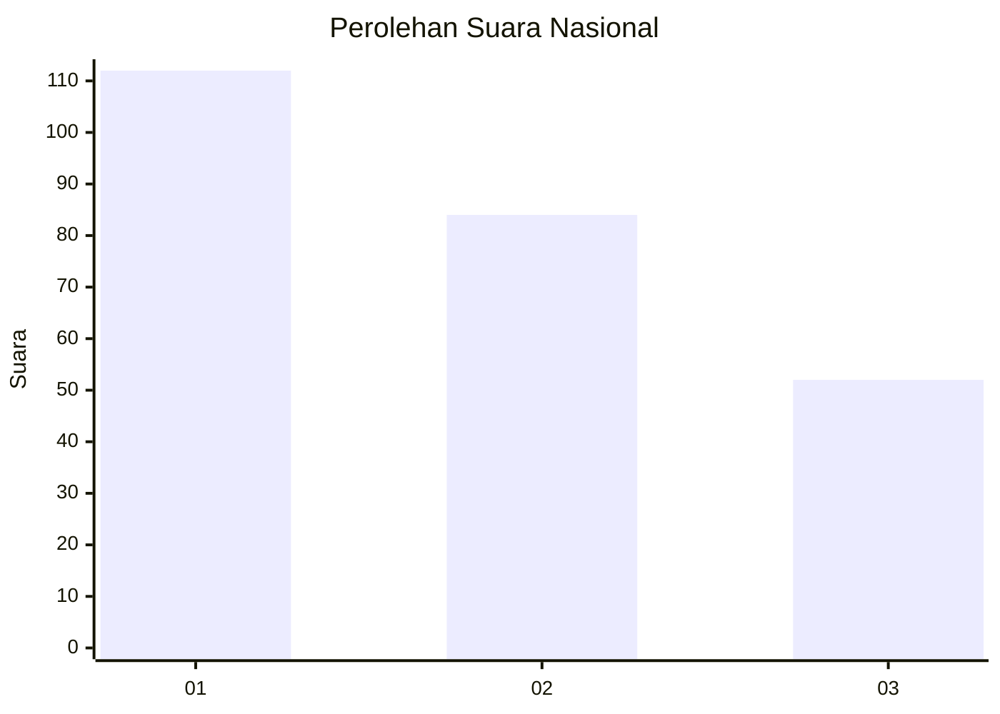
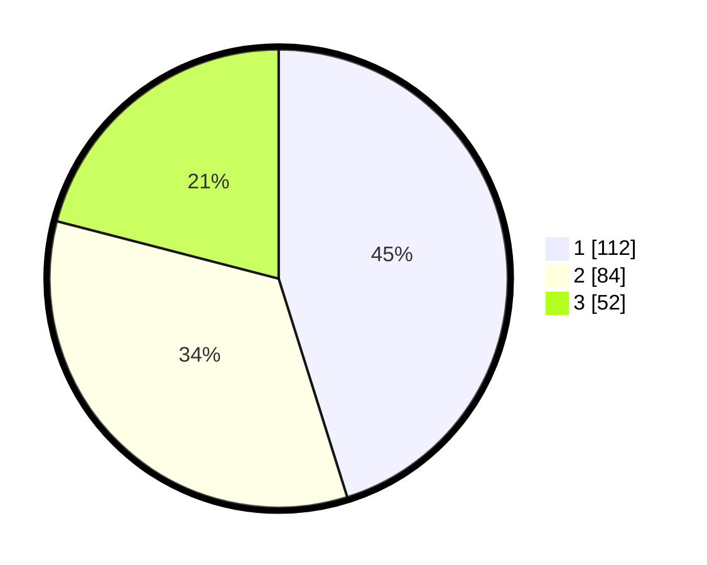

# Hasil

## Grafik

## Tabel

| No. | Nama Paslon    | Suara | Suara (raw) | Persentase |
|:--- |:-------------- | -----:| -----------:| ----------:|
| 1   | ANIES MUHAIMIN | 112   | [112][p-1]  | 45,16      |
| 2   | PRABOWO GIBRAN | 84    | [84][p-2]   | 33,87      |
| 3   | GANJAR MAHFUD  | 52    | [52][p-3]   | 20,97      |

[p-1]: https://github.com/gigit-pemilu/pemilu-2024/blob/main/pilpres/hitung-suara/sub/34-di-yogyakarta/sub/02-bantul/sub/12-banguntapan/sub/2001-baturetno/sub/024-tps/sub/paslon-1.txt
[p-2]: https://github.com/gigit-pemilu/pemilu-2024/blob/main/pilpres/hitung-suara/sub/34-di-yogyakarta/sub/02-bantul/sub/12-banguntapan/sub/2001-baturetno/sub/024-tps/sub/paslon-2.txt
[p-3]: https://github.com/gigit-pemilu/pemilu-2024/blob/main/pilpres/hitung-suara/sub/34-di-yogyakarta/sub/02-bantul/sub/12-banguntapan/sub/2001-baturetno/sub/024-tps/sub/paslon-3.txt

## Foto C Plano

https://sirekap-obj-formc.kpu.go.id/e15a/pemilu/ppwp/34/02/12/20/01/3402122001024-20240215-000958--b7b21270-4768-4675-a2ba-47b0ab7d18cd.jpg

https://sirekap-obj-formc.kpu.go.id/e15a/pemilu/ppwp/34/02/12/20/01/3402122001024-20240215-003906--69bfcd89-7c44-480b-8e18-c970acd7700e.jpg

https://sirekap-obj-formc.kpu.go.id/e15a/pemilu/ppwp/34/02/12/20/01/3402122001024-20240215-040158--aff703f6-ae1d-49ed-9a01-421720a7d94b.jpg

## Metadata

| Key        | Value               |
| ---------- | ------------------- |
| Time Stamp | 2024-02-24 22:31:28 |

