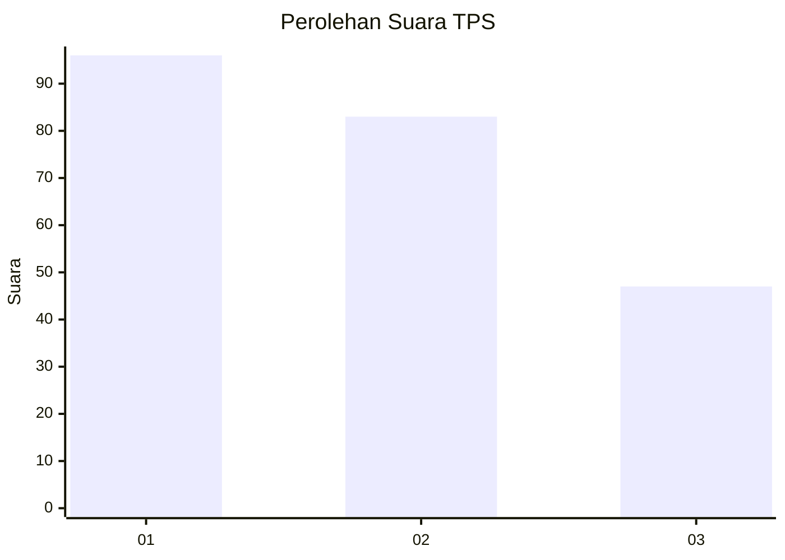
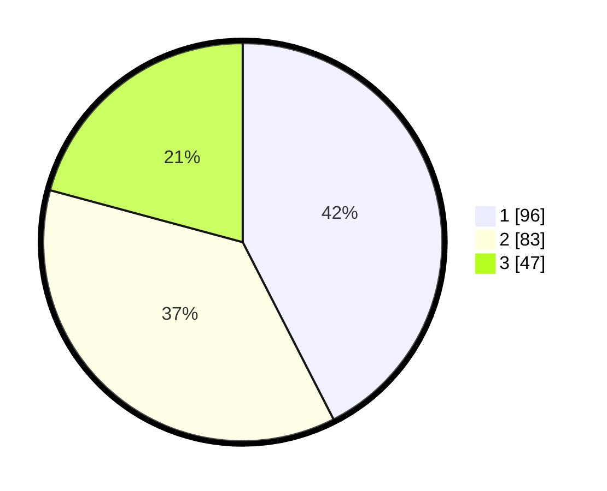

# Hasil

## Grafik

## Tabel

| No. | Nama Paslon    | Suara | Suara (raw) | Persentase |
|:--- |:-------------- | -----:| -----------:| ----------:|
| 1   | ANIES MUHAIMIN | 96    | [96][p-1]   | 42,48      |
| 2   | PRABOWO GIBRAN | 83    | [83][p-2]   | 36,73      |
| 3   | GANJAR MAHFUD  | 47    | [47][p-3]   | 20,80      |

[p-1]: https://github.com/gigit-pemilu/pemilu-2024-34-di-yogyakarta/blob/main/pilpres/hitung-suara/sub/34-di-yogyakarta/sub/02-bantul/sub/12-banguntapan/sub/2001-baturetno/sub/032-tps/sub/paslon-1.txt
[p-2]: https://github.com/gigit-pemilu/pemilu-2024-34-di-yogyakarta/blob/main/pilpres/hitung-suara/sub/34-di-yogyakarta/sub/02-bantul/sub/12-banguntapan/sub/2001-baturetno/sub/032-tps/sub/paslon-2.txt
[p-3]: https://github.com/gigit-pemilu/pemilu-2024-34-di-yogyakarta/blob/main/pilpres/hitung-suara/sub/34-di-yogyakarta/sub/02-bantul/sub/12-banguntapan/sub/2001-baturetno/sub/032-tps/sub/paslon-3.txt

## Foto C Plano

https://sirekap-obj-formc.kpu.go.id/5283/pemilu/ppwp/34/02/12/20/01/3402122001032-20240214-211559--7aa0c0b7-a0cd-4743-99f1-fc9a9cf461c0.jpg

https://sirekap-obj-formc.kpu.go.id/5283/pemilu/ppwp/34/02/12/20/01/3402122001032-20240214-211754--4753b251-ac94-45d2-ba06-b8d973afac6b.jpg

https://sirekap-obj-formc.kpu.go.id/5283/pemilu/ppwp/34/02/12/20/01/3402122001032-20240214-211949--c3be8911-0cda-41d6-82dd-3272afc99ca6.jpg

## Metadata

| Key        | Value               |
| ---------- | ------------------- |
| Time Stamp | 2024-02-25 16:00:00 |

