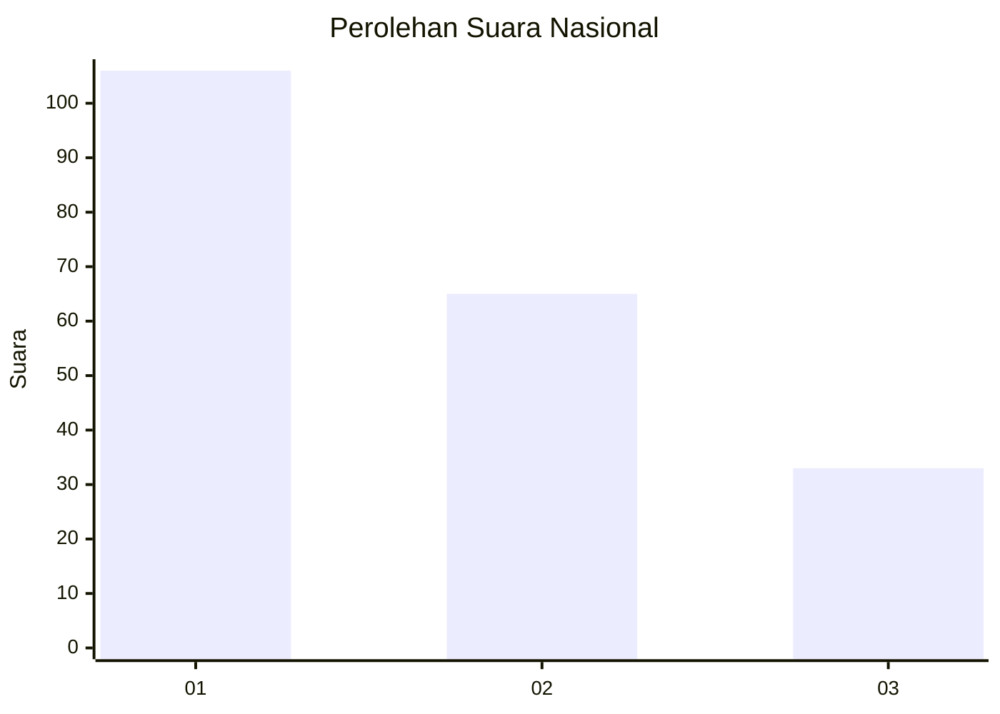
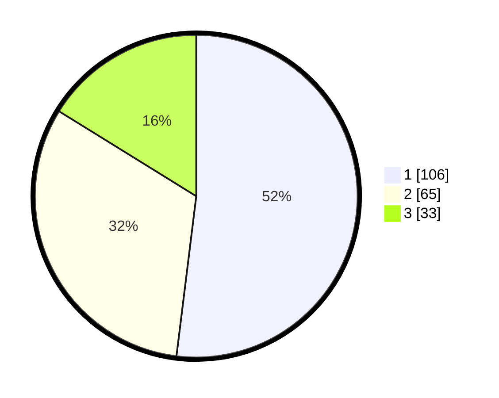

# Hasil

## Grafik

## Tabel

| No. | Nama Paslon    | Suara | Suara (raw) | Persentase |
|:--- |:-------------- | -----:| -----------:| ----------:|
| 1   | ANIES MUHAIMIN | 106   | [106][p-1]  | 51,96      |
| 2   | PRABOWO GIBRAN | 65    | [65][p-2]   | 31,86      |
| 3   | GANJAR MAHFUD  | 33    | [33][p-3]   | 16,18      |

[p-1]: https://github.com/gigit-pemilu/pemilu-2024/blob/main/pilpres/hitung-suara/sub/34-di-yogyakarta/sub/02-bantul/sub/12-banguntapan/sub/2001-baturetno/sub/034-tps/sub/paslon-1.txt
[p-2]: https://github.com/gigit-pemilu/pemilu-2024/blob/main/pilpres/hitung-suara/sub/34-di-yogyakarta/sub/02-bantul/sub/12-banguntapan/sub/2001-baturetno/sub/034-tps/sub/paslon-2.txt
[p-3]: https://github.com/gigit-pemilu/pemilu-2024/blob/main/pilpres/hitung-suara/sub/34-di-yogyakarta/sub/02-bantul/sub/12-banguntapan/sub/2001-baturetno/sub/034-tps/sub/paslon-3.txt

## Foto C Plano

https://sirekap-obj-formc.kpu.go.id/4556/pemilu/ppwp/34/02/12/20/01/3402122001034-20240214-222004--8894ae36-45e0-41fa-935d-d3a5e822d7d5.jpg

https://sirekap-obj-formc.kpu.go.id/4556/pemilu/ppwp/34/02/12/20/01/3402122001034-20240214-222118--58357cd9-195e-4d9a-a839-9a7495b8984c.jpg

https://sirekap-obj-formc.kpu.go.id/4556/pemilu/ppwp/34/02/12/20/01/3402122001034-20240214-222218--4a1bb57d-5ab0-4468-a631-b89e980a4a41.jpg

## Metadata

| Key        | Value               |
| ---------- | ------------------- |
| Time Stamp | 2024-02-26 12:00:00 |

