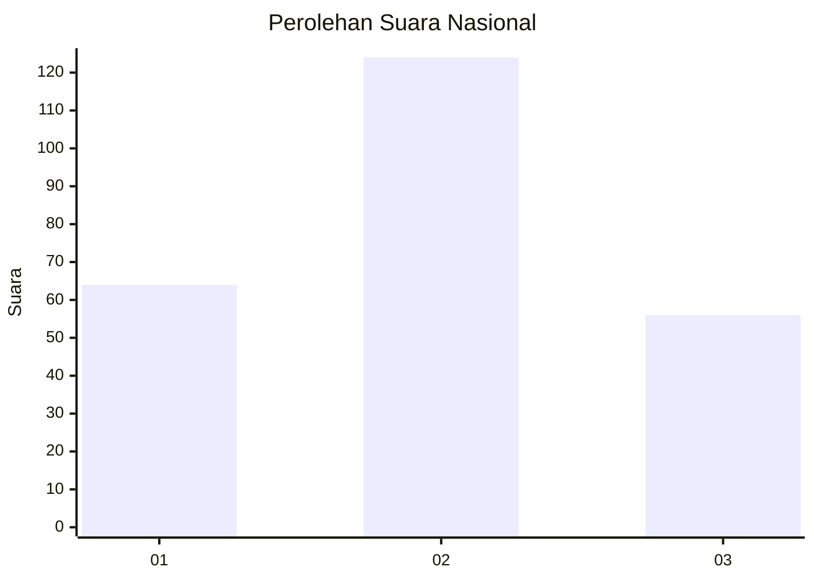
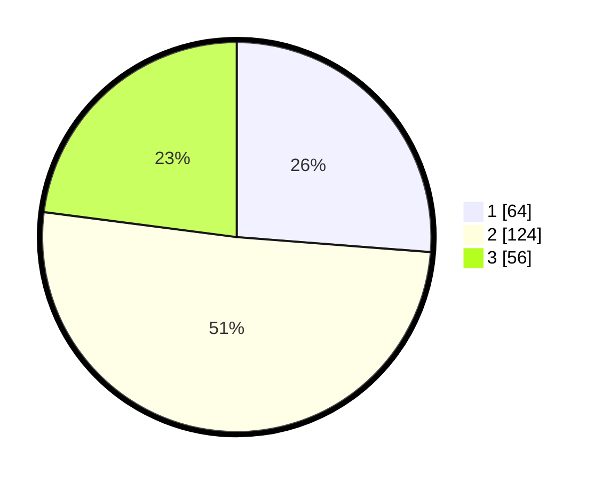

# Hasil

## Grafik

## Tabel

| No. | Nama Paslon    | Suara | Suara (raw) | Persentase |
|:--- |:-------------- | -----:| -----------:| ----------:|
| 1   | ANIES MUHAIMIN | 64    | [64][p-1]   | 26,23      |
| 2   | PRABOWO GIBRAN | 124   | [124][p-2]  | 50,82      |
| 3   | GANJAR MAHFUD  | 56    | [56][p-3]   | 22,95      |

[p-1]: https://github.com/gigit-pemilu/pemilu-2024/blob/main/pilpres/hitung-suara/sub/34-di-yogyakarta/sub/02-bantul/sub/12-banguntapan/sub/2001-baturetno/sub/035-tps/sub/paslon-1.txt
[p-2]: https://github.com/gigit-pemilu/pemilu-2024/blob/main/pilpres/hitung-suara/sub/34-di-yogyakarta/sub/02-bantul/sub/12-banguntapan/sub/2001-baturetno/sub/035-tps/sub/paslon-2.txt
[p-3]: https://github.com/gigit-pemilu/pemilu-2024/blob/main/pilpres/hitung-suara/sub/34-di-yogyakarta/sub/02-bantul/sub/12-banguntapan/sub/2001-baturetno/sub/035-tps/sub/paslon-3.txt

## Foto C Plano

https://sirekap-obj-formc.kpu.go.id/bf57/pemilu/ppwp/34/02/12/20/01/3402122001035-20240214-230009--bd07d657-8cf0-43dc-b35e-a51ca5b5805f.jpg

https://sirekap-obj-formc.kpu.go.id/bf57/pemilu/ppwp/34/02/12/20/01/3402122001035-20240214-230110--0b0b302f-f151-424e-a474-f5a45172a3cc.jpg

https://sirekap-obj-formc.kpu.go.id/bf57/pemilu/ppwp/34/02/12/20/01/3402122001035-20240214-230246--b11df01b-3ecb-4cf5-95f1-283b8c46b84f.jpg

## Metadata

| Key        | Value               |
| ---------- | ------------------- |
| Time Stamp | 2024-02-24 22:31:28 |

