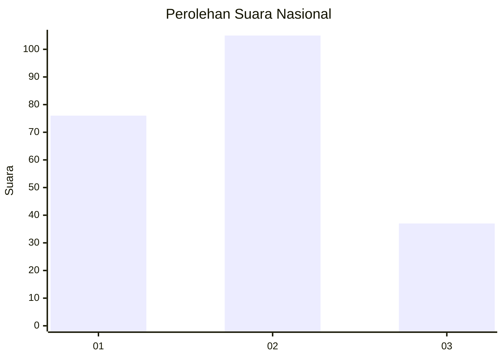
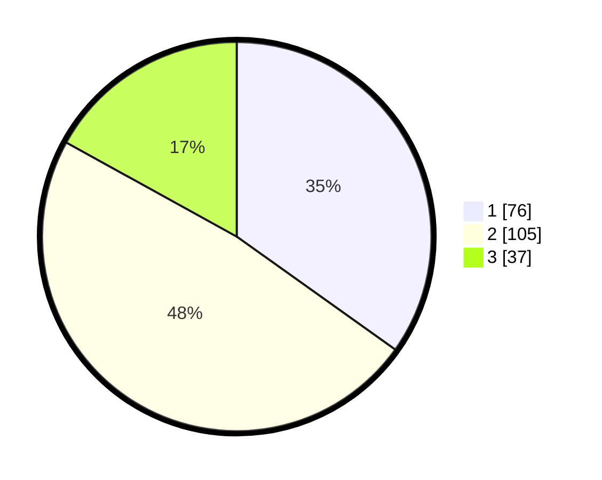

# Hasil

## Grafik

## Tabel

| No. | Nama Paslon    | Suara | Suara (raw) | Persentase |
|:--- |:-------------- | -----:| -----------:| ----------:|
| 1   | ANIES MUHAIMIN | 76    | [76][p-1]   | 34,86      |
| 2   | PRABOWO GIBRAN | 105   | [105][p-2]  | 48,17      |
| 3   | GANJAR MAHFUD  | 37    | [37][p-3]   | 16,97      |

[p-1]: https://github.com/gigit-pemilu/pemilu-2024/blob/main/pilpres/hitung-suara/sub/34-di-yogyakarta/sub/02-bantul/sub/12-banguntapan/sub/2001-baturetno/sub/036-tps/sub/paslon-1.txt
[p-2]: https://github.com/gigit-pemilu/pemilu-2024/blob/main/pilpres/hitung-suara/sub/34-di-yogyakarta/sub/02-bantul/sub/12-banguntapan/sub/2001-baturetno/sub/036-tps/sub/paslon-2.txt
[p-3]: https://github.com/gigit-pemilu/pemilu-2024/blob/main/pilpres/hitung-suara/sub/34-di-yogyakarta/sub/02-bantul/sub/12-banguntapan/sub/2001-baturetno/sub/036-tps/sub/paslon-3.txt

## Foto C Plano

https://sirekap-obj-formc.kpu.go.id/2376/pemilu/ppwp/34/02/12/20/01/3402122001036-20240215-182833--7b81bfbc-b922-44e7-b1da-006b56f0bbb9.jpg

https://sirekap-obj-formc.kpu.go.id/2376/pemilu/ppwp/34/02/12/20/01/3402122001036-20240214-160101--6348bec8-9abd-4bdd-b990-37e3160dde35.jpg

https://sirekap-obj-formc.kpu.go.id/2376/pemilu/ppwp/34/02/12/20/01/3402122001036-20240215-182830--b959720f-b1bc-4370-a585-dfc85d051985.jpg

## Metadata

| Key        | Value               |
| ---------- | ------------------- |
| Time Stamp | 2024-02-24 23:00:00 |

