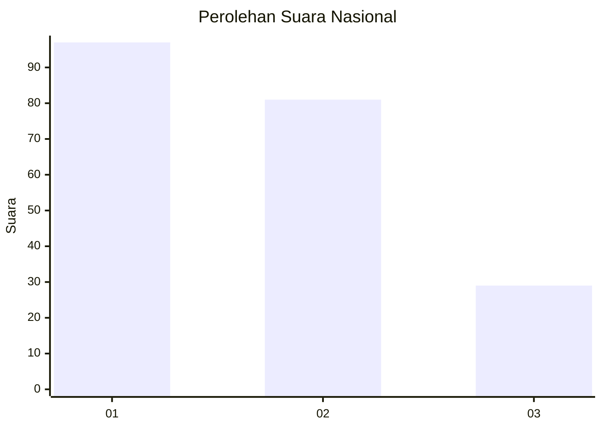
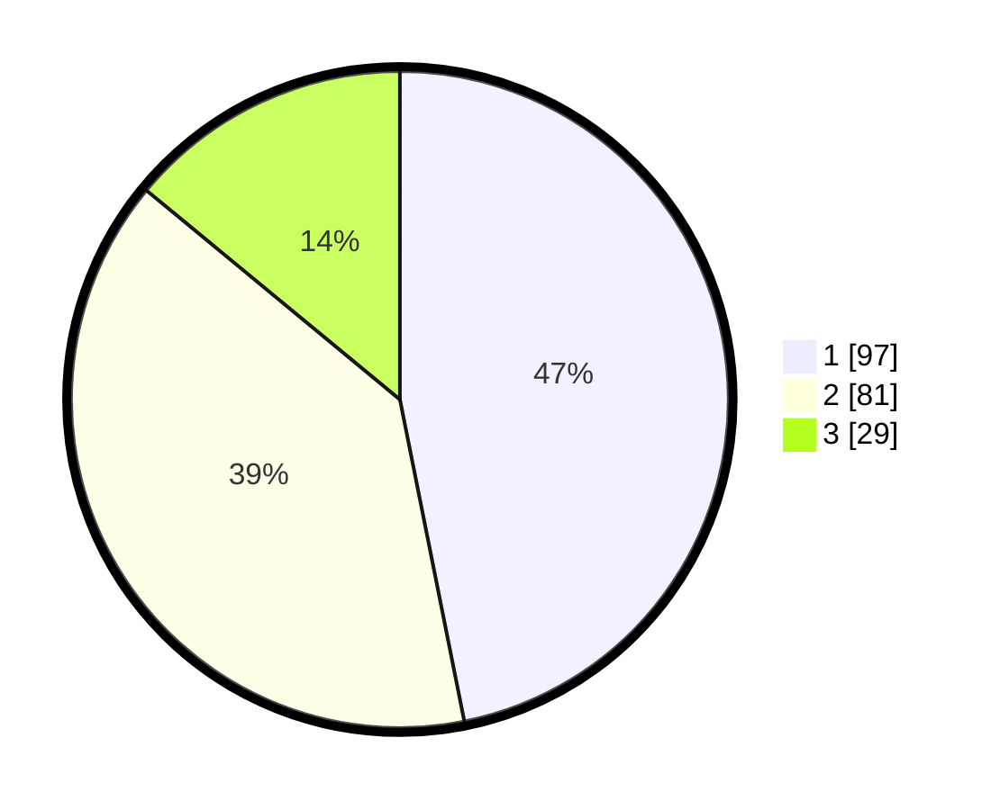

# Hasil

## Grafik

## Tabel

| No. | Nama Paslon    | Suara | Suara (raw) | Persentase |
|:--- |:-------------- | -----:| -----------:| ----------:|
| 1   | ANIES MUHAIMIN | 97    | [97][p-1]   | 46,86      |
| 2   | PRABOWO GIBRAN | 81    | [81][p-2]   | 39,13      |
| 3   | GANJAR MAHFUD  | 29    | [29][p-3]   | 14,01      |

[p-1]: https://github.com/gigit-pemilu/pemilu-2024/blob/main/pilpres/hitung-suara/sub/34-di-yogyakarta/sub/02-bantul/sub/12-banguntapan/sub/2001-baturetno/sub/038-tps/sub/paslon-1.txt
[p-2]: https://github.com/gigit-pemilu/pemilu-2024/blob/main/pilpres/hitung-suara/sub/34-di-yogyakarta/sub/02-bantul/sub/12-banguntapan/sub/2001-baturetno/sub/038-tps/sub/paslon-2.txt
[p-3]: https://github.com/gigit-pemilu/pemilu-2024/blob/main/pilpres/hitung-suara/sub/34-di-yogyakarta/sub/02-bantul/sub/12-banguntapan/sub/2001-baturetno/sub/038-tps/sub/paslon-3.txt

## Foto C Plano

https://sirekap-obj-formc.kpu.go.id/44bd/pemilu/ppwp/34/02/12/20/01/3402122001038-20240215-021802--b2db52af-e50f-4557-aec9-21cc4def2242.jpg

https://sirekap-obj-formc.kpu.go.id/44bd/pemilu/ppwp/34/02/12/20/01/3402122001038-20240215-142107--7397d125-1b52-4007-8959-43195f2b595a.jpg

https://sirekap-obj-formc.kpu.go.id/44bd/pemilu/ppwp/34/02/12/20/01/3402122001038-20240216-002557--53c2857e-5f08-4aef-bf11-f5a56dfa3e4e.jpg

## Metadata

| Key        | Value               |
| ---------- | ------------------- |
| Time Stamp | 2024-02-25 18:00:00 |

