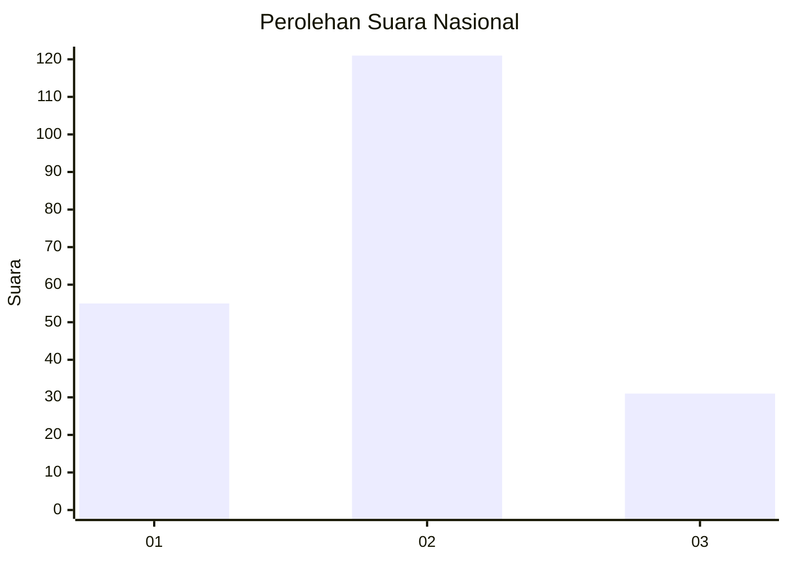
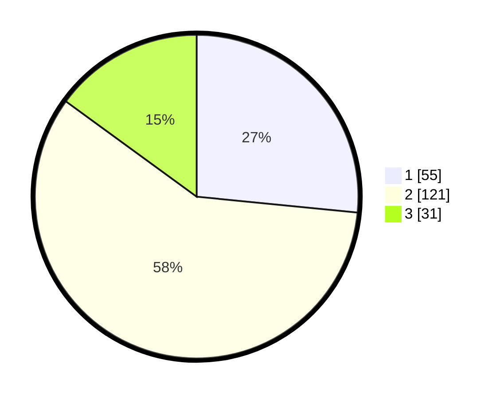

# Hasil

## Grafik

## Tabel

| No. | Nama Paslon    | Suara | Suara (raw) | Persentase |
|:--- |:-------------- | -----:| -----------:| ----------:|
| 1   | ANIES MUHAIMIN | 55    | [55][p-1]   | 26,57      |
| 2   | PRABOWO GIBRAN | 121   | [121][p-2]  | 58,45      |
| 3   | GANJAR MAHFUD  | 31    | [31][p-3]   | 14,98      |

[p-1]: https://github.com/gigit-pemilu/pemilu-2024/blob/main/pilpres/hitung-suara/sub/34-di-yogyakarta/sub/02-bantul/sub/12-banguntapan/sub/2001-baturetno/sub/042-tps/sub/paslon-1.txt
[p-2]: https://github.com/gigit-pemilu/pemilu-2024/blob/main/pilpres/hitung-suara/sub/34-di-yogyakarta/sub/02-bantul/sub/12-banguntapan/sub/2001-baturetno/sub/042-tps/sub/paslon-2.txt
[p-3]: https://github.com/gigit-pemilu/pemilu-2024/blob/main/pilpres/hitung-suara/sub/34-di-yogyakarta/sub/02-bantul/sub/12-banguntapan/sub/2001-baturetno/sub/042-tps/sub/paslon-3.txt

## Foto C Plano

https://sirekap-obj-formc.kpu.go.id/7a5b/pemilu/ppwp/34/02/12/20/01/3402122001042-20240215-014122--dfb48559-0bb7-47a1-9627-39b21c85c47b.jpg

https://sirekap-obj-formc.kpu.go.id/7a5b/pemilu/ppwp/34/02/12/20/01/3402122001042-20240215-014254--5c02a9ce-94d8-4003-a7e4-7c8c5641f227.jpg

## Metadata

| Key        | Value               |
| ---------- | ------------------- |
| Time Stamp | 2024-02-24 22:31:28 |

