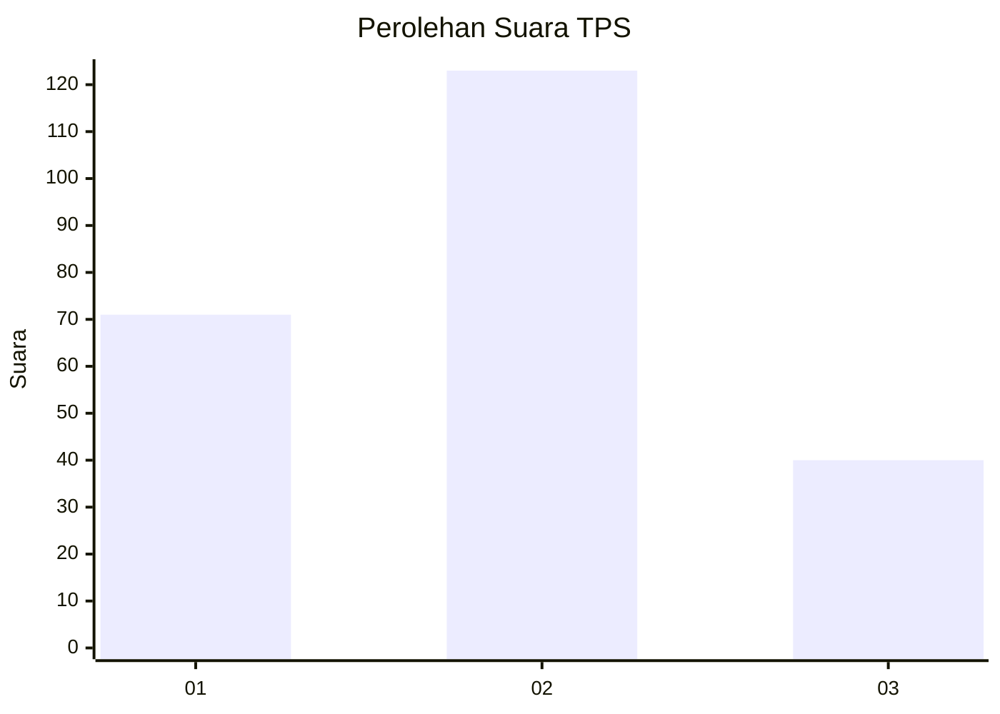
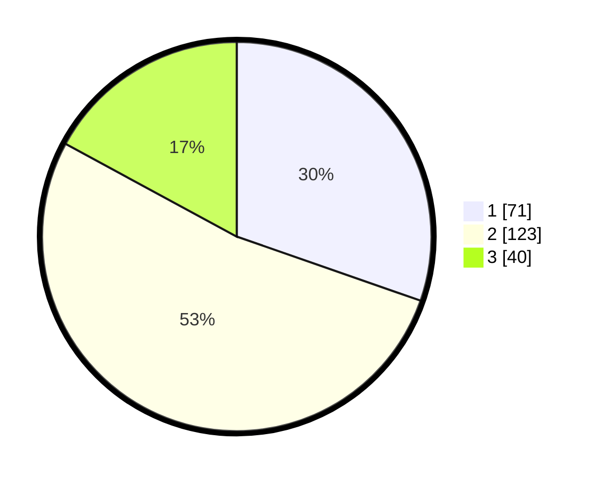

# Hasil

## Grafik

## Tabel

| No. | Nama Paslon    | Suara | Suara (raw) | Persentase |
|:--- |:-------------- | -----:| -----------:| ----------:|
| 1   | ANIES MUHAIMIN | 71    | [71][p-1]   | 30,34      |
| 2   | PRABOWO GIBRAN | 123   | [123][p-2]  | 52,56      |
| 3   | GANJAR MAHFUD  | 40    | [40][p-3]   | 17,09      |

[p-1]: https://github.com/gigit-pemilu/pemilu-2024-34-di-yogyakarta/blob/main/pilpres/hitung-suara/sub/34-di-yogyakarta/sub/02-bantul/sub/12-banguntapan/sub/2001-baturetno/sub/046-tps/sub/paslon-1.txt
[p-2]: https://github.com/gigit-pemilu/pemilu-2024-34-di-yogyakarta/blob/main/pilpres/hitung-suara/sub/34-di-yogyakarta/sub/02-bantul/sub/12-banguntapan/sub/2001-baturetno/sub/046-tps/sub/paslon-2.txt
[p-3]: https://github.com/gigit-pemilu/pemilu-2024-34-di-yogyakarta/blob/main/pilpres/hitung-suara/sub/34-di-yogyakarta/sub/02-bantul/sub/12-banguntapan/sub/2001-baturetno/sub/046-tps/sub/paslon-3.txt

## Foto C Plano

https://sirekap-obj-formc.kpu.go.id/bc97/pemilu/ppwp/34/02/12/20/01/3402122001046-20240214-215713--def3c195-0604-4b69-84f3-fcfa47bb7daa.jpg

https://sirekap-obj-formc.kpu.go.id/bc97/pemilu/ppwp/34/02/12/20/01/3402122001046-20240214-215720--9fadc018-129d-469c-b02c-d7d675344a7f.jpg

https://sirekap-obj-formc.kpu.go.id/bc97/pemilu/ppwp/34/02/12/20/01/3402122001046-20240214-215726--a324e5bd-901f-4abf-a39f-7ca9cffb544f.jpg

## Metadata

| Key        | Value               |
| ---------- | ------------------- |
| Time Stamp | 2024-02-24 22:31:28 |

