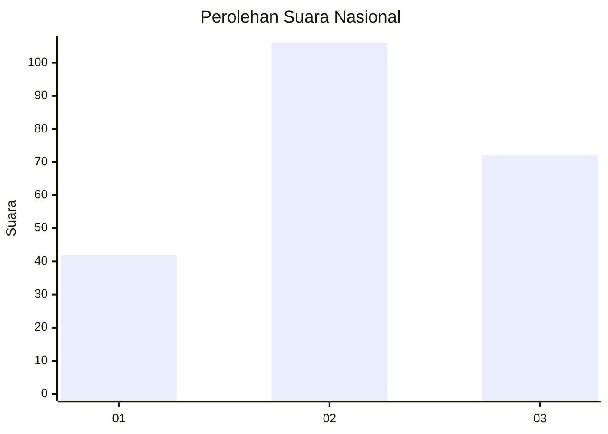
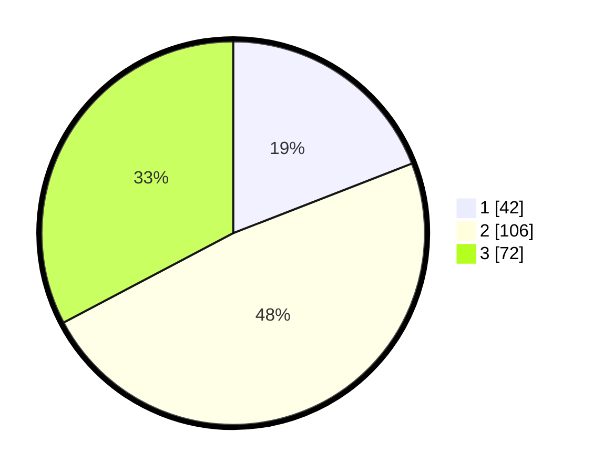

# Hasil

## Grafik

## Tabel

| No. | Nama Paslon    | Suara | Suara (raw) | Persentase |
|:--- |:-------------- | -----:| -----------:| ----------:|
| 1   | ANIES MUHAIMIN | 42    | [42][p-1]   | 19,09      |
| 2   | PRABOWO GIBRAN | 106   | [106][p-2]  | 48,18      |
| 3   | GANJAR MAHFUD  | 72    | [72][p-3]   | 32,73      |

[p-1]: https://github.com/gigit-pemilu/pemilu-2024/blob/main/pilpres/hitung-suara/sub/34-di-yogyakarta/sub/02-bantul/sub/12-banguntapan/sub/2001-baturetno/sub/050-tps/sub/paslon-1.txt
[p-2]: https://github.com/gigit-pemilu/pemilu-2024/blob/main/pilpres/hitung-suara/sub/34-di-yogyakarta/sub/02-bantul/sub/12-banguntapan/sub/2001-baturetno/sub/050-tps/sub/paslon-2.txt
[p-3]: https://github.com/gigit-pemilu/pemilu-2024/blob/main/pilpres/hitung-suara/sub/34-di-yogyakarta/sub/02-bantul/sub/12-banguntapan/sub/2001-baturetno/sub/050-tps/sub/paslon-3.txt

## Foto C Plano

https://sirekap-obj-formc.kpu.go.id/87e1/pemilu/ppwp/34/02/12/20/01/3402122001050-20240215-033418--99a5a549-3e75-4a5a-9fde-89d2f16a18af.jpg

https://sirekap-obj-formc.kpu.go.id/87e1/pemilu/ppwp/34/02/12/20/01/3402122001050-20240214-190837--54b47024-9f92-46a0-9092-89e1dffd11c2.jpg

https://sirekap-obj-formc.kpu.go.id/87e1/pemilu/ppwp/34/02/12/20/01/3402122001050-20240215-021419--916a9739-2e33-4dc7-a6b8-356500c9b452.jpg

## Metadata

| Key        | Value               |
| ---------- | ------------------- |
| Time Stamp | 2024-02-25 18:00:00 |

