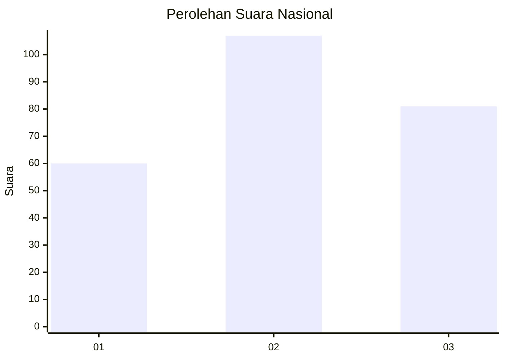
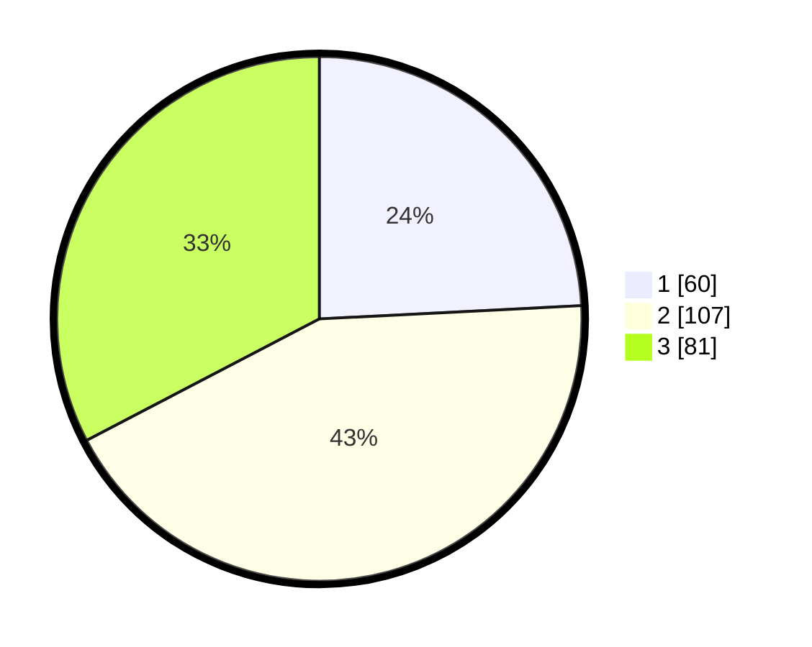

# Hasil

## Grafik

## Tabel

| No. | Nama Paslon    | Suara | Suara (raw) | Persentase |
|:--- |:-------------- | -----:| -----------:| ----------:|
| 1   | ANIES MUHAIMIN | 60    | [60][p-1]   | 24,19      |
| 2   | PRABOWO GIBRAN | 107   | [107][p-2]  | 43,15      |
| 3   | GANJAR MAHFUD  | 81    | [81][p-3]   | 32,66      |

[p-1]: https://github.com/gigit-pemilu/pemilu-2024/blob/main/pilpres/hitung-suara/sub/34-di-yogyakarta/sub/02-bantul/sub/12-banguntapan/sub/2002-banguntapan/sub/001-tps/sub/paslon-1.txt
[p-2]: https://github.com/gigit-pemilu/pemilu-2024/blob/main/pilpres/hitung-suara/sub/34-di-yogyakarta/sub/02-bantul/sub/12-banguntapan/sub/2002-banguntapan/sub/001-tps/sub/paslon-2.txt
[p-3]: https://github.com/gigit-pemilu/pemilu-2024/blob/main/pilpres/hitung-suara/sub/34-di-yogyakarta/sub/02-bantul/sub/12-banguntapan/sub/2002-banguntapan/sub/001-tps/sub/paslon-3.txt

## Foto C Plano

https://sirekap-obj-formc.kpu.go.id/2d19/pemilu/ppwp/34/02/12/20/02/3402122002001-20240215-075547--68e08b53-7972-4ad4-aa07-174740630c5d.jpg

https://sirekap-obj-formc.kpu.go.id/2d19/pemilu/ppwp/34/02/12/20/02/3402122002001-20240215-075807--86904fe1-1964-4a99-8e99-4f604a4603b1.jpg

https://sirekap-obj-formc.kpu.go.id/2d19/pemilu/ppwp/34/02/12/20/02/3402122002001-20240214-232708--b11b9843-8504-495f-b7d5-de5370d5a8fd.jpg

## Metadata

| Key        | Value               |
| ---------- | ------------------- |
| Time Stamp | 2024-02-25 22:00:00 |

