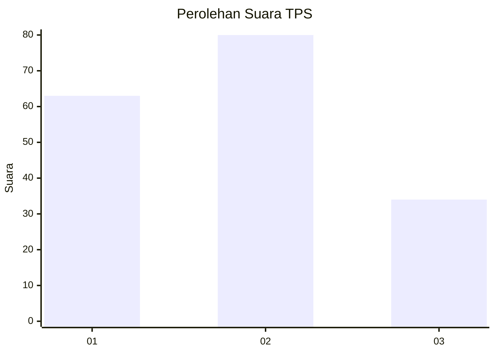
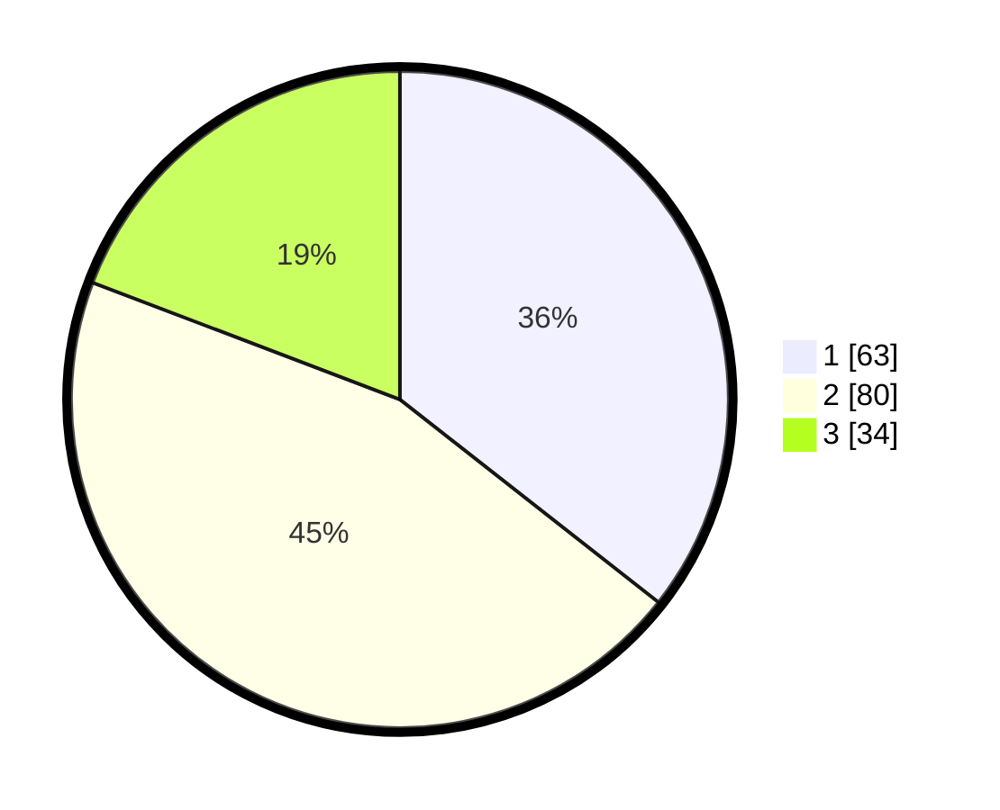

# Hasil

## Grafik

## Tabel

| No. | Nama Paslon    | Suara | Suara (raw) | Persentase |
|:--- |:-------------- | -----:| -----------:| ----------:|
| 1   | ANIES MUHAIMIN | 63    | [63][p-1]   | 35,59      |
| 2   | PRABOWO GIBRAN | 80    | [80][p-2]   | 45,20      |
| 3   | GANJAR MAHFUD  | 34    | [34][p-3]   | 19,21      |

[p-1]: https://github.com/gigit-pemilu/pemilu-2024-34-di-yogyakarta/blob/main/pilpres/hitung-suara/sub/34-di-yogyakarta/sub/02-bantul/sub/12-banguntapan/sub/2002-banguntapan/sub/002-tps/sub/paslon-1.txt
[p-2]: https://github.com/gigit-pemilu/pemilu-2024-34-di-yogyakarta/blob/main/pilpres/hitung-suara/sub/34-di-yogyakarta/sub/02-bantul/sub/12-banguntapan/sub/2002-banguntapan/sub/002-tps/sub/paslon-2.txt
[p-3]: https://github.com/gigit-pemilu/pemilu-2024-34-di-yogyakarta/blob/main/pilpres/hitung-suara/sub/34-di-yogyakarta/sub/02-bantul/sub/12-banguntapan/sub/2002-banguntapan/sub/002-tps/sub/paslon-3.txt

## Foto C Plano

https://sirekap-obj-formc.kpu.go.id/5328/pemilu/ppwp/34/02/12/20/02/3402122002002-20240214-223647--28fa3a53-9f45-4c24-a475-7bb2da42c026.jpg

https://sirekap-obj-formc.kpu.go.id/5328/pemilu/ppwp/34/02/12/20/02/3402122002002-20240214-223656--ea31f525-78ec-4b05-9c65-8edb5d758ba1.jpg

https://sirekap-obj-formc.kpu.go.id/5328/pemilu/ppwp/34/02/12/20/02/3402122002002-20240214-203143--dd31df1a-3ad8-4f64-be6e-76bdf1a55228.jpg

## Metadata

| Key        | Value               |
| ---------- | ------------------- |
| Time Stamp | 2024-02-24 22:31:28 |

