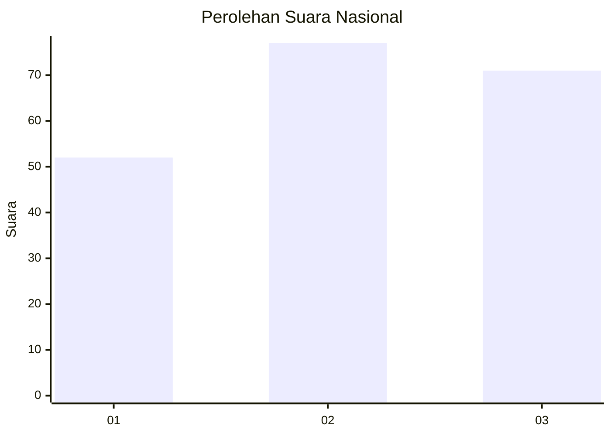
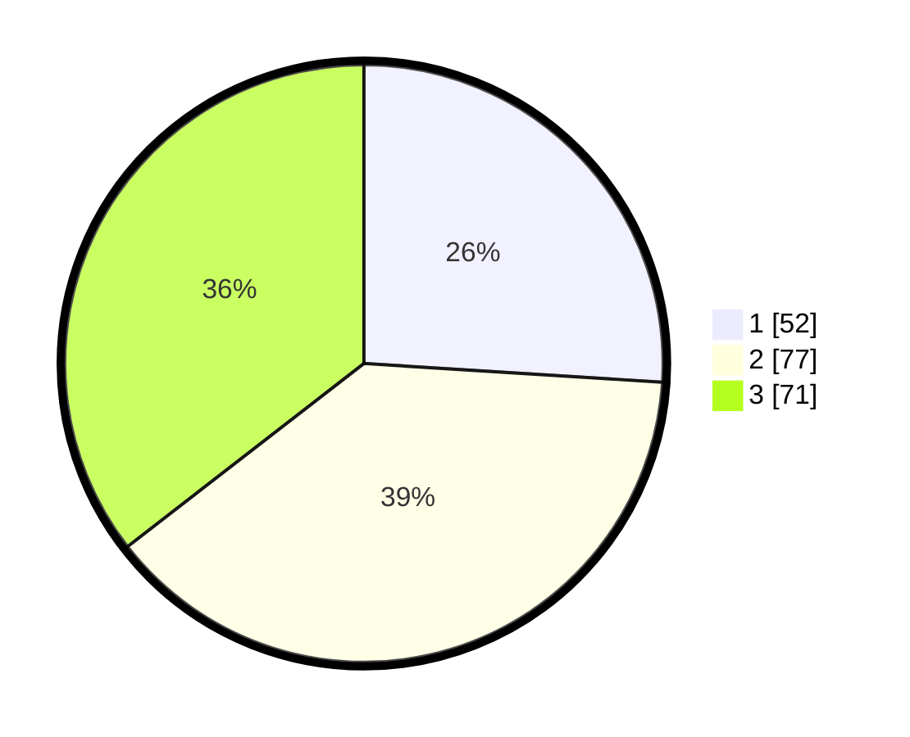

# Hasil

## Grafik

## Tabel

| No. | Nama Paslon    | Suara | Suara (raw) | Persentase |
|:--- |:-------------- | -----:| -----------:| ----------:|
| 1   | ANIES MUHAIMIN | 52    | [52][p-1]   | 26,00      |
| 2   | PRABOWO GIBRAN | 77    | [77][p-2]   | 38,50      |
| 3   | GANJAR MAHFUD  | 71    | [71][p-3]   | 35,50      |

[p-1]: https://github.com/gigit-pemilu/pemilu-2024/blob/main/pilpres/hitung-suara/sub/34-di-yogyakarta/sub/02-bantul/sub/12-banguntapan/sub/2002-banguntapan/sub/004-tps/sub/paslon-1.txt
[p-2]: https://github.com/gigit-pemilu/pemilu-2024/blob/main/pilpres/hitung-suara/sub/34-di-yogyakarta/sub/02-bantul/sub/12-banguntapan/sub/2002-banguntapan/sub/004-tps/sub/paslon-2.txt
[p-3]: https://github.com/gigit-pemilu/pemilu-2024/blob/main/pilpres/hitung-suara/sub/34-di-yogyakarta/sub/02-bantul/sub/12-banguntapan/sub/2002-banguntapan/sub/004-tps/sub/paslon-3.txt

## Foto C Plano

https://sirekap-obj-formc.kpu.go.id/99a2/pemilu/ppwp/34/02/12/20/02/3402122002004-20240217-094255--b885b6fa-1464-4c86-a4f1-62c7bab7f4b2.jpg

https://sirekap-obj-formc.kpu.go.id/99a2/pemilu/ppwp/34/02/12/20/02/3402122002004-20240217-093839--972228cb-acc2-4780-a73e-ecf49f096277.jpg

https://sirekap-obj-formc.kpu.go.id/99a2/pemilu/ppwp/34/02/12/20/02/3402122002004-20240217-095114--99051eb8-374e-4689-b097-11d4843d7558.jpg

## Metadata

| Key        | Value               |
| ---------- | ------------------- |
| Time Stamp | 2024-02-17 10:00:02 |

