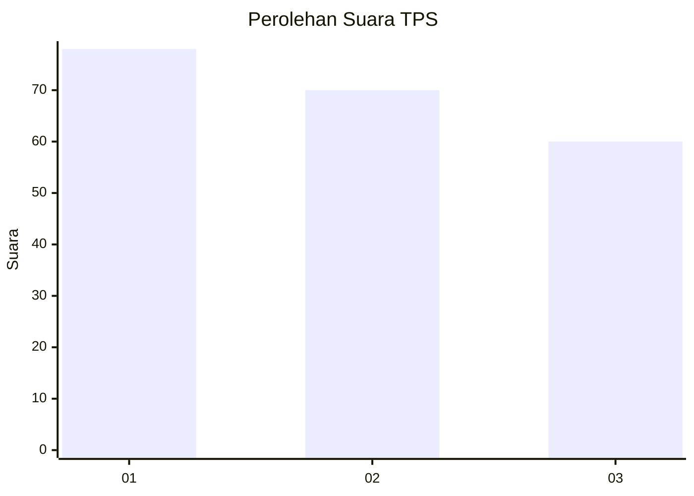
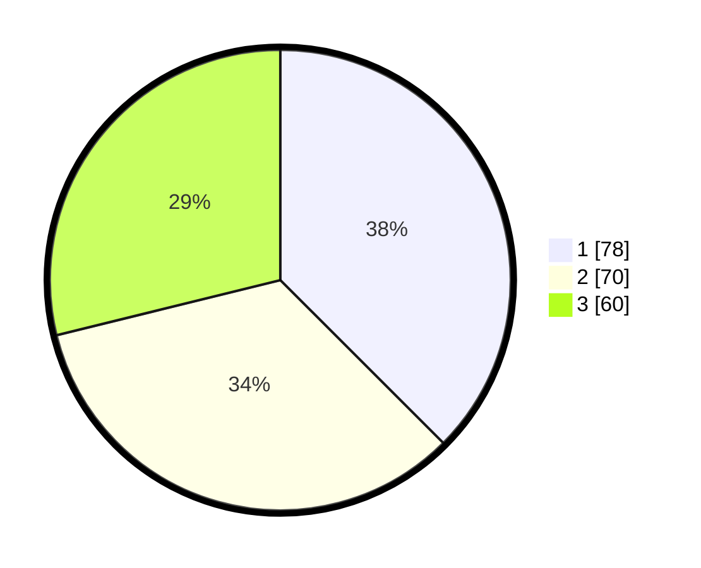

# Hasil

## Grafik

## Tabel

| No. | Nama Paslon    | Suara | Suara (raw) | Persentase |
|:--- |:-------------- | -----:| -----------:| ----------:|
| 1   | ANIES MUHAIMIN | 78    | [78][p-1]   | 37,50      |
| 2   | PRABOWO GIBRAN | 70    | [70][p-2]   | 33,65      |
| 3   | GANJAR MAHFUD  | 60    | [60][p-3]   | 28,85      |

[p-1]: https://github.com/gigit-pemilu/pemilu-2024-34-di-yogyakarta/blob/main/pilpres/hitung-suara/sub/34-di-yogyakarta/sub/02-bantul/sub/12-banguntapan/sub/2002-banguntapan/sub/005-tps/sub/paslon-1.txt
[p-2]: https://github.com/gigit-pemilu/pemilu-2024-34-di-yogyakarta/blob/main/pilpres/hitung-suara/sub/34-di-yogyakarta/sub/02-bantul/sub/12-banguntapan/sub/2002-banguntapan/sub/005-tps/sub/paslon-2.txt
[p-3]: https://github.com/gigit-pemilu/pemilu-2024-34-di-yogyakarta/blob/main/pilpres/hitung-suara/sub/34-di-yogyakarta/sub/02-bantul/sub/12-banguntapan/sub/2002-banguntapan/sub/005-tps/sub/paslon-3.txt

## Foto C Plano

https://sirekap-obj-formc.kpu.go.id/67ca/pemilu/ppwp/34/02/12/20/02/3402122002005-20240214-194916--315ad1ba-5d51-498f-a2aa-b8f1b2bee41a.jpg

https://sirekap-obj-formc.kpu.go.id/67ca/pemilu/ppwp/34/02/12/20/02/3402122002005-20240214-194925--3914d0fc-2b56-4018-81e4-a25aed65fd33.jpg

https://sirekap-obj-formc.kpu.go.id/67ca/pemilu/ppwp/34/02/12/20/02/3402122002005-20240214-212308--552dcf40-1b5d-403f-b2c4-5ed04749d411.jpg

## Metadata

| Key        | Value               |
| ---------- | ------------------- |
| Time Stamp | 2024-02-14 21:46:01 |

