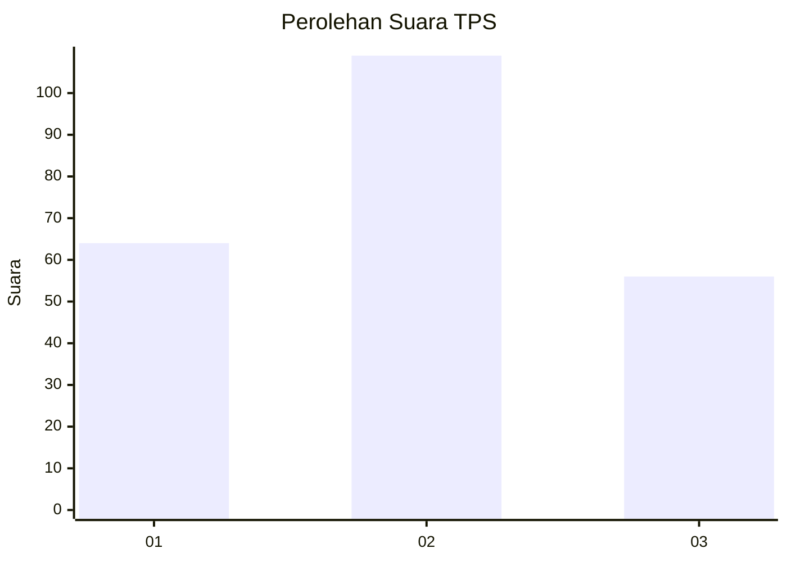
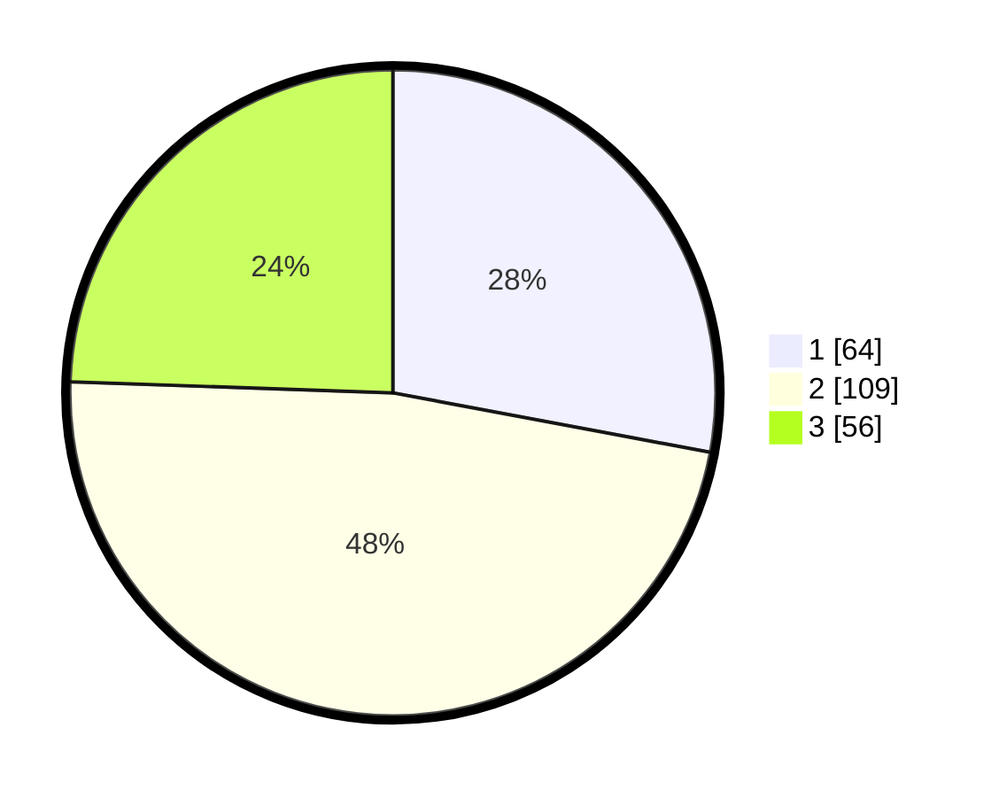

# Hasil

## Grafik

## Tabel

| No. | Nama Paslon    | Suara | Suara (raw) | Persentase |
|:--- |:-------------- | -----:| -----------:| ----------:|
| 1   | ANIES MUHAIMIN | 64    | [64][p-1]   | 27,95      |
| 2   | PRABOWO GIBRAN | 109   | [109][p-2]  | 47,60      |
| 3   | GANJAR MAHFUD  | 56    | [56][p-3]   | 24,45      |

[p-1]: https://github.com/gigit-pemilu/pemilu-2024-34-di-yogyakarta/blob/main/pilpres/hitung-suara/sub/34-di-yogyakarta/sub/02-bantul/sub/12-banguntapan/sub/2002-banguntapan/sub/008-tps/sub/paslon-1.txt
[p-2]: https://github.com/gigit-pemilu/pemilu-2024-34-di-yogyakarta/blob/main/pilpres/hitung-suara/sub/34-di-yogyakarta/sub/02-bantul/sub/12-banguntapan/sub/2002-banguntapan/sub/008-tps/sub/paslon-2.txt
[p-3]: https://github.com/gigit-pemilu/pemilu-2024-34-di-yogyakarta/blob/main/pilpres/hitung-suara/sub/34-di-yogyakarta/sub/02-bantul/sub/12-banguntapan/sub/2002-banguntapan/sub/008-tps/sub/paslon-3.txt

## Foto C Plano

https://sirekap-obj-formc.kpu.go.id/cb21/pemilu/ppwp/34/02/12/20/02/3402122002008-20240214-211844--6161209a-9984-4c5e-84ee-dc05e4b83288.jpg

https://sirekap-obj-formc.kpu.go.id/cb21/pemilu/ppwp/34/02/12/20/02/3402122002008-20240214-212218--f52a1af3-519c-45c9-99af-81186b1df3e9.jpg

https://sirekap-obj-formc.kpu.go.id/cb21/pemilu/ppwp/34/02/12/20/02/3402122002008-20240215-003843--8c91c21a-37c8-460f-8c8a-ab8d6da779e5.jpg

## Metadata

| Key        | Value               |
| ---------- | ------------------- |
| Time Stamp | 2024-02-15 00:41:44 |

