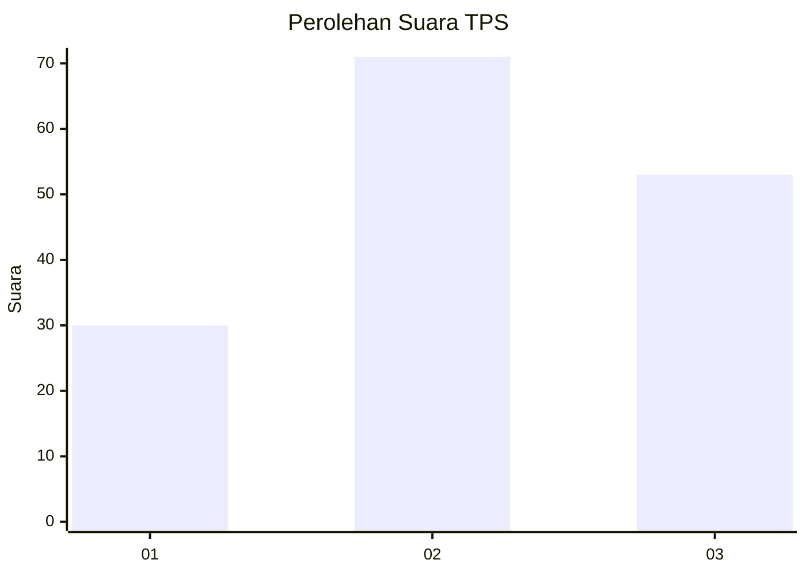
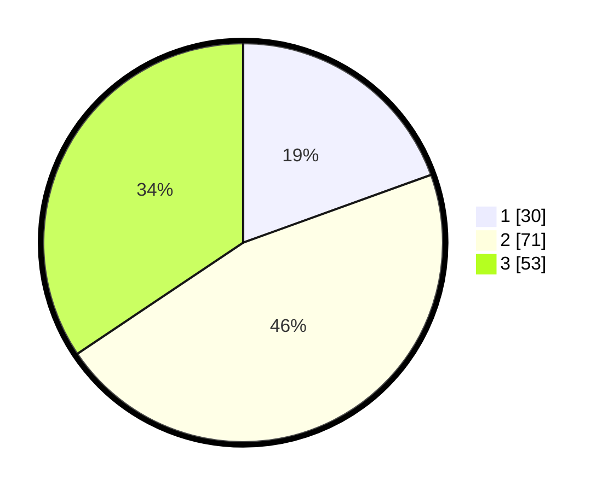

# Hasil

## Grafik

## Tabel

| No. | Nama Paslon    | Suara | Suara (raw) | Persentase |
|:--- |:-------------- | -----:| -----------:| ----------:|
| 1   | ANIES MUHAIMIN | 30    | [30][p-1]   | 19,48      |
| 2   | PRABOWO GIBRAN | 71    | [71][p-2]   | 46,10      |
| 3   | GANJAR MAHFUD  | 53    | [53][p-3]   | 34,42      |

[p-1]: https://github.com/gigit-pemilu/pemilu-2024-34-di-yogyakarta/blob/main/pilpres/hitung-suara/sub/34-di-yogyakarta/sub/02-bantul/sub/12-banguntapan/sub/2002-banguntapan/sub/011-tps/sub/paslon-1.txt
[p-2]: https://github.com/gigit-pemilu/pemilu-2024-34-di-yogyakarta/blob/main/pilpres/hitung-suara/sub/34-di-yogyakarta/sub/02-bantul/sub/12-banguntapan/sub/2002-banguntapan/sub/011-tps/sub/paslon-2.txt
[p-3]: https://github.com/gigit-pemilu/pemilu-2024-34-di-yogyakarta/blob/main/pilpres/hitung-suara/sub/34-di-yogyakarta/sub/02-bantul/sub/12-banguntapan/sub/2002-banguntapan/sub/011-tps/sub/paslon-3.txt

## Foto C Plano

https://sirekap-obj-formc.kpu.go.id/3afd/pemilu/ppwp/34/02/12/20/02/3402122002011-20240214-141149--423bba00-db14-444e-a979-7e8ef9c9f8a4.jpg

https://sirekap-obj-formc.kpu.go.id/3afd/pemilu/ppwp/34/02/12/20/02/3402122002011-20240214-141225--6726cf12-f251-4969-b241-957e472653cc.jpg

https://sirekap-obj-formc.kpu.go.id/3afd/pemilu/ppwp/34/02/12/20/02/3402122002011-20240214-141457--cc78b8e8-87e5-4db6-8068-10f02c347be1.jpg

## Metadata

| Key        | Value               |
| ---------- | ------------------- |
| Time Stamp | 2024-02-17 18:00:00 |

