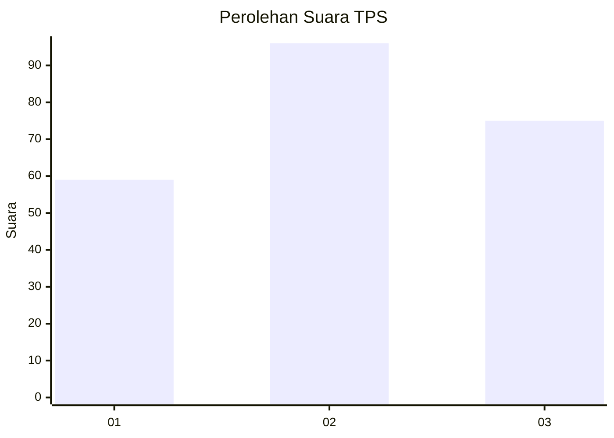
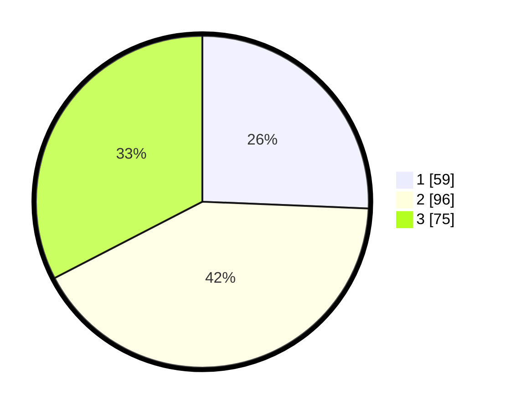

# Hasil

## Grafik

## Tabel

| No. | Nama Paslon    | Suara | Suara (raw) | Persentase |
|:--- |:-------------- | -----:| -----------:| ----------:|
| 1   | ANIES MUHAIMIN | 59    | [59][p-1]   | 25,65      |
| 2   | PRABOWO GIBRAN | 96    | [96][p-2]   | 41,74      |
| 3   | GANJAR MAHFUD  | 75    | [75][p-3]   | 32,61      |

[p-1]: https://github.com/gigit-pemilu/pemilu-2024-34-di-yogyakarta/blob/main/pilpres/hitung-suara/sub/34-di-yogyakarta/sub/02-bantul/sub/12-banguntapan/sub/2002-banguntapan/sub/015-tps/sub/paslon-1.txt
[p-2]: https://github.com/gigit-pemilu/pemilu-2024-34-di-yogyakarta/blob/main/pilpres/hitung-suara/sub/34-di-yogyakarta/sub/02-bantul/sub/12-banguntapan/sub/2002-banguntapan/sub/015-tps/sub/paslon-2.txt
[p-3]: https://github.com/gigit-pemilu/pemilu-2024-34-di-yogyakarta/blob/main/pilpres/hitung-suara/sub/34-di-yogyakarta/sub/02-bantul/sub/12-banguntapan/sub/2002-banguntapan/sub/015-tps/sub/paslon-3.txt

## Foto C Plano

https://sirekap-obj-formc.kpu.go.id/a2fd/pemilu/ppwp/34/02/12/20/02/3402122002015-20240215-020925--c704a808-f395-4a82-b665-8e75ccb957b0.jpg

https://sirekap-obj-formc.kpu.go.id/a2fd/pemilu/ppwp/34/02/12/20/02/3402122002015-20240215-034617--4f1be394-b19c-4cd9-8b05-d3a2c7856f65.jpg

https://sirekap-obj-formc.kpu.go.id/a2fd/pemilu/ppwp/34/02/12/20/02/3402122002015-20240215-021513--85931d0c-23e4-45f8-a89d-44adbf0281b3.jpg

## Metadata

| Key        | Value               |
| ---------- | ------------------- |
| Time Stamp | 2024-02-24 22:31:28 |

