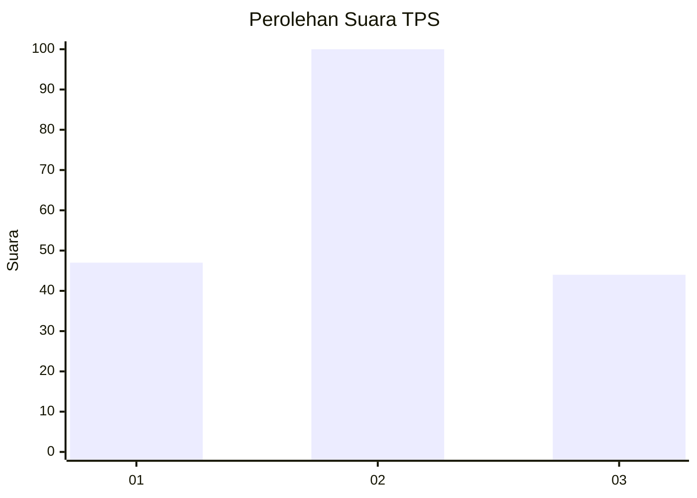
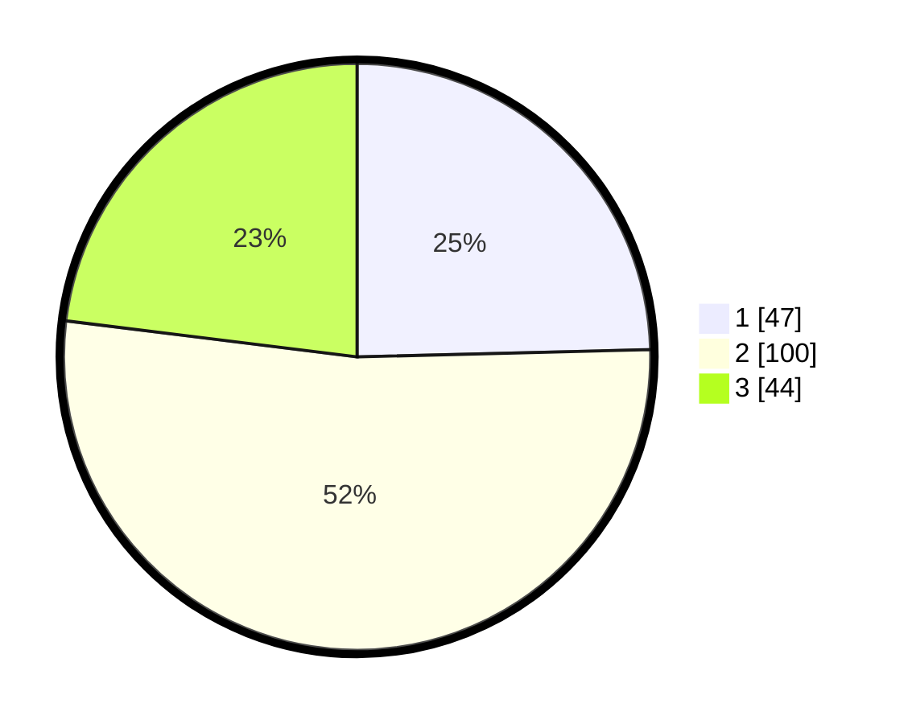

# Hasil

## Grafik

## Tabel

| No. | Nama Paslon    | Suara | Suara (raw) | Persentase |
|:--- |:-------------- | -----:| -----------:| ----------:|
| 1   | ANIES MUHAIMIN | 47    | [47][p-1]   | 24,61      |
| 2   | PRABOWO GIBRAN | 100   | [100][p-2]  | 52,36      |
| 3   | GANJAR MAHFUD  | 44    | [44][p-3]   | 23,04      |

[p-1]: https://github.com/gigit-pemilu/pemilu-2024-34-di-yogyakarta/blob/main/pilpres/hitung-suara/sub/34-di-yogyakarta/sub/02-bantul/sub/12-banguntapan/sub/2002-banguntapan/sub/020-tps/sub/paslon-1.txt
[p-2]: https://github.com/gigit-pemilu/pemilu-2024-34-di-yogyakarta/blob/main/pilpres/hitung-suara/sub/34-di-yogyakarta/sub/02-bantul/sub/12-banguntapan/sub/2002-banguntapan/sub/020-tps/sub/paslon-2.txt
[p-3]: https://github.com/gigit-pemilu/pemilu-2024-34-di-yogyakarta/blob/main/pilpres/hitung-suara/sub/34-di-yogyakarta/sub/02-bantul/sub/12-banguntapan/sub/2002-banguntapan/sub/020-tps/sub/paslon-3.txt

## Foto C Plano

https://sirekap-obj-formc.kpu.go.id/5059/pemilu/ppwp/34/02/12/20/02/3402122002020-20240214-235338--89b4d08c-8b5c-4f2a-b7b6-70aadeb89c92.jpg

https://sirekap-obj-formc.kpu.go.id/5059/pemilu/ppwp/34/02/12/20/02/3402122002020-20240214-213119--8acd2895-f124-4702-9c61-a1e9ce596996.jpg

https://sirekap-obj-formc.kpu.go.id/5059/pemilu/ppwp/34/02/12/20/02/3402122002020-20240214-213053--91392a6b-1e8e-4dfe-bdf5-7e0d49133e7f.jpg

## Metadata

| Key        | Value               |
| ---------- | ------------------- |
| Time Stamp | 2024-02-24 22:31:28 |

