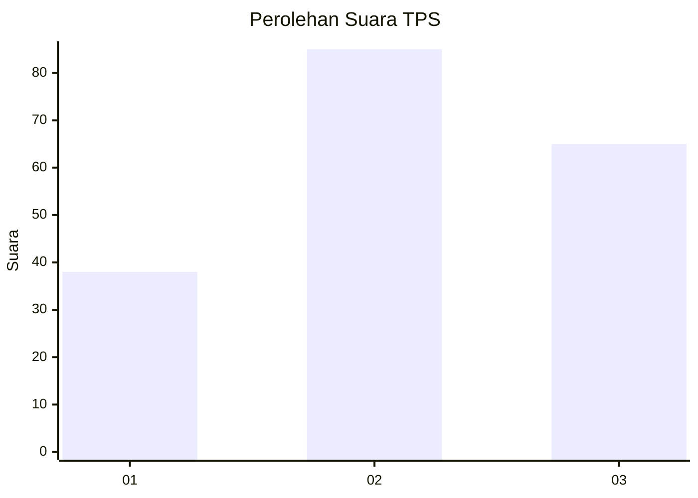
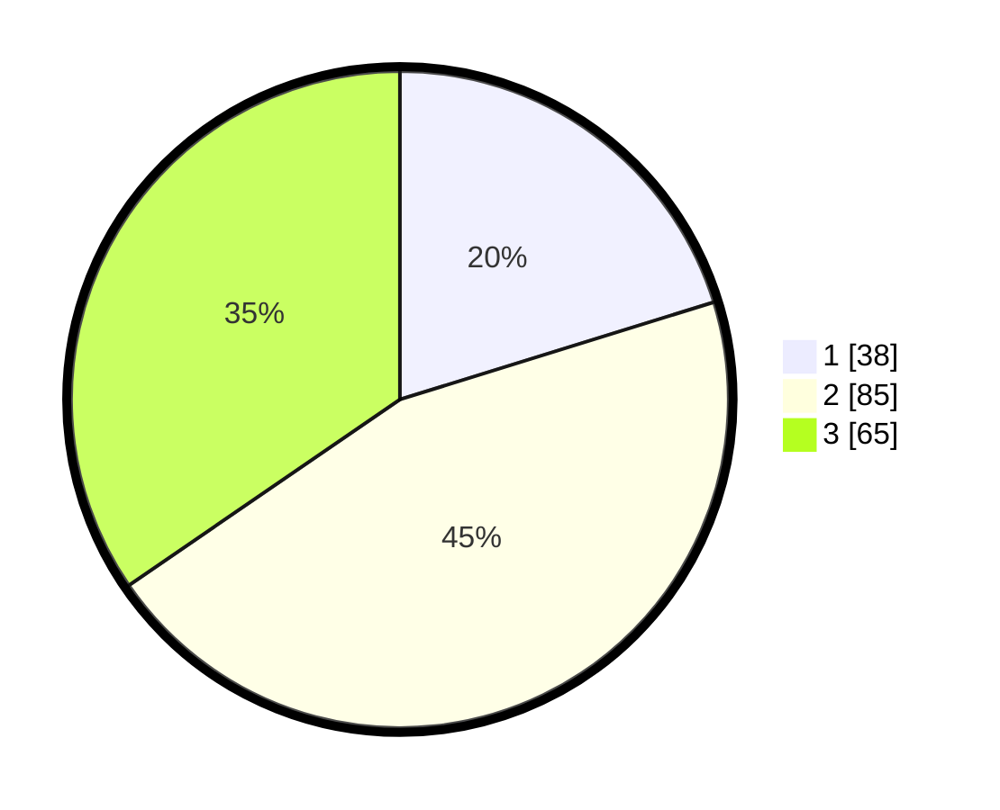

# Hasil

## Grafik

## Tabel

| No. | Nama Paslon    | Suara | Suara (raw) | Persentase |
|:--- |:-------------- | -----:| -----------:| ----------:|
| 1   | ANIES MUHAIMIN | 38    | [38][p-1]   | 20,21      |
| 2   | PRABOWO GIBRAN | 85    | [85][p-2]   | 45,21      |
| 3   | GANJAR MAHFUD  | 65    | [65][p-3]   | 34,57      |

[p-1]: https://github.com/gigit-pemilu/pemilu-2024-34-di-yogyakarta/blob/main/pilpres/hitung-suara/sub/34-di-yogyakarta/sub/02-bantul/sub/12-banguntapan/sub/2002-banguntapan/sub/021-tps/sub/paslon-1.txt
[p-2]: https://github.com/gigit-pemilu/pemilu-2024-34-di-yogyakarta/blob/main/pilpres/hitung-suara/sub/34-di-yogyakarta/sub/02-bantul/sub/12-banguntapan/sub/2002-banguntapan/sub/021-tps/sub/paslon-2.txt
[p-3]: https://github.com/gigit-pemilu/pemilu-2024-34-di-yogyakarta/blob/main/pilpres/hitung-suara/sub/34-di-yogyakarta/sub/02-bantul/sub/12-banguntapan/sub/2002-banguntapan/sub/021-tps/sub/paslon-3.txt

## Foto C Plano

https://sirekap-obj-formc.kpu.go.id/efae/pemilu/ppwp/34/02/12/20/02/3402122002021-20240219-135147--480514c0-8880-417e-8122-f9069364ed04.jpg

https://sirekap-obj-formc.kpu.go.id/efae/pemilu/ppwp/34/02/12/20/02/3402122002021-20240218-235549--f6411386-3001-4aba-8111-c9f240801818.jpg

https://sirekap-obj-formc.kpu.go.id/efae/pemilu/ppwp/34/02/12/20/02/3402122002021-20240219-000020--40ccd0a6-ca7d-4d7a-b4a8-b228c1a93876.jpg

## Metadata

| Key        | Value               |
| ---------- | ------------------- |
| Time Stamp | 2024-02-19 14:00:00 |

