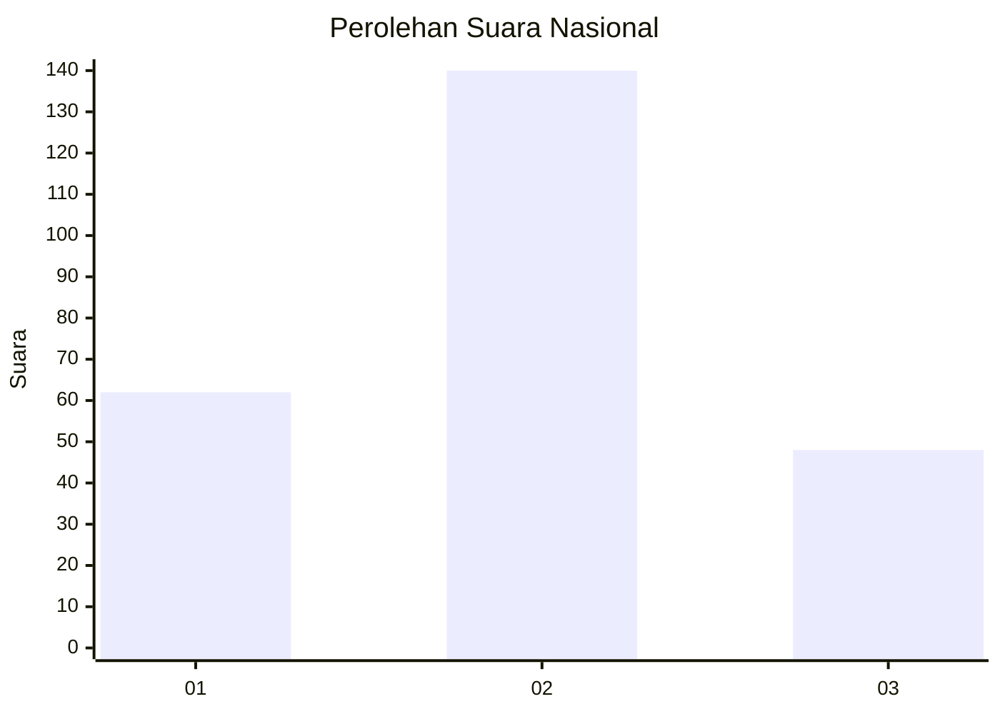
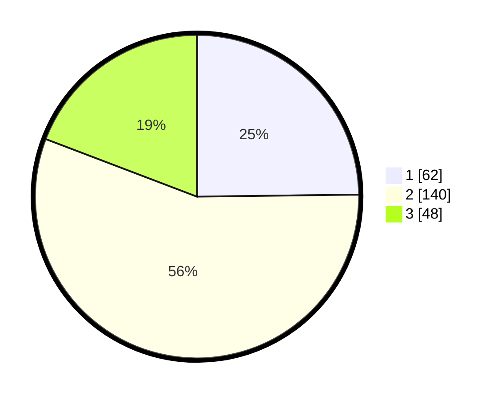

# Hasil

## Grafik

## Tabel

| No. | Nama Paslon    | Suara | Suara (raw) | Persentase |
|:--- |:-------------- | -----:| -----------:| ----------:|
| 1   | ANIES MUHAIMIN | 62    | [62][p-1]   | 24,80      |
| 2   | PRABOWO GIBRAN | 140   | [140][p-2]  | 56,00      |
| 3   | GANJAR MAHFUD  | 48    | [48][p-3]   | 19,20      |

[p-1]: https://github.com/gigit-pemilu/pemilu-2024/blob/main/pilpres/hitung-suara/sub/34-di-yogyakarta/sub/02-bantul/sub/12-banguntapan/sub/2002-banguntapan/sub/026-tps/sub/paslon-1.txt
[p-2]: https://github.com/gigit-pemilu/pemilu-2024/blob/main/pilpres/hitung-suara/sub/34-di-yogyakarta/sub/02-bantul/sub/12-banguntapan/sub/2002-banguntapan/sub/026-tps/sub/paslon-2.txt
[p-3]: https://github.com/gigit-pemilu/pemilu-2024/blob/main/pilpres/hitung-suara/sub/34-di-yogyakarta/sub/02-bantul/sub/12-banguntapan/sub/2002-banguntapan/sub/026-tps/sub/paslon-3.txt

## Foto C Plano

https://sirekap-obj-formc.kpu.go.id/31c1/pemilu/ppwp/34/02/12/20/02/3402122002026-20240214-213505--d38e5fdc-7b96-4b6e-a1ab-59ba2907791e.jpg

https://sirekap-obj-formc.kpu.go.id/31c1/pemilu/ppwp/34/02/12/20/02/3402122002026-20240214-213632--9d000362-2ac8-4359-9e4d-f53a2588da18.jpg

https://sirekap-obj-formc.kpu.go.id/31c1/pemilu/ppwp/34/02/12/20/02/3402122002026-20240214-205236--b4f14c25-2604-4804-bcd5-25aa8eb13987.jpg

## Metadata

| Key        | Value               |
| ---------- | ------------------- |
| Time Stamp | 2024-02-15 20:00:44 |

