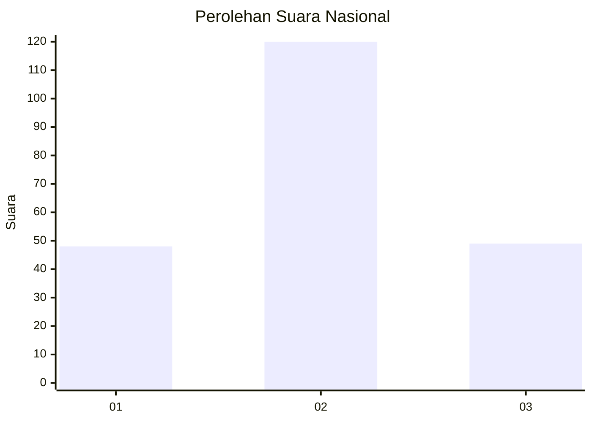
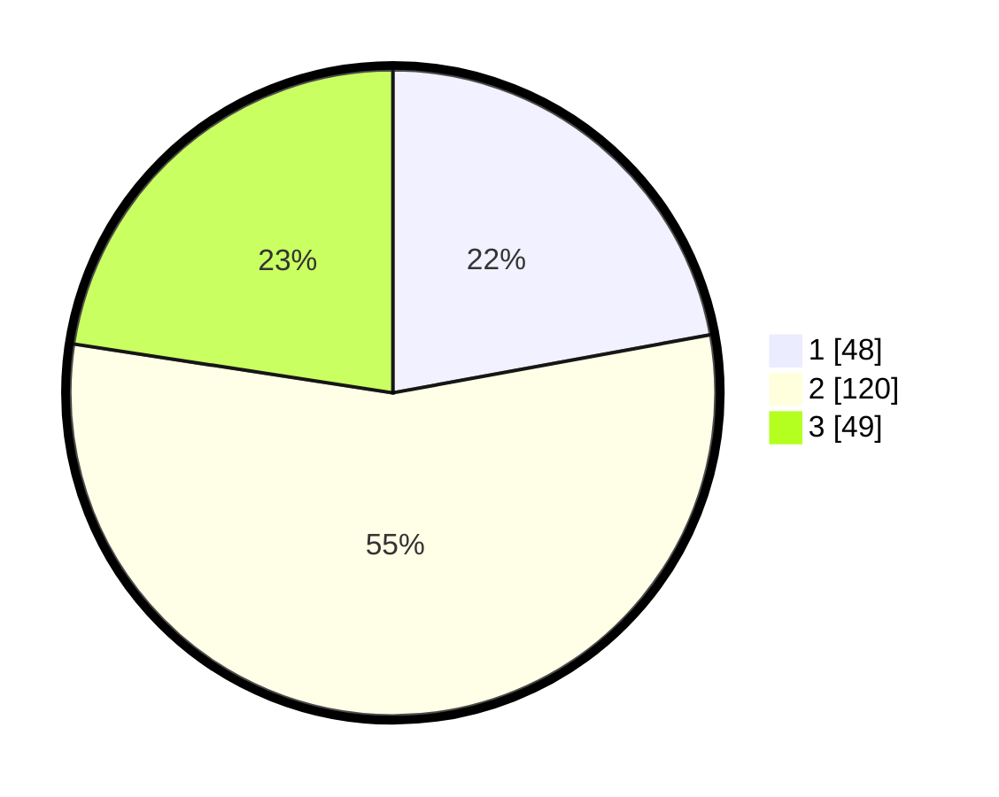

# Hasil

## Grafik

## Tabel

| No. | Nama Paslon    | Suara | Suara (raw) | Persentase |
|:--- |:-------------- | -----:| -----------:| ----------:|
| 1   | ANIES MUHAIMIN | 48    | [48][p-1]   | 22,12      |
| 2   | PRABOWO GIBRAN | 120   | [120][p-2]  | 55,30      |
| 3   | GANJAR MAHFUD  | 49    | [49][p-3]   | 22,58      |

[p-1]: https://github.com/gigit-pemilu/pemilu-2024/blob/main/pilpres/hitung-suara/sub/34-di-yogyakarta/sub/02-bantul/sub/12-banguntapan/sub/2002-banguntapan/sub/032-tps/sub/paslon-1.txt
[p-2]: https://github.com/gigit-pemilu/pemilu-2024/blob/main/pilpres/hitung-suara/sub/34-di-yogyakarta/sub/02-bantul/sub/12-banguntapan/sub/2002-banguntapan/sub/032-tps/sub/paslon-2.txt
[p-3]: https://github.com/gigit-pemilu/pemilu-2024/blob/main/pilpres/hitung-suara/sub/34-di-yogyakarta/sub/02-bantul/sub/12-banguntapan/sub/2002-banguntapan/sub/032-tps/sub/paslon-3.txt

## Foto C Plano

https://sirekap-obj-formc.kpu.go.id/a9d5/pemilu/ppwp/34/02/12/20/02/3402122002032-20240214-225450--3772f05f-9cce-4cc8-b511-2ec8bdc91823.jpg

https://sirekap-obj-formc.kpu.go.id/a9d5/pemilu/ppwp/34/02/12/20/02/3402122002032-20240214-225122--cb57b674-ccf8-4f24-a385-fe993e4387c8.jpg

https://sirekap-obj-formc.kpu.go.id/a9d5/pemilu/ppwp/34/02/12/20/02/3402122002032-20240214-224920--340ca3ab-2a36-44ec-ad75-143ea0a2aaf4.jpg

## Metadata

| Key        | Value               |
| ---------- | ------------------- |
| Time Stamp | 2024-02-24 22:31:28 |

