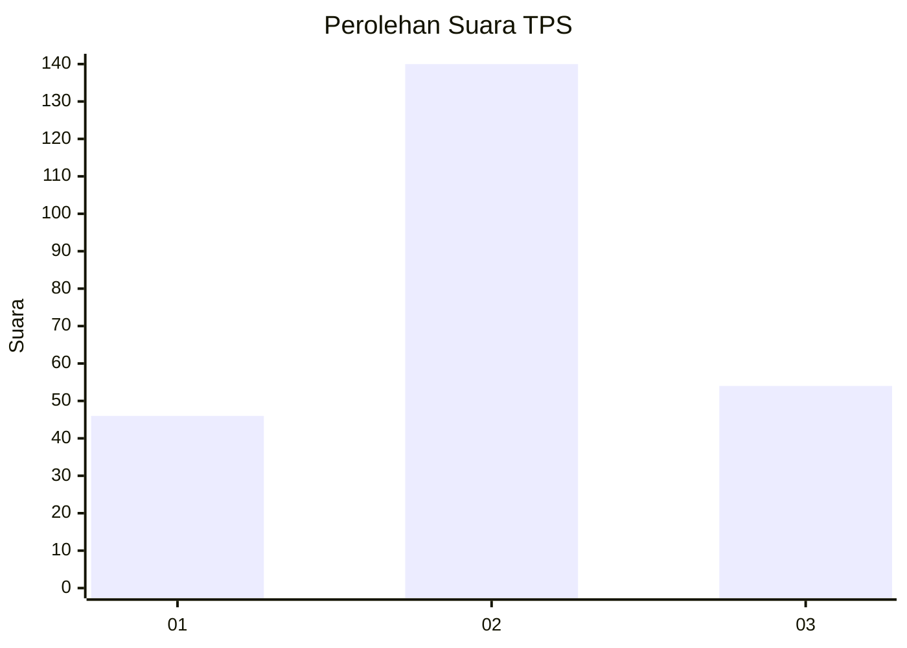
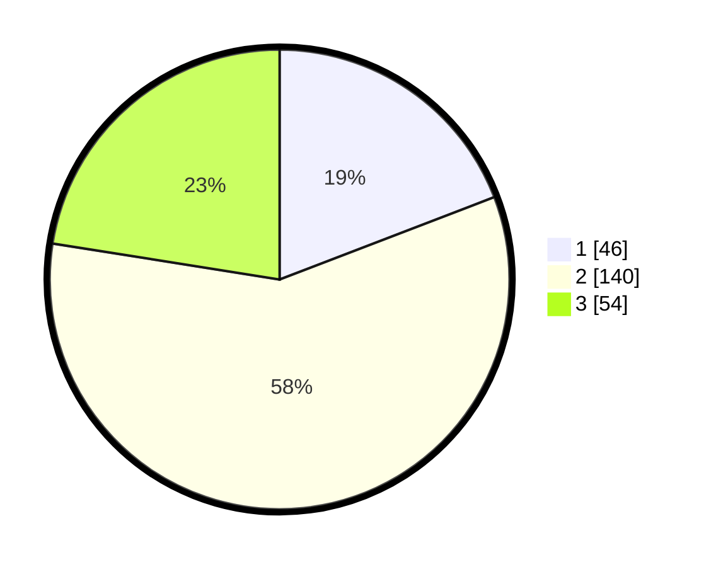

# Hasil

## Grafik

## Tabel

| No. | Nama Paslon    | Suara | Suara (raw) | Persentase |
|:--- |:-------------- | -----:| -----------:| ----------:|
| 1   | ANIES MUHAIMIN | 46    | [46][p-1]   | 19,17      |
| 2   | PRABOWO GIBRAN | 140   | [140][p-2]  | 58,33      |
| 3   | GANJAR MAHFUD  | 54    | [54][p-3]   | 22,50      |

[p-1]: https://github.com/gigit-pemilu/pemilu-2024-34-di-yogyakarta/blob/main/pilpres/hitung-suara/sub/34-di-yogyakarta/sub/02-bantul/sub/12-banguntapan/sub/2002-banguntapan/sub/039-tps/sub/paslon-1.txt
[p-2]: https://github.com/gigit-pemilu/pemilu-2024-34-di-yogyakarta/blob/main/pilpres/hitung-suara/sub/34-di-yogyakarta/sub/02-bantul/sub/12-banguntapan/sub/2002-banguntapan/sub/039-tps/sub/paslon-2.txt
[p-3]: https://github.com/gigit-pemilu/pemilu-2024-34-di-yogyakarta/blob/main/pilpres/hitung-suara/sub/34-di-yogyakarta/sub/02-bantul/sub/12-banguntapan/sub/2002-banguntapan/sub/039-tps/sub/paslon-3.txt

## Foto C Plano

https://sirekap-obj-formc.kpu.go.id/759d/pemilu/ppwp/34/02/12/20/02/3402122002039-20240214-231436--2c76de97-f358-4ad2-8c11-774a62cb7c5a.jpg

https://sirekap-obj-formc.kpu.go.id/759d/pemilu/ppwp/34/02/12/20/02/3402122002039-20240214-231746--4382d713-9148-4ae3-84a9-e75c5349c855.jpg

https://sirekap-obj-formc.kpu.go.id/759d/pemilu/ppwp/34/02/12/20/02/3402122002039-20240214-231930--c7042038-ac67-4930-b06b-44406369834c.jpg

## Metadata

| Key        | Value               |
| ---------- | ------------------- |
| Time Stamp | 2024-02-24 22:31:28 |

