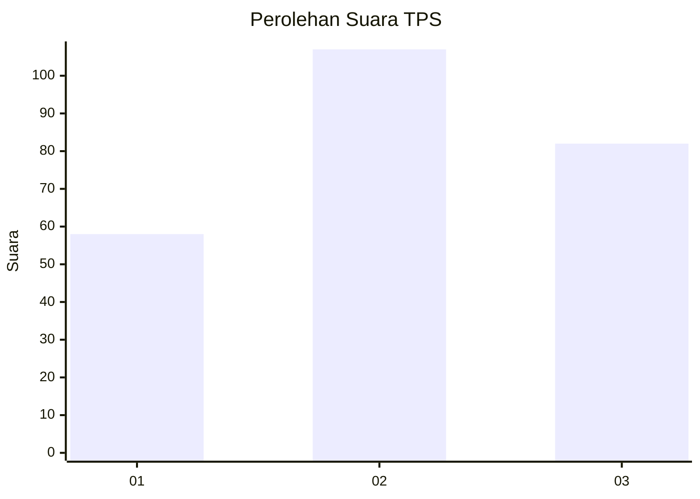
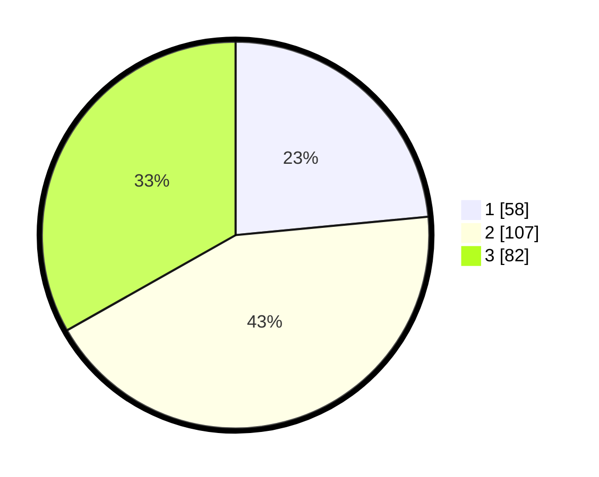

# Hasil

## Grafik

## Tabel

| No. | Nama Paslon    | Suara | Suara (raw) | Persentase |
|:--- |:-------------- | -----:| -----------:| ----------:|
| 1   | ANIES MUHAIMIN | 58    | [58][p-1]   | 23,48      |
| 2   | PRABOWO GIBRAN | 107   | [107][p-2]  | 43,32      |
| 3   | GANJAR MAHFUD  | 82    | [82][p-3]   | 33,20      |

[p-1]: https://github.com/gigit-pemilu/pemilu-2024-34-di-yogyakarta/blob/main/pilpres/hitung-suara/sub/34-di-yogyakarta/sub/02-bantul/sub/12-banguntapan/sub/2002-banguntapan/sub/040-tps/sub/paslon-1.txt
[p-2]: https://github.com/gigit-pemilu/pemilu-2024-34-di-yogyakarta/blob/main/pilpres/hitung-suara/sub/34-di-yogyakarta/sub/02-bantul/sub/12-banguntapan/sub/2002-banguntapan/sub/040-tps/sub/paslon-2.txt
[p-3]: https://github.com/gigit-pemilu/pemilu-2024-34-di-yogyakarta/blob/main/pilpres/hitung-suara/sub/34-di-yogyakarta/sub/02-bantul/sub/12-banguntapan/sub/2002-banguntapan/sub/040-tps/sub/paslon-3.txt

## Foto C Plano

https://sirekap-obj-formc.kpu.go.id/1eb2/pemilu/ppwp/34/02/12/20/02/3402122002040-20240214-221451--9007a96f-fe83-4df9-8ed3-06a1540a85db.jpg

https://sirekap-obj-formc.kpu.go.id/1eb2/pemilu/ppwp/34/02/12/20/02/3402122002040-20240214-221614--5fbf5e33-222f-41a1-b1be-d55fa946ce6d.jpg

https://sirekap-obj-formc.kpu.go.id/1eb2/pemilu/ppwp/34/02/12/20/02/3402122002040-20240215-202408--7f7af361-87d5-4560-ba78-eff2f7f04de4.jpg

## Metadata

| Key        | Value               |
| ---------- | ------------------- |
| Time Stamp | 2024-02-15 20:30:46 |

