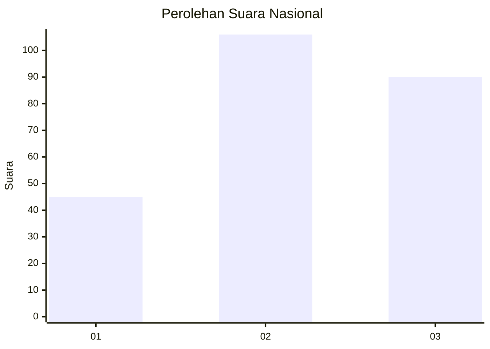
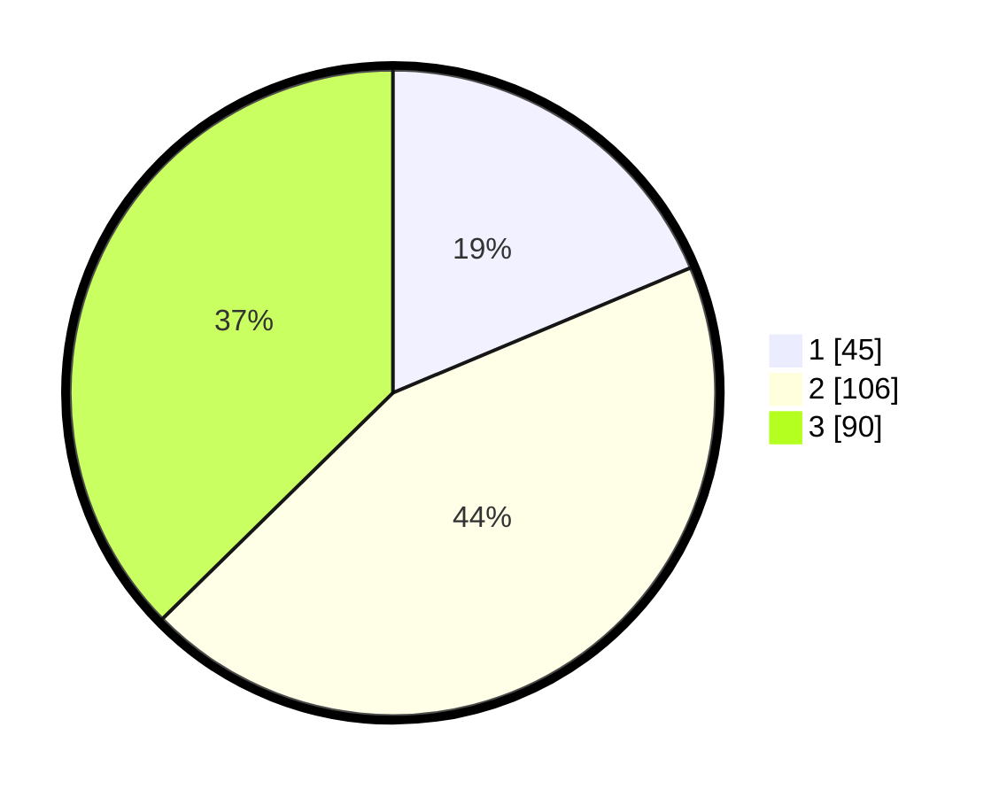

# Hasil

## Grafik

## Tabel

| No. | Nama Paslon    | Suara | Suara (raw) | Persentase |
|:--- |:-------------- | -----:| -----------:| ----------:|
| 1   | ANIES MUHAIMIN | 45    | [45][p-1]   | 18,67      |
| 2   | PRABOWO GIBRAN | 106   | [106][p-2]  | 43,98      |
| 3   | GANJAR MAHFUD  | 90    | [90][p-3]   | 37,34      |

[p-1]: https://github.com/gigit-pemilu/pemilu-2024/blob/main/pilpres/hitung-suara/sub/34-di-yogyakarta/sub/02-bantul/sub/12-banguntapan/sub/2002-banguntapan/sub/041-tps/sub/paslon-1.txt
[p-2]: https://github.com/gigit-pemilu/pemilu-2024/blob/main/pilpres/hitung-suara/sub/34-di-yogyakarta/sub/02-bantul/sub/12-banguntapan/sub/2002-banguntapan/sub/041-tps/sub/paslon-2.txt
[p-3]: https://github.com/gigit-pemilu/pemilu-2024/blob/main/pilpres/hitung-suara/sub/34-di-yogyakarta/sub/02-bantul/sub/12-banguntapan/sub/2002-banguntapan/sub/041-tps/sub/paslon-3.txt

## Foto C Plano

https://sirekap-obj-formc.kpu.go.id/4723/pemilu/ppwp/34/02/12/20/02/3402122002041-20240215-053302--c9e414b5-a922-4ad5-962d-09740614143c.jpg

https://sirekap-obj-formc.kpu.go.id/4723/pemilu/ppwp/34/02/12/20/02/3402122002041-20240215-053450--6b11a132-bd06-4a9d-9490-16b6eed3fd94.jpg

https://sirekap-obj-formc.kpu.go.id/4723/pemilu/ppwp/34/02/12/20/02/3402122002041-20240215-053759--67b313e8-772b-442e-bac9-808501c0f93f.jpg

## Metadata

| Key        | Value               |
| ---------- | ------------------- |
| Time Stamp | 2024-02-24 22:31:28 |

