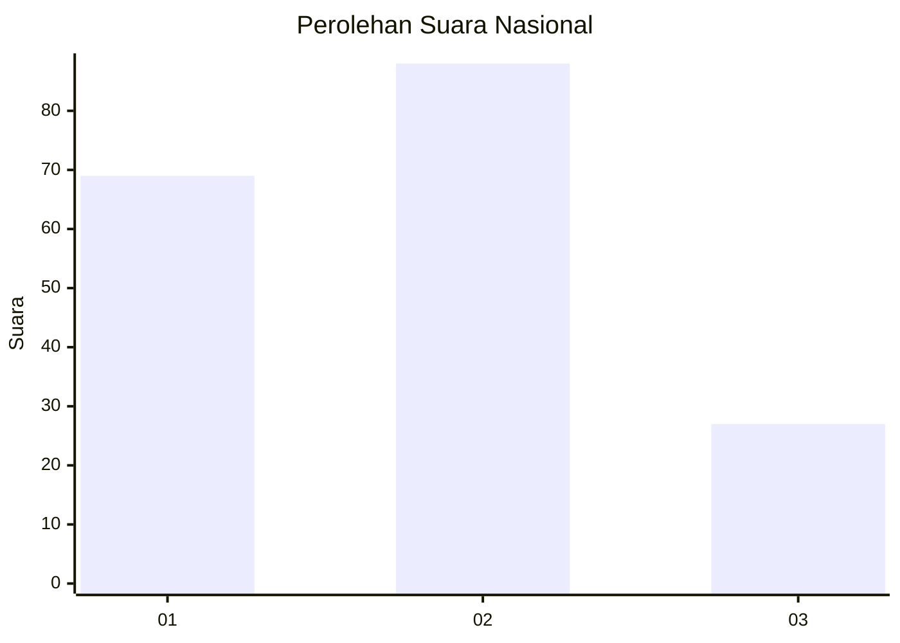
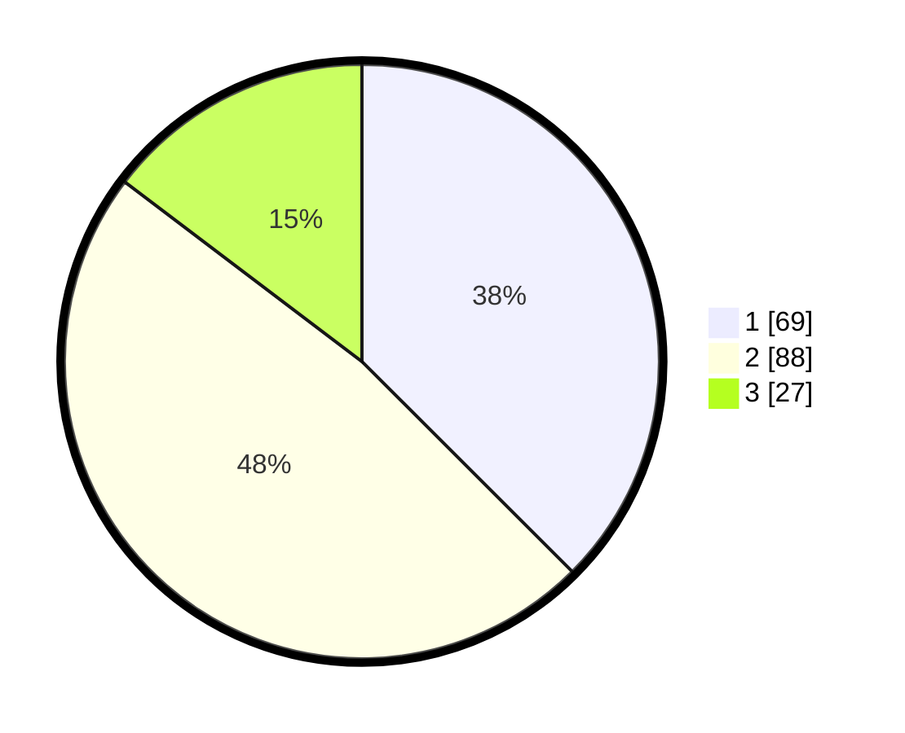

# Hasil

## Grafik

## Tabel

| No. | Nama Paslon    | Suara | Suara (raw) | Persentase |
|:--- |:-------------- | -----:| -----------:| ----------:|
| 1   | ANIES MUHAIMIN | 69    | [69][p-1]   | 37,50      |
| 2   | PRABOWO GIBRAN | 88    | [88][p-2]   | 47,83      |
| 3   | GANJAR MAHFUD  | 27    | [27][p-3]   | 14,67      |

[p-1]: https://github.com/gigit-pemilu/pemilu-2024/blob/main/pilpres/hitung-suara/sub/34-di-yogyakarta/sub/02-bantul/sub/12-banguntapan/sub/2002-banguntapan/sub/047-tps/sub/paslon-1.txt
[p-2]: https://github.com/gigit-pemilu/pemilu-2024/blob/main/pilpres/hitung-suara/sub/34-di-yogyakarta/sub/02-bantul/sub/12-banguntapan/sub/2002-banguntapan/sub/047-tps/sub/paslon-2.txt
[p-3]: https://github.com/gigit-pemilu/pemilu-2024/blob/main/pilpres/hitung-suara/sub/34-di-yogyakarta/sub/02-bantul/sub/12-banguntapan/sub/2002-banguntapan/sub/047-tps/sub/paslon-3.txt

## Foto C Plano

https://sirekap-obj-formc.kpu.go.id/f118/pemilu/ppwp/34/02/12/20/02/3402122002047-20240214-205514--f235f176-cd69-4c63-b364-d080bc760a93.jpg

https://sirekap-obj-formc.kpu.go.id/f118/pemilu/ppwp/34/02/12/20/02/3402122002047-20240214-205518--f46c6f81-2ade-495a-964f-ee791933f2cc.jpg

https://sirekap-obj-formc.kpu.go.id/f118/pemilu/ppwp/34/02/12/20/02/3402122002047-20240214-205522--ece6d848-1c1d-4c66-92a5-d27b1d40b37d.jpg

## Metadata

| Key        | Value               |
| ---------- | ------------------- |
| Time Stamp | 2024-02-26 18:00:00 |

