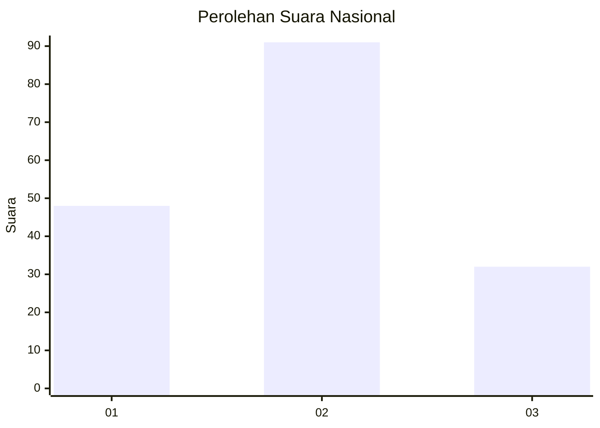
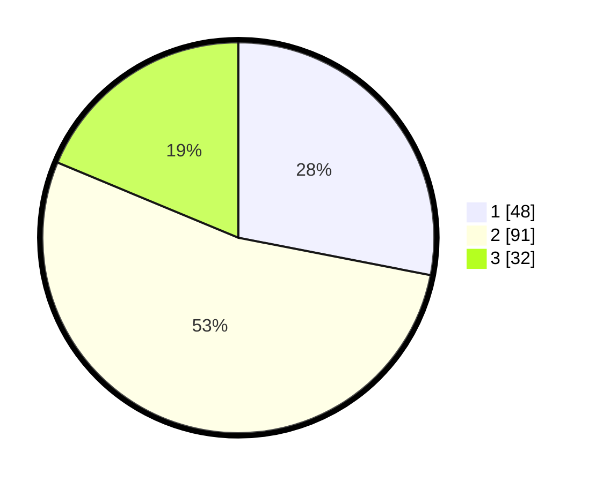

# Hasil

## Grafik

## Tabel

| No. | Nama Paslon    | Suara | Suara (raw) | Persentase |
|:--- |:-------------- | -----:| -----------:| ----------:|
| 1   | ANIES MUHAIMIN | 48    | [48][p-1]   | 28,07      |
| 2   | PRABOWO GIBRAN | 91    | [91][p-2]   | 53,22      |
| 3   | GANJAR MAHFUD  | 32    | [32][p-3]   | 18,71      |

[p-1]: https://github.com/gigit-pemilu/pemilu-2024/blob/main/pilpres/hitung-suara/sub/34-di-yogyakarta/sub/02-bantul/sub/12-banguntapan/sub/2002-banguntapan/sub/048-tps/sub/paslon-1.txt
[p-2]: https://github.com/gigit-pemilu/pemilu-2024/blob/main/pilpres/hitung-suara/sub/34-di-yogyakarta/sub/02-bantul/sub/12-banguntapan/sub/2002-banguntapan/sub/048-tps/sub/paslon-2.txt
[p-3]: https://github.com/gigit-pemilu/pemilu-2024/blob/main/pilpres/hitung-suara/sub/34-di-yogyakarta/sub/02-bantul/sub/12-banguntapan/sub/2002-banguntapan/sub/048-tps/sub/paslon-3.txt

## Foto C Plano

https://sirekap-obj-formc.kpu.go.id/ac7b/pemilu/ppwp/34/02/12/20/02/3402122002048-20240215-001933--9ed2ad0e-7d3a-43b2-a33a-06f6bc50a1e1.jpg

https://sirekap-obj-formc.kpu.go.id/ac7b/pemilu/ppwp/34/02/12/20/02/3402122002048-20240215-002052--d639b685-dd32-4a6a-bccc-783c19b187b3.jpg

https://sirekap-obj-formc.kpu.go.id/ac7b/pemilu/ppwp/34/02/12/20/02/3402122002048-20240215-002213--20b6c227-a0c0-451f-ae76-c80fa3515def.jpg

## Metadata

| Key        | Value               |
| ---------- | ------------------- |
| Time Stamp | 2024-02-25 16:00:00 |

