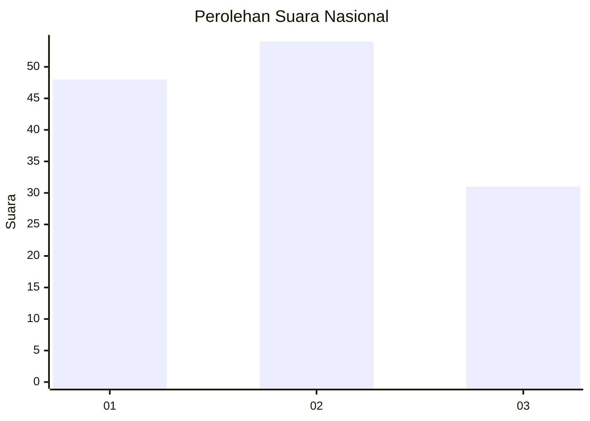
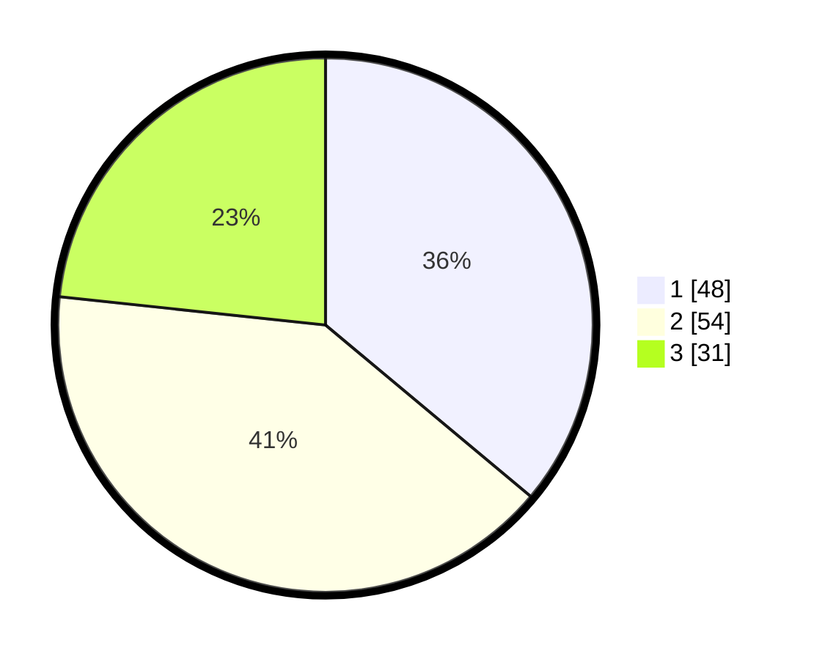

# Hasil

## Grafik

## Tabel

| No. | Nama Paslon    | Suara | Suara (raw) | Persentase |
|:--- |:-------------- | -----:| -----------:| ----------:|
| 1   | ANIES MUHAIMIN | 48    | [48][p-1]   | 36,09      |
| 2   | PRABOWO GIBRAN | 54    | [54][p-2]   | 40,60      |
| 3   | GANJAR MAHFUD  | 31    | [31][p-3]   | 23,31      |

[p-1]: https://github.com/gigit-pemilu/pemilu-2024/blob/main/pilpres/hitung-suara/sub/34-di-yogyakarta/sub/02-bantul/sub/12-banguntapan/sub/2002-banguntapan/sub/052-tps/sub/paslon-1.txt
[p-2]: https://github.com/gigit-pemilu/pemilu-2024/blob/main/pilpres/hitung-suara/sub/34-di-yogyakarta/sub/02-bantul/sub/12-banguntapan/sub/2002-banguntapan/sub/052-tps/sub/paslon-2.txt
[p-3]: https://github.com/gigit-pemilu/pemilu-2024/blob/main/pilpres/hitung-suara/sub/34-di-yogyakarta/sub/02-bantul/sub/12-banguntapan/sub/2002-banguntapan/sub/052-tps/sub/paslon-3.txt

## Foto C Plano

https://sirekap-obj-formc.kpu.go.id/f956/pemilu/ppwp/34/02/12/20/02/3402122002052-20240214-221328--1e69590b-be61-40a9-a699-ab213644460e.jpg

https://sirekap-obj-formc.kpu.go.id/f956/pemilu/ppwp/34/02/12/20/02/3402122002052-20240214-221548--d5d0858c-35f1-4032-a134-264d88083409.jpg

https://sirekap-obj-formc.kpu.go.id/f956/pemilu/ppwp/34/02/12/20/02/3402122002052-20240214-221727--33c7e521-63b3-4f88-b2ed-475566180cf4.jpg

## Metadata

| Key        | Value               |
| ---------- | ------------------- |
| Time Stamp | 2024-02-22 09:00:00 |

