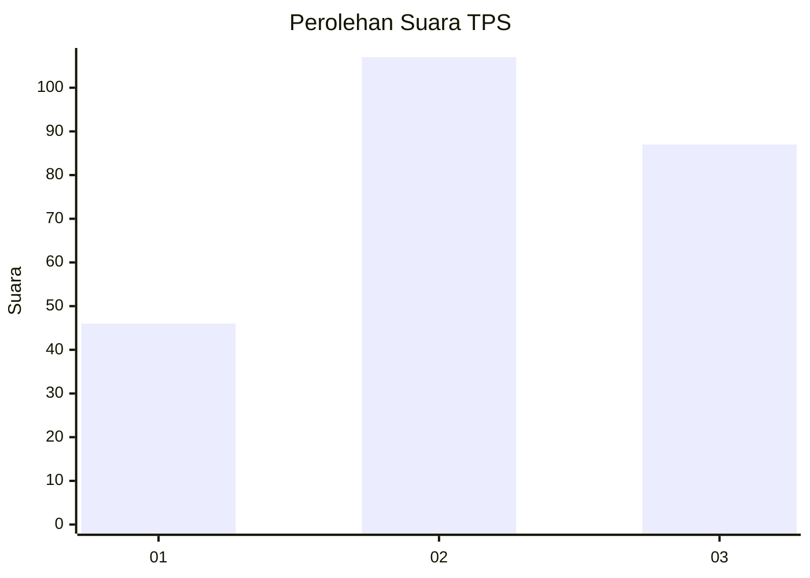
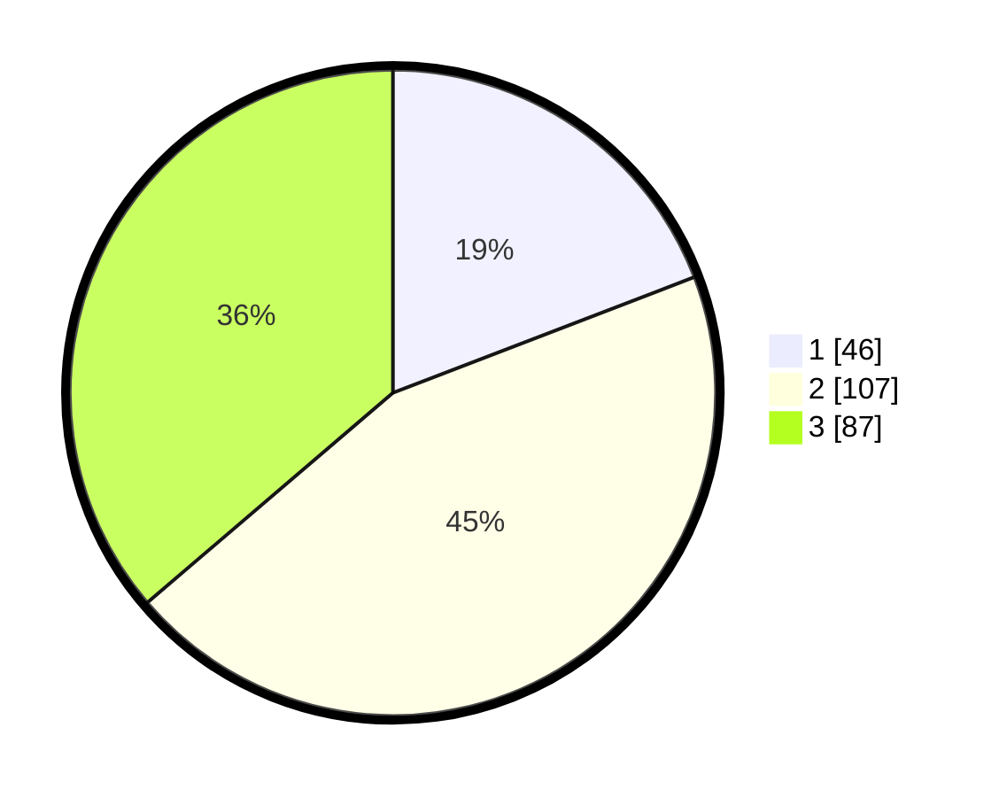

# Hasil

## Grafik

## Tabel

| No. | Nama Paslon    | Suara | Suara (raw) | Persentase |
|:--- |:-------------- | -----:| -----------:| ----------:|
| 1   | ANIES MUHAIMIN | 46    | [46][p-1]   | 19,17      |
| 2   | PRABOWO GIBRAN | 107   | [107][p-2]  | 44,58      |
| 3   | GANJAR MAHFUD  | 87    | [87][p-3]   | 36,25      |

[p-1]: https://github.com/gigit-pemilu/pemilu-2024-34-di-yogyakarta/blob/main/pilpres/hitung-suara/sub/34-di-yogyakarta/sub/02-bantul/sub/12-banguntapan/sub/2002-banguntapan/sub/058-tps/sub/paslon-1.txt
[p-2]: https://github.com/gigit-pemilu/pemilu-2024-34-di-yogyakarta/blob/main/pilpres/hitung-suara/sub/34-di-yogyakarta/sub/02-bantul/sub/12-banguntapan/sub/2002-banguntapan/sub/058-tps/sub/paslon-2.txt
[p-3]: https://github.com/gigit-pemilu/pemilu-2024-34-di-yogyakarta/blob/main/pilpres/hitung-suara/sub/34-di-yogyakarta/sub/02-bantul/sub/12-banguntapan/sub/2002-banguntapan/sub/058-tps/sub/paslon-3.txt

## Foto C Plano

https://sirekap-obj-formc.kpu.go.id/5c3b/pemilu/ppwp/34/02/12/20/02/3402122002058-20240214-221448--dd4f9780-cb63-4d10-8bbe-6de1eb7ee147.jpg

https://sirekap-obj-formc.kpu.go.id/5c3b/pemilu/ppwp/34/02/12/20/02/3402122002058-20240214-224152--cfc3d79d-0718-4eda-bbba-dd3a4a02a1d6.jpg

https://sirekap-obj-formc.kpu.go.id/5c3b/pemilu/ppwp/34/02/12/20/02/3402122002058-20240214-224356--c9798ab4-3135-45e1-9b63-1ad03c3602aa.jpg

## Metadata

| Key        | Value               |
| ---------- | ------------------- |
| Time Stamp | 2024-02-24 22:31:28 |

