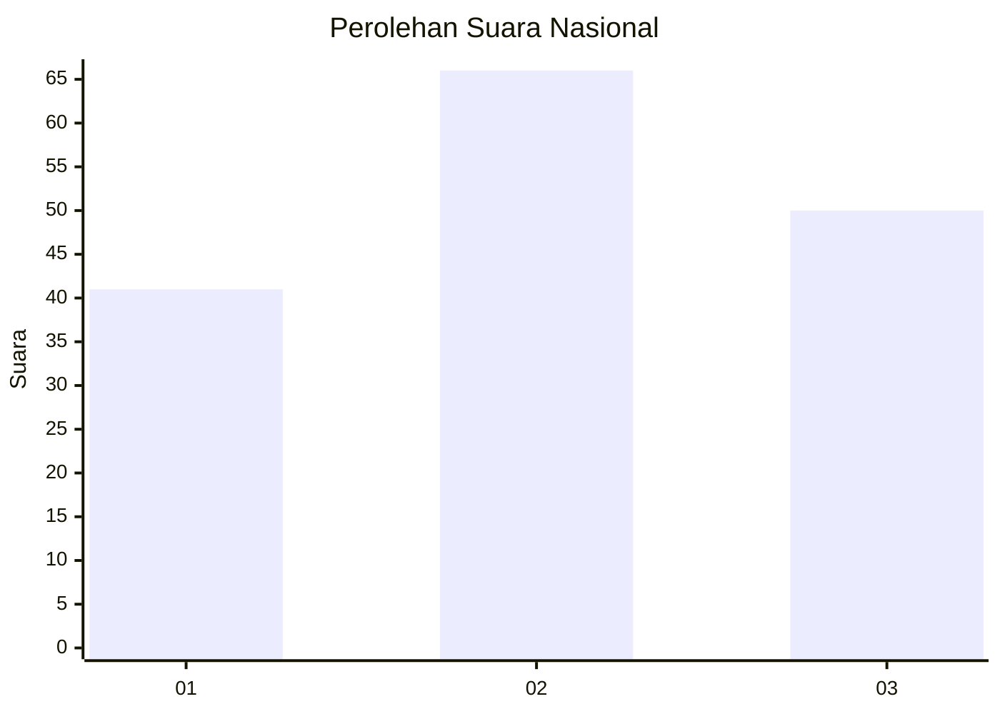
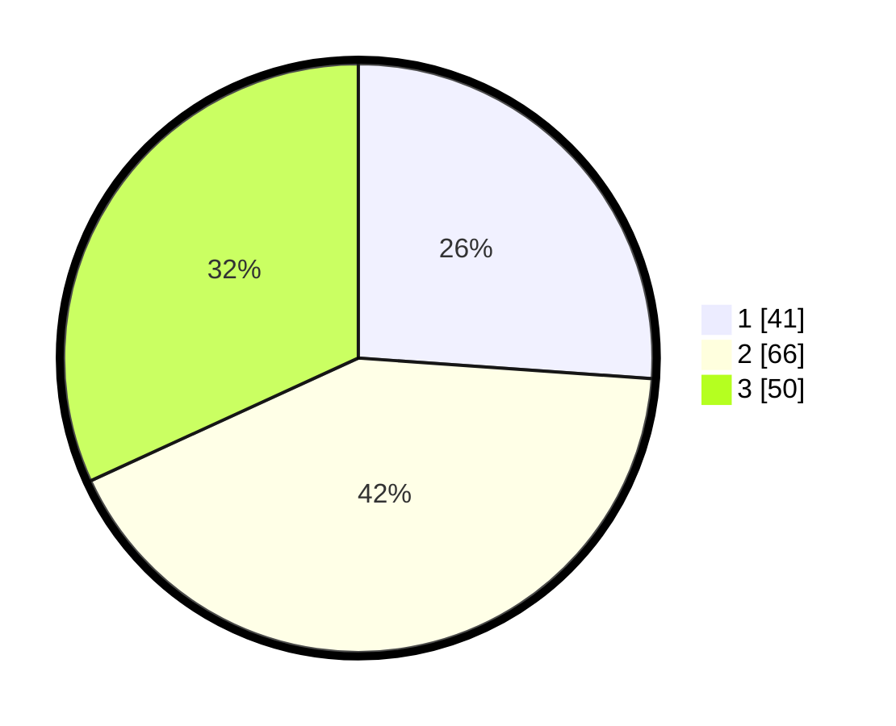

# Hasil

## Grafik

## Tabel

| No. | Nama Paslon    | Suara | Suara (raw) | Persentase |
|:--- |:-------------- | -----:| -----------:| ----------:|
| 1   | ANIES MUHAIMIN | 41    | [41][p-1]   | 26,11      |
| 2   | PRABOWO GIBRAN | 66    | [66][p-2]   | 42,04      |
| 3   | GANJAR MAHFUD  | 50    | [50][p-3]   | 31,85      |

[p-1]: https://github.com/gigit-pemilu/pemilu-2024/blob/main/pilpres/hitung-suara/sub/34-di-yogyakarta/sub/02-bantul/sub/12-banguntapan/sub/2002-banguntapan/sub/062-tps/sub/paslon-1.txt
[p-2]: https://github.com/gigit-pemilu/pemilu-2024/blob/main/pilpres/hitung-suara/sub/34-di-yogyakarta/sub/02-bantul/sub/12-banguntapan/sub/2002-banguntapan/sub/062-tps/sub/paslon-2.txt
[p-3]: https://github.com/gigit-pemilu/pemilu-2024/blob/main/pilpres/hitung-suara/sub/34-di-yogyakarta/sub/02-bantul/sub/12-banguntapan/sub/2002-banguntapan/sub/062-tps/sub/paslon-3.txt

## Foto C Plano

https://sirekap-obj-formc.kpu.go.id/8d8a/pemilu/ppwp/34/02/12/20/02/3402122002062-20240215-040716--47d26337-17cf-4041-bd17-0fae03730c6c.jpg

https://sirekap-obj-formc.kpu.go.id/8d8a/pemilu/ppwp/34/02/12/20/02/3402122002062-20240215-040732--aebd31a2-cc7a-4165-b549-bfc73bab8bad.jpg

https://sirekap-obj-formc.kpu.go.id/8d8a/pemilu/ppwp/34/02/12/20/02/3402122002062-20240215-040739--cdeeed74-f589-4baa-a297-361b291a64e9.jpg

## Metadata

| Key        | Value               |
| ---------- | ------------------- |
| Time Stamp | 2024-02-25 10:00:00 |

