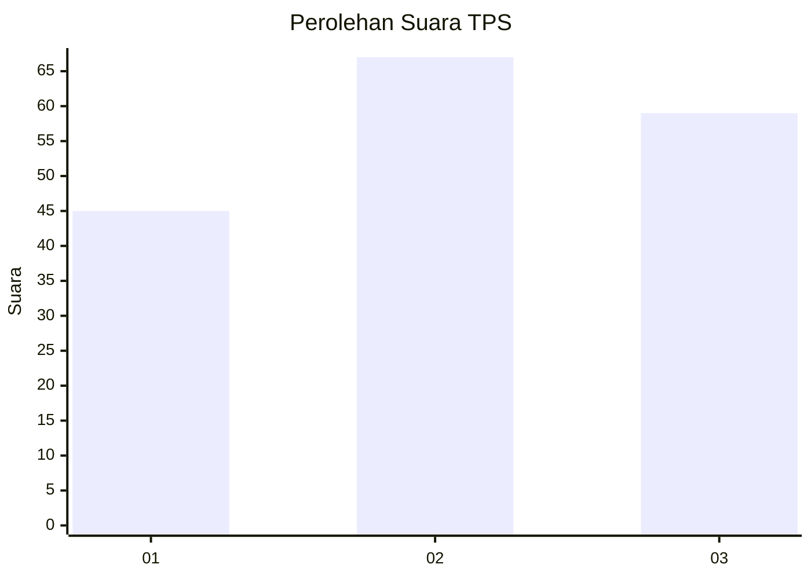
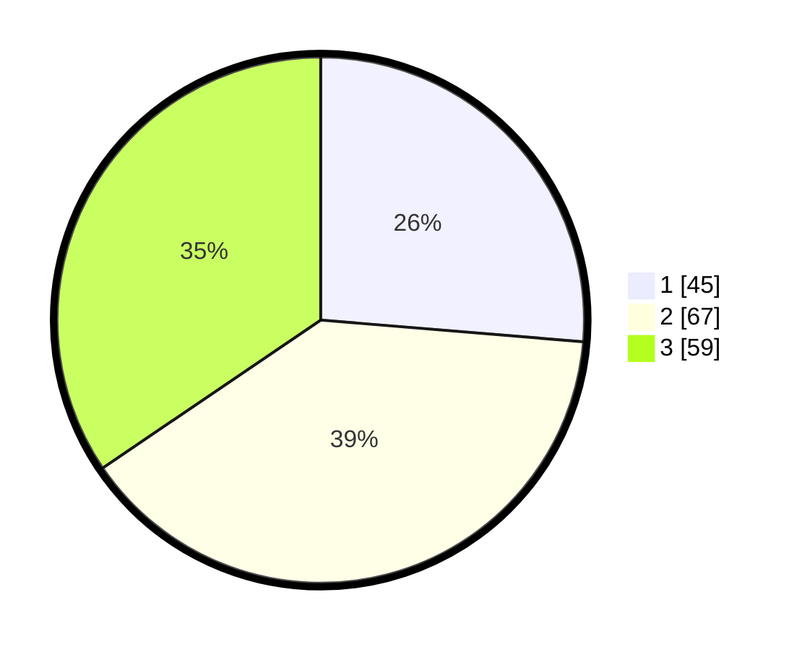

# Hasil

## Grafik

## Tabel

| No. | Nama Paslon    | Suara | Suara (raw) | Persentase |
|:--- |:-------------- | -----:| -----------:| ----------:|
| 1   | ANIES MUHAIMIN | 45    | [45][p-1]   | 26,32      |
| 2   | PRABOWO GIBRAN | 67    | [67][p-2]   | 39,18      |
| 3   | GANJAR MAHFUD  | 59    | [59][p-3]   | 34,50      |

[p-1]: https://github.com/gigit-pemilu/pemilu-2024-34-di-yogyakarta/blob/main/pilpres/hitung-suara/sub/34-di-yogyakarta/sub/02-bantul/sub/12-banguntapan/sub/2002-banguntapan/sub/063-tps/sub/paslon-1.txt
[p-2]: https://github.com/gigit-pemilu/pemilu-2024-34-di-yogyakarta/blob/main/pilpres/hitung-suara/sub/34-di-yogyakarta/sub/02-bantul/sub/12-banguntapan/sub/2002-banguntapan/sub/063-tps/sub/paslon-2.txt
[p-3]: https://github.com/gigit-pemilu/pemilu-2024-34-di-yogyakarta/blob/main/pilpres/hitung-suara/sub/34-di-yogyakarta/sub/02-bantul/sub/12-banguntapan/sub/2002-banguntapan/sub/063-tps/sub/paslon-3.txt

## Foto C Plano

https://sirekap-obj-formc.kpu.go.id/7742/pemilu/ppwp/34/02/12/20/02/3402122002063-20240214-190317--3f163334-40e3-47ea-b9e9-f3e259d72a9d.jpg

https://sirekap-obj-formc.kpu.go.id/7742/pemilu/ppwp/34/02/12/20/02/3402122002063-20240214-184525--37b34324-b288-4d5a-8642-0fb3c05f7ac7.jpg

https://sirekap-obj-formc.kpu.go.id/7742/pemilu/ppwp/34/02/12/20/02/3402122002063-20240214-184853--b6f677d4-9fbc-49b6-9b3c-3cf9aaa9f308.jpg

## Metadata

| Key        | Value               |
| ---------- | ------------------- |
| Time Stamp | 2024-02-24 22:31:28 |

