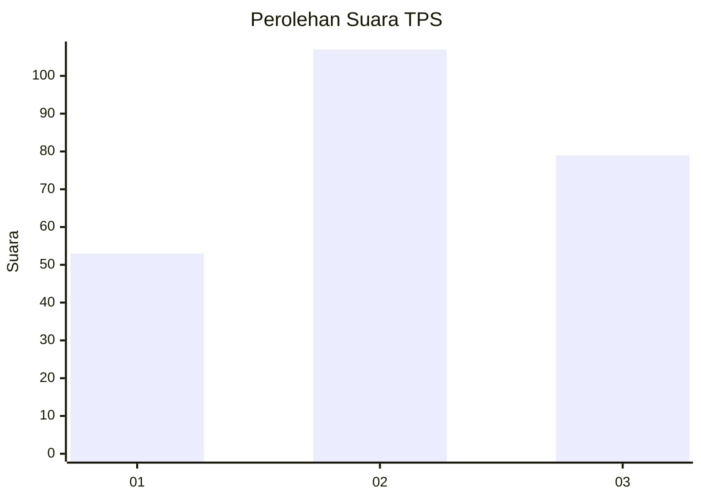
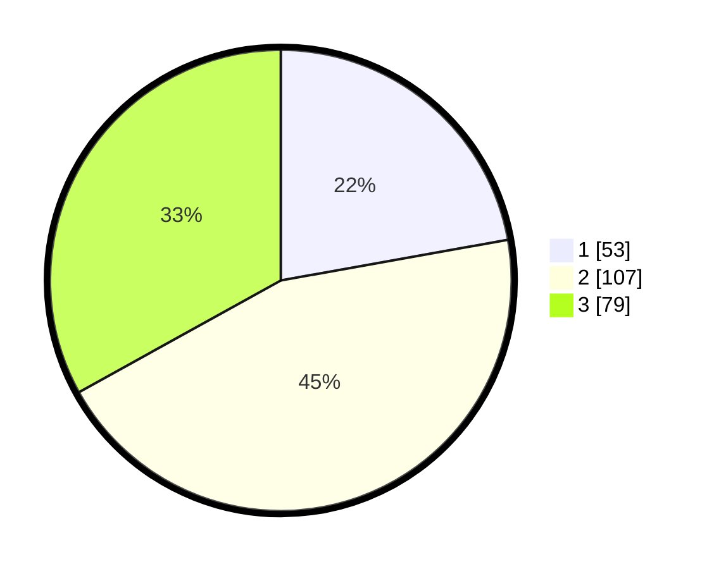

# Hasil

## Grafik

## Tabel

| No. | Nama Paslon    | Suara | Suara (raw) | Persentase |
|:--- |:-------------- | -----:| -----------:| ----------:|
| 1   | ANIES MUHAIMIN | 53    | [53][p-1]   | 22,18      |
| 2   | PRABOWO GIBRAN | 107   | [107][p-2]  | 44,77      |
| 3   | GANJAR MAHFUD  | 79    | [79][p-3]   | 33,05      |

[p-1]: https://github.com/gigit-pemilu/pemilu-2024-34-di-yogyakarta/blob/main/pilpres/hitung-suara/sub/34-di-yogyakarta/sub/02-bantul/sub/12-banguntapan/sub/2002-banguntapan/sub/066-tps/sub/paslon-1.txt
[p-2]: https://github.com/gigit-pemilu/pemilu-2024-34-di-yogyakarta/blob/main/pilpres/hitung-suara/sub/34-di-yogyakarta/sub/02-bantul/sub/12-banguntapan/sub/2002-banguntapan/sub/066-tps/sub/paslon-2.txt
[p-3]: https://github.com/gigit-pemilu/pemilu-2024-34-di-yogyakarta/blob/main/pilpres/hitung-suara/sub/34-di-yogyakarta/sub/02-bantul/sub/12-banguntapan/sub/2002-banguntapan/sub/066-tps/sub/paslon-3.txt

## Foto C Plano

https://sirekap-obj-formc.kpu.go.id/8d31/pemilu/ppwp/34/02/12/20/02/3402122002066-20240215-005701--d05531b3-15d2-4107-ad6d-a40e6fe25c82.jpg

https://sirekap-obj-formc.kpu.go.id/8d31/pemilu/ppwp/34/02/12/20/02/3402122002066-20240215-005929--41d597d9-5d18-49e7-b98f-1ea5a6614986.jpg

https://sirekap-obj-formc.kpu.go.id/8d31/pemilu/ppwp/34/02/12/20/02/3402122002066-20240215-010039--6fd18939-2375-470d-9168-ca59f3ec3a93.jpg

## Metadata

| Key        | Value               |
| ---------- | ------------------- |
| Time Stamp | 2024-02-24 22:31:28 |

