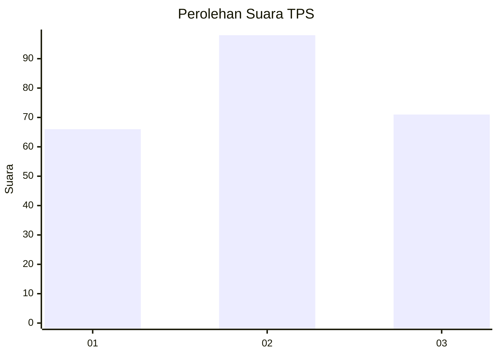
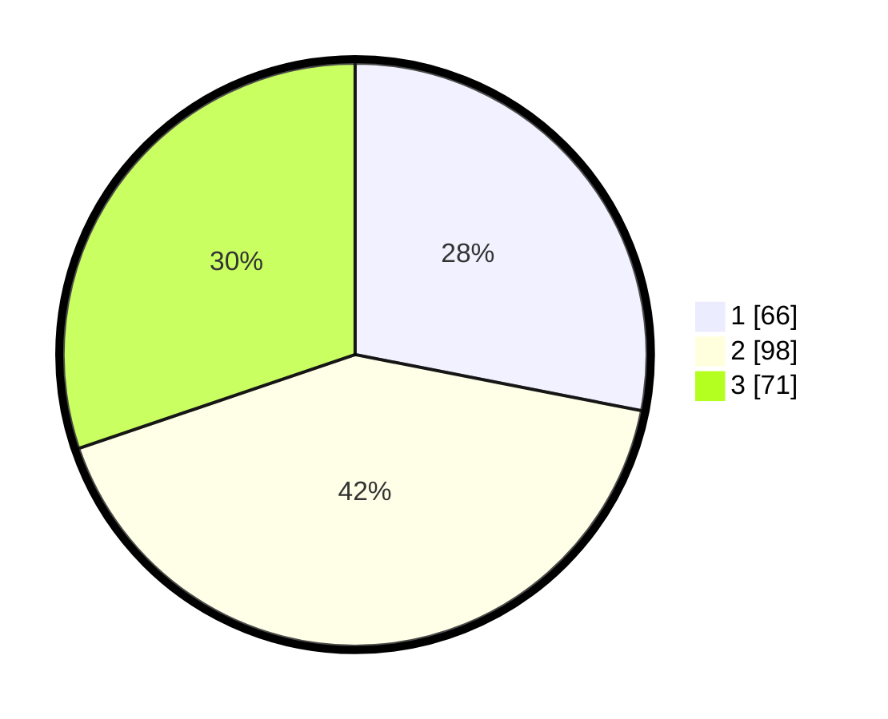

# Hasil

## Grafik

## Tabel

| No. | Nama Paslon    | Suara | Suara (raw) | Persentase |
|:--- |:-------------- | -----:| -----------:| ----------:|
| 1   | ANIES MUHAIMIN | 66    | [66][p-1]   | 28,09      |
| 2   | PRABOWO GIBRAN | 98    | [98][p-2]   | 41,70      |
| 3   | GANJAR MAHFUD  | 71    | [71][p-3]   | 30,21      |

[p-1]: https://github.com/gigit-pemilu/pemilu-2024-34-di-yogyakarta/blob/main/pilpres/hitung-suara/sub/34-di-yogyakarta/sub/02-bantul/sub/12-banguntapan/sub/2002-banguntapan/sub/067-tps/sub/paslon-1.txt
[p-2]: https://github.com/gigit-pemilu/pemilu-2024-34-di-yogyakarta/blob/main/pilpres/hitung-suara/sub/34-di-yogyakarta/sub/02-bantul/sub/12-banguntapan/sub/2002-banguntapan/sub/067-tps/sub/paslon-2.txt
[p-3]: https://github.com/gigit-pemilu/pemilu-2024-34-di-yogyakarta/blob/main/pilpres/hitung-suara/sub/34-di-yogyakarta/sub/02-bantul/sub/12-banguntapan/sub/2002-banguntapan/sub/067-tps/sub/paslon-3.txt

## Foto C Plano

https://sirekap-obj-formc.kpu.go.id/9858/pemilu/ppwp/34/02/12/20/02/3402122002067-20240214-194447--bdd07d6c-75d6-4d52-a68e-38b3708e2a08.jpg

https://sirekap-obj-formc.kpu.go.id/9858/pemilu/ppwp/34/02/12/20/02/3402122002067-20240214-194538--2b222f22-a516-405d-9de9-62fc067efd74.jpg

https://sirekap-obj-formc.kpu.go.id/9858/pemilu/ppwp/34/02/12/20/02/3402122002067-20240214-213747--77b7b982-ab47-430c-944b-e64ca22d7190.jpg

## Metadata

| Key        | Value               |
| ---------- | ------------------- |
| Time Stamp | 2024-02-24 22:31:28 |

