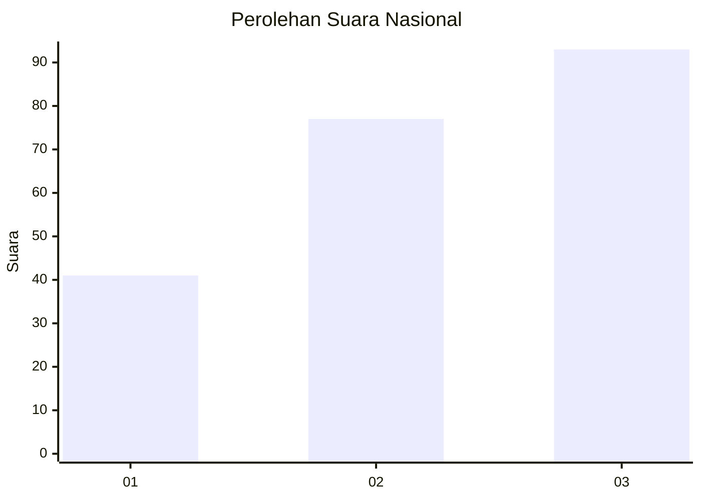
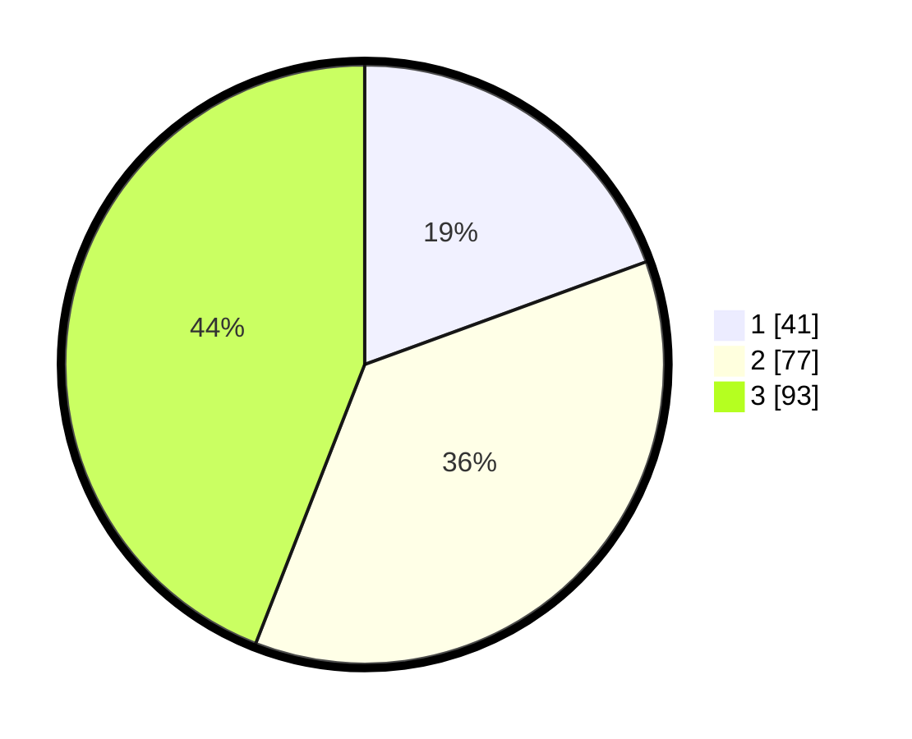

# Hasil

## Grafik

## Tabel

| No. | Nama Paslon    | Suara | Suara (raw) | Persentase |
|:--- |:-------------- | -----:| -----------:| ----------:|
| 1   | ANIES MUHAIMIN | 41    | [41][p-1]   | 19,43      |
| 2   | PRABOWO GIBRAN | 77    | [77][p-2]   | 36,49      |
| 3   | GANJAR MAHFUD  | 93    | [93][p-3]   | 44,08      |

[p-1]: https://github.com/gigit-pemilu/pemilu-2024/blob/main/pilpres/hitung-suara/sub/34-di-yogyakarta/sub/02-bantul/sub/12-banguntapan/sub/2002-banguntapan/sub/075-tps/sub/paslon-1.txt
[p-2]: https://github.com/gigit-pemilu/pemilu-2024/blob/main/pilpres/hitung-suara/sub/34-di-yogyakarta/sub/02-bantul/sub/12-banguntapan/sub/2002-banguntapan/sub/075-tps/sub/paslon-2.txt
[p-3]: https://github.com/gigit-pemilu/pemilu-2024/blob/main/pilpres/hitung-suara/sub/34-di-yogyakarta/sub/02-bantul/sub/12-banguntapan/sub/2002-banguntapan/sub/075-tps/sub/paslon-3.txt

## Foto C Plano

https://sirekap-obj-formc.kpu.go.id/0f5c/pemilu/ppwp/34/02/12/20/02/3402122002075-20240214-210212--106d7c74-3c9d-4be3-b49a-f097a000944d.jpg

https://sirekap-obj-formc.kpu.go.id/0f5c/pemilu/ppwp/34/02/12/20/02/3402122002075-20240214-155622--3d102352-7ddd-4775-99b1-70f6cf28fa8f.jpg

https://sirekap-obj-formc.kpu.go.id/0f5c/pemilu/ppwp/34/02/12/20/02/3402122002075-20240214-155807--86fc0d54-eb4e-4211-a4e6-8438ae07aec3.jpg

## Metadata

| Key        | Value               |
| ---------- | ------------------- |
| Time Stamp | 2024-02-24 22:31:28 |

