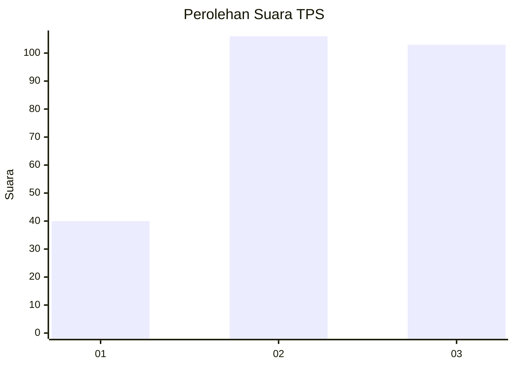
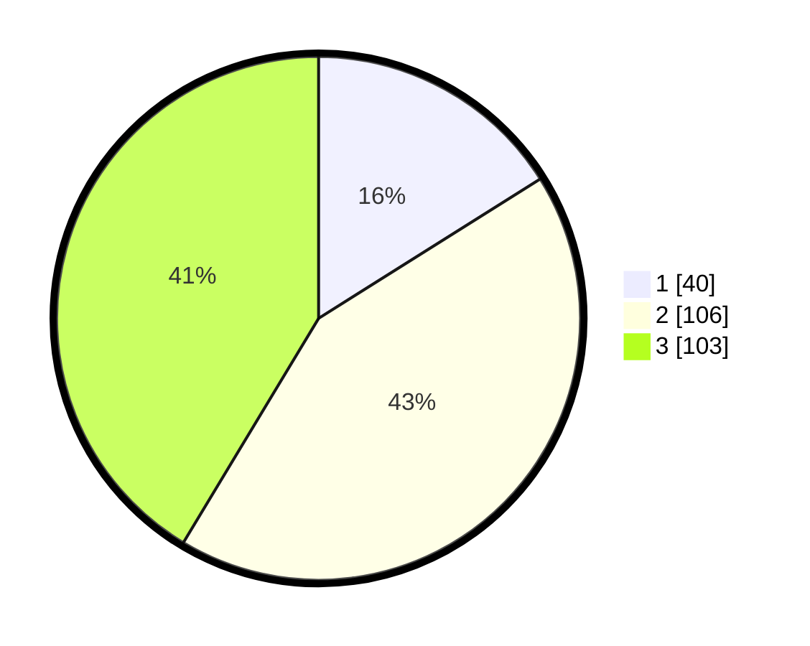

# Hasil

## Grafik

## Tabel

| No. | Nama Paslon    | Suara | Suara (raw) | Persentase |
|:--- |:-------------- | -----:| -----------:| ----------:|
| 1   | ANIES MUHAIMIN | 40    | [40][p-1]   | 16,06      |
| 2   | PRABOWO GIBRAN | 106   | [106][p-2]  | 42,57      |
| 3   | GANJAR MAHFUD  | 103   | [103][p-3]  | 41,37      |

[p-1]: https://github.com/gigit-pemilu/pemilu-2024-34-di-yogyakarta/blob/main/pilpres/hitung-suara/sub/34-di-yogyakarta/sub/02-bantul/sub/12-banguntapan/sub/2002-banguntapan/sub/083-tps/sub/paslon-1.txt
[p-2]: https://github.com/gigit-pemilu/pemilu-2024-34-di-yogyakarta/blob/main/pilpres/hitung-suara/sub/34-di-yogyakarta/sub/02-bantul/sub/12-banguntapan/sub/2002-banguntapan/sub/083-tps/sub/paslon-2.txt
[p-3]: https://github.com/gigit-pemilu/pemilu-2024-34-di-yogyakarta/blob/main/pilpres/hitung-suara/sub/34-di-yogyakarta/sub/02-bantul/sub/12-banguntapan/sub/2002-banguntapan/sub/083-tps/sub/paslon-3.txt

## Foto C Plano

https://sirekap-obj-formc.kpu.go.id/afc6/pemilu/ppwp/34/02/12/20/02/3402122002083-20240215-015715--432d2474-70a7-48f1-8433-8ee45a030249.jpg

https://sirekap-obj-formc.kpu.go.id/afc6/pemilu/ppwp/34/02/12/20/02/3402122002083-20240215-015853--14ccb43a-2def-4581-a7fb-7ca717eb4c64.jpg

https://sirekap-obj-formc.kpu.go.id/afc6/pemilu/ppwp/34/02/12/20/02/3402122002083-20240215-015925--66a8aa59-cf9b-4703-b05f-d63c7c6dcad2.jpg

## Metadata

| Key        | Value               |
| ---------- | ------------------- |
| Time Stamp | 2024-02-24 22:31:28 |

