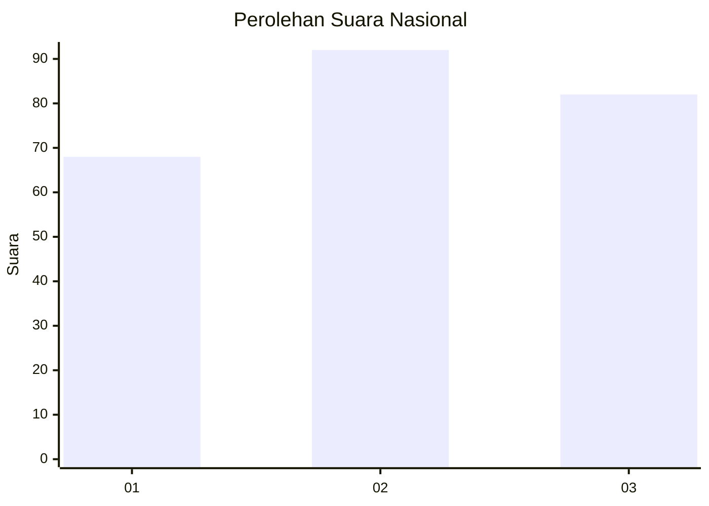
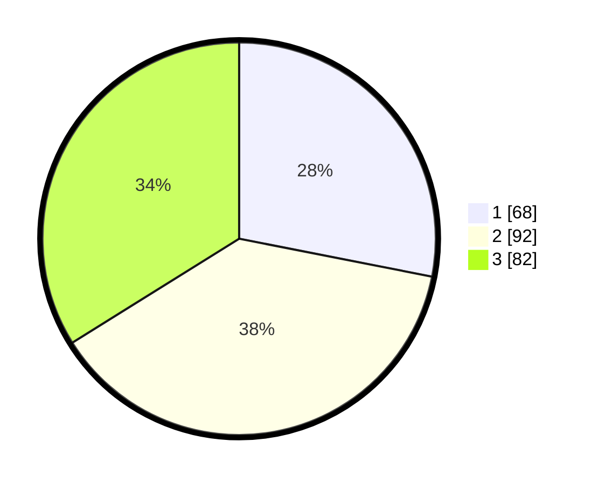

# Hasil

## Grafik

## Tabel

| No. | Nama Paslon    | Suara | Suara (raw) | Persentase |
|:--- |:-------------- | -----:| -----------:| ----------:|
| 1   | ANIES MUHAIMIN | 68    | [68][p-1]   | 28,10      |
| 2   | PRABOWO GIBRAN | 92    | [92][p-2]   | 38,02      |
| 3   | GANJAR MAHFUD  | 82    | [82][p-3]   | 33,88      |

[p-1]: https://github.com/gigit-pemilu/pemilu-2024/blob/main/pilpres/hitung-suara/sub/34-di-yogyakarta/sub/02-bantul/sub/12-banguntapan/sub/2002-banguntapan/sub/085-tps/sub/paslon-1.txt
[p-2]: https://github.com/gigit-pemilu/pemilu-2024/blob/main/pilpres/hitung-suara/sub/34-di-yogyakarta/sub/02-bantul/sub/12-banguntapan/sub/2002-banguntapan/sub/085-tps/sub/paslon-2.txt
[p-3]: https://github.com/gigit-pemilu/pemilu-2024/blob/main/pilpres/hitung-suara/sub/34-di-yogyakarta/sub/02-bantul/sub/12-banguntapan/sub/2002-banguntapan/sub/085-tps/sub/paslon-3.txt

## Foto C Plano

https://sirekap-obj-formc.kpu.go.id/bd99/pemilu/ppwp/34/02/12/20/02/3402122002085-20240215-012058--f465a10b-a2d5-4903-935d-c34e9a700877.jpg

https://sirekap-obj-formc.kpu.go.id/bd99/pemilu/ppwp/34/02/12/20/02/3402122002085-20240215-011822--c7a3191a-4bfe-415a-9712-7559dc5214eb.jpg

https://sirekap-obj-formc.kpu.go.id/bd99/pemilu/ppwp/34/02/12/20/02/3402122002085-20240215-012249--08289054-f462-4527-bd6f-2be23f27484b.jpg

## Metadata

| Key        | Value               |
| ---------- | ------------------- |
| Time Stamp | 2024-02-15 17:30:25 |

