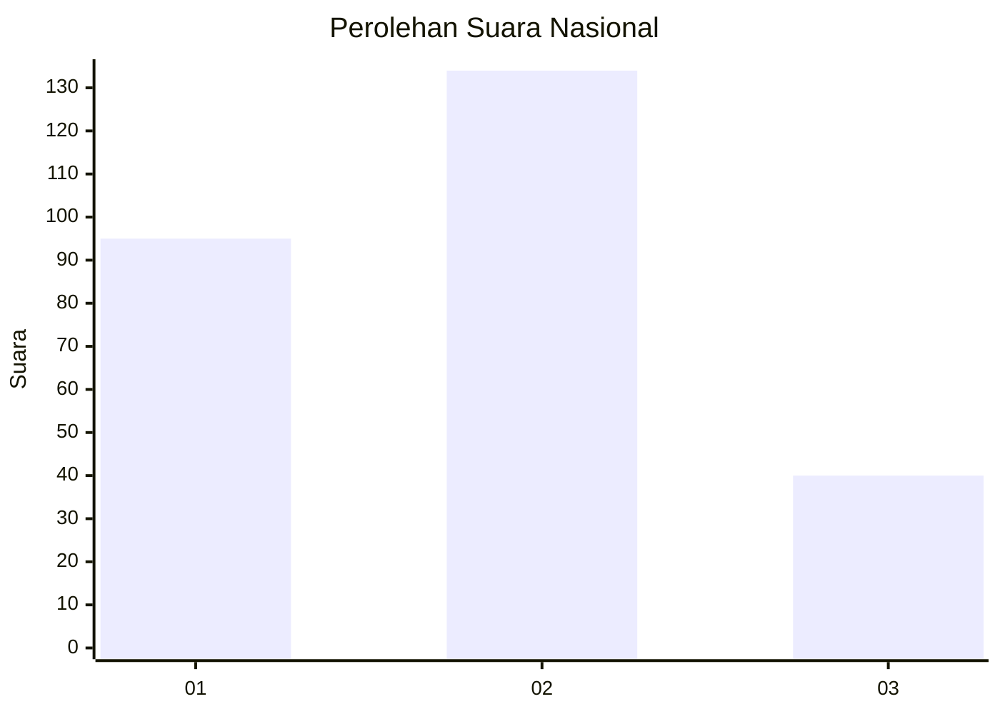
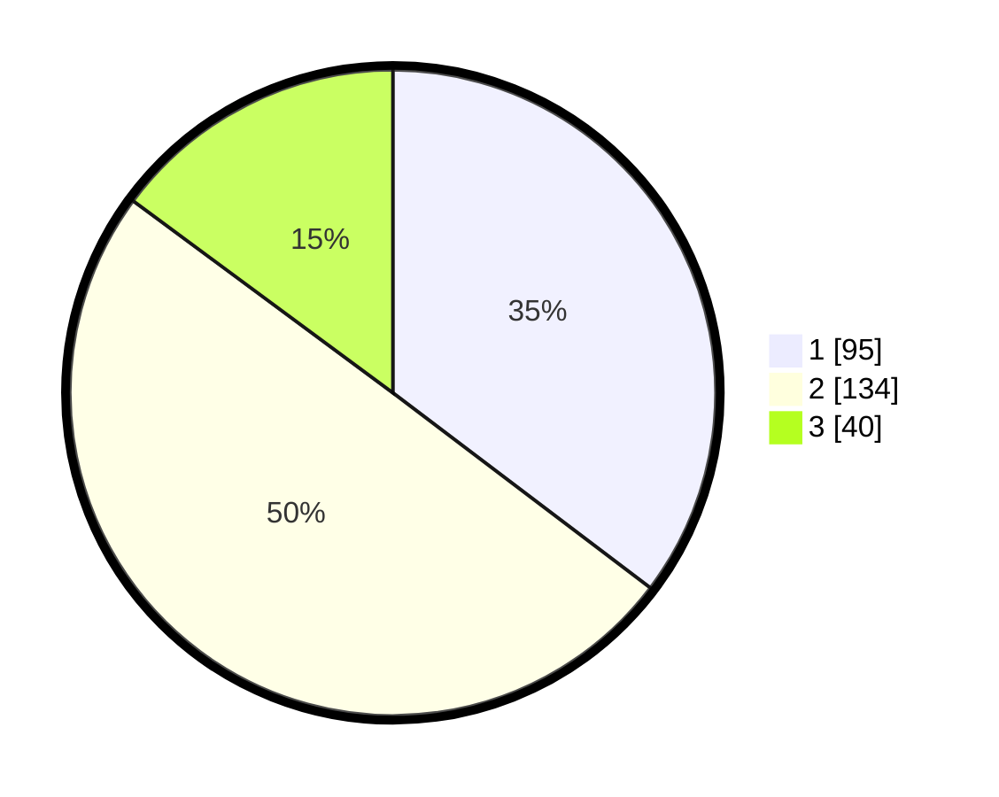

# Hasil

## Grafik

## Tabel

| No. | Nama Paslon    | Suara | Suara (raw) | Persentase |
|:--- |:-------------- | -----:| -----------:| ----------:|
| 1   | ANIES MUHAIMIN | 95    | [95][p-1]   | 35,32      |
| 2   | PRABOWO GIBRAN | 134   | [134][p-2]  | 49,81      |
| 3   | GANJAR MAHFUD  | 40    | [40][p-3]   | 14,87      |

[p-1]: https://github.com/gigit-pemilu/pemilu-2024/blob/main/pilpres/hitung-suara/sub/34-di-yogyakarta/sub/02-bantul/sub/12-banguntapan/sub/2002-banguntapan/sub/091-tps/sub/paslon-1.txt
[p-2]: https://github.com/gigit-pemilu/pemilu-2024/blob/main/pilpres/hitung-suara/sub/34-di-yogyakarta/sub/02-bantul/sub/12-banguntapan/sub/2002-banguntapan/sub/091-tps/sub/paslon-2.txt
[p-3]: https://github.com/gigit-pemilu/pemilu-2024/blob/main/pilpres/hitung-suara/sub/34-di-yogyakarta/sub/02-bantul/sub/12-banguntapan/sub/2002-banguntapan/sub/091-tps/sub/paslon-3.txt

## Foto C Plano

https://sirekap-obj-formc.kpu.go.id/e3ee/pemilu/ppwp/34/02/12/20/02/3402122002091-20240214-190555--eafca097-1bc1-421e-8a6d-31f9423445a3.jpg

https://sirekap-obj-formc.kpu.go.id/e3ee/pemilu/ppwp/34/02/12/20/02/3402122002091-20240214-185850--acb8f8bf-8c5b-4b92-98f2-206db09909a9.jpg

https://sirekap-obj-formc.kpu.go.id/e3ee/pemilu/ppwp/34/02/12/20/02/3402122002091-20240214-185954--d8e875d5-cf68-4273-9de8-eabb9180d6e0.jpg

## Metadata

| Key        | Value               |
| ---------- | ------------------- |
| Time Stamp | 2024-02-14 21:46:01 |

## DATA PEMILIH TETAP

Jumlah pemilih dalam DPT: **298**.
 * L: **142**.
 * P: **156**.

## DATA PENGGUNA HAK PILIH

Jumlah pengguna hak pilih dalam DPT: **267**.
 * L: **127**.
 * P: **140**.

Jumlah pengguna hak pilih dalam DPTb: **5**.
 * L: **0**.
 * P: **5**.

Jumlah pengguna hak pilih dalam DPK: **1**.
 * L: **1**.
 * P: **0**.

Jumlah pengguna hak pilih: **273**.
 * L: **128**.
 * P: **145**.

## JUMLAH SUARA SAH DAN TIDAK SAH

JUMLAH SELURUH SUARA SAH: **269**.

JUMLAH SUARA TIDAK SAH: **4**.

JUMLAH SELURUH SUARA SAH DAN SUARA TIDAK SAH: **273**.

