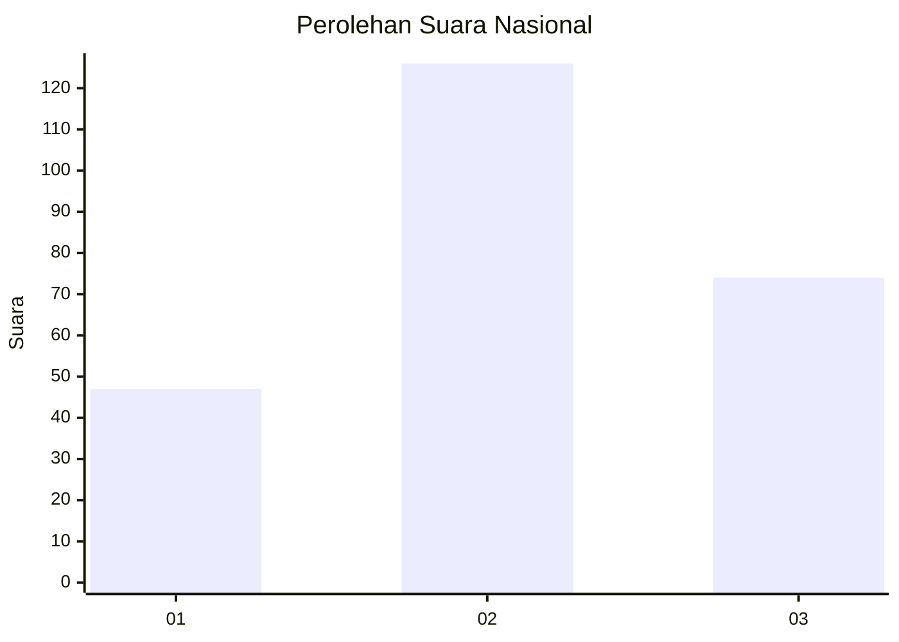
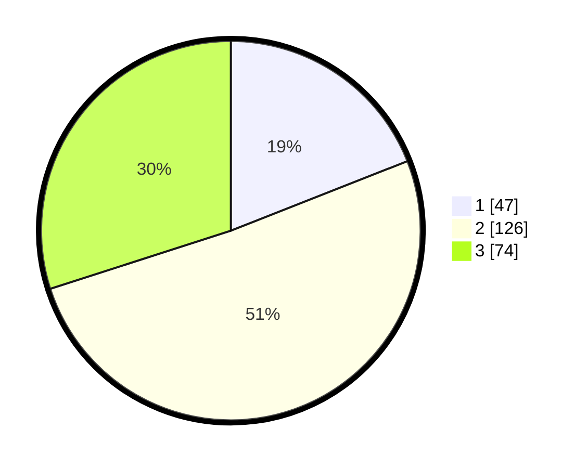

# Hasil

## Grafik

## Tabel

| No. | Nama Paslon    | Suara | Suara (raw) | Persentase |
|:--- |:-------------- | -----:| -----------:| ----------:|
| 1   | ANIES MUHAIMIN | 47    | [47][p-1]   | 19,03      |
| 2   | PRABOWO GIBRAN | 126   | [126][p-2]  | 51,01      |
| 3   | GANJAR MAHFUD  | 74    | [74][p-3]   | 29,96      |

[p-1]: https://github.com/gigit-pemilu/pemilu-2024/blob/main/pilpres/hitung-suara/sub/34-di-yogyakarta/sub/02-bantul/sub/12-banguntapan/sub/2002-banguntapan/sub/096-tps/sub/paslon-1.txt
[p-2]: https://github.com/gigit-pemilu/pemilu-2024/blob/main/pilpres/hitung-suara/sub/34-di-yogyakarta/sub/02-bantul/sub/12-banguntapan/sub/2002-banguntapan/sub/096-tps/sub/paslon-2.txt
[p-3]: https://github.com/gigit-pemilu/pemilu-2024/blob/main/pilpres/hitung-suara/sub/34-di-yogyakarta/sub/02-bantul/sub/12-banguntapan/sub/2002-banguntapan/sub/096-tps/sub/paslon-3.txt

## Foto C Plano

https://sirekap-obj-formc.kpu.go.id/dd70/pemilu/ppwp/34/02/12/20/02/3402122002096-20240214-202556--a3ce31fb-f969-4b95-9542-a6aa3259fe0f.jpg

https://sirekap-obj-formc.kpu.go.id/dd70/pemilu/ppwp/34/02/12/20/02/3402122002096-20240214-202728--89b18211-c3f6-432c-8796-4fc50383bd78.jpg

https://sirekap-obj-formc.kpu.go.id/dd70/pemilu/ppwp/34/02/12/20/02/3402122002096-20240214-202824--128f798e-bbd1-4c4e-b97b-9ced01d28dca.jpg

## Metadata

| Key        | Value               |
| ---------- | ------------------- |
| Time Stamp | 2024-02-24 22:31:28 |

