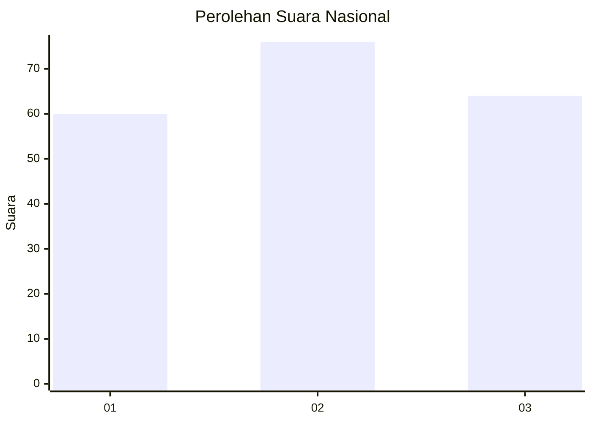
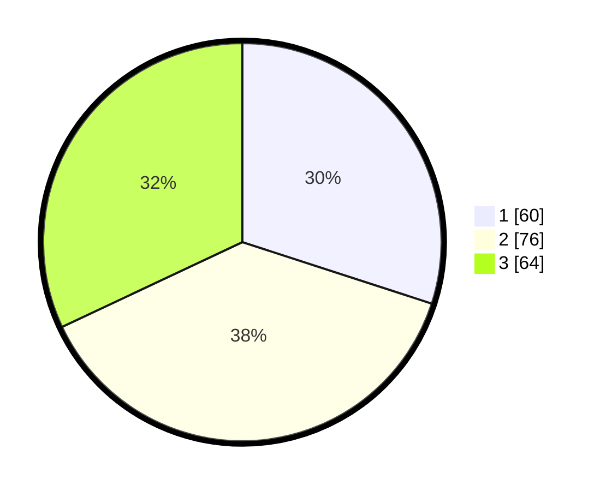

# Hasil

## Grafik

## Tabel

| No. | Nama Paslon    | Suara | Suara (raw) | Persentase |
|:--- |:-------------- | -----:| -----------:| ----------:|
| 1   | ANIES MUHAIMIN | 60    | [60][p-1]   | 30,00      |
| 2   | PRABOWO GIBRAN | 76    | [76][p-2]   | 38,00      |
| 3   | GANJAR MAHFUD  | 64    | [64][p-3]   | 32,00      |

[p-1]: https://github.com/gigit-pemilu/pemilu-2024/blob/main/pilpres/hitung-suara/sub/34-di-yogyakarta/sub/02-bantul/sub/12-banguntapan/sub/2002-banguntapan/sub/098-tps/sub/paslon-1.txt
[p-2]: https://github.com/gigit-pemilu/pemilu-2024/blob/main/pilpres/hitung-suara/sub/34-di-yogyakarta/sub/02-bantul/sub/12-banguntapan/sub/2002-banguntapan/sub/098-tps/sub/paslon-2.txt
[p-3]: https://github.com/gigit-pemilu/pemilu-2024/blob/main/pilpres/hitung-suara/sub/34-di-yogyakarta/sub/02-bantul/sub/12-banguntapan/sub/2002-banguntapan/sub/098-tps/sub/paslon-3.txt

## Foto C Plano

https://sirekap-obj-formc.kpu.go.id/31d2/pemilu/ppwp/34/02/12/20/02/3402122002098-20240215-004848--746d02ce-eaf9-43ba-bc38-bb40e8a015da.jpg

https://sirekap-obj-formc.kpu.go.id/31d2/pemilu/ppwp/34/02/12/20/02/3402122002098-20240215-005140--e1029d30-655f-413e-af5c-0d3277d13922.jpg

https://sirekap-obj-formc.kpu.go.id/31d2/pemilu/ppwp/34/02/12/20/02/3402122002098-20240215-005406--9d3b5049-438e-403c-8c42-cc1d63d3ac4c.jpg

## Metadata

| Key        | Value               |
| ---------- | ------------------- |
| Time Stamp | 2024-02-24 22:31:28 |

