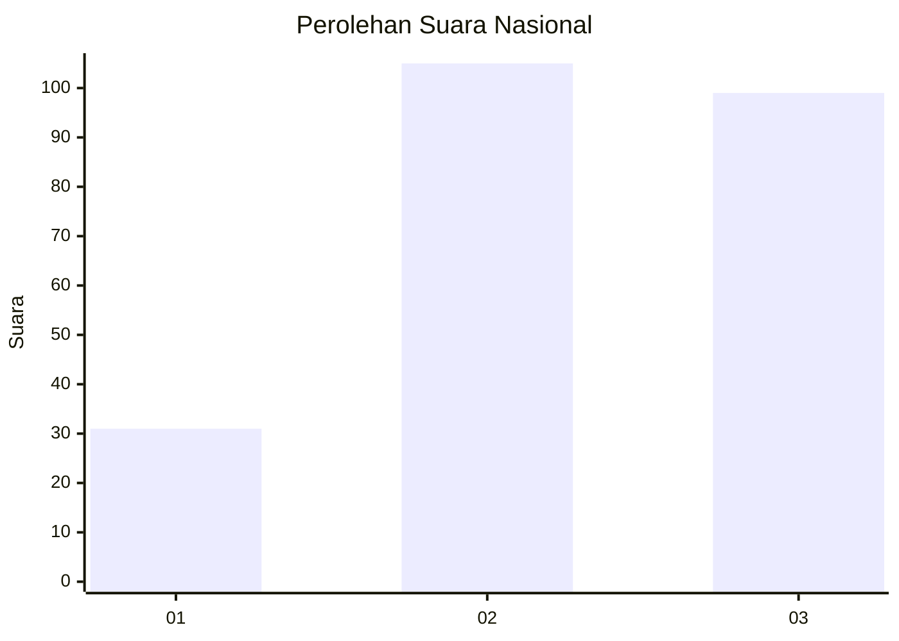
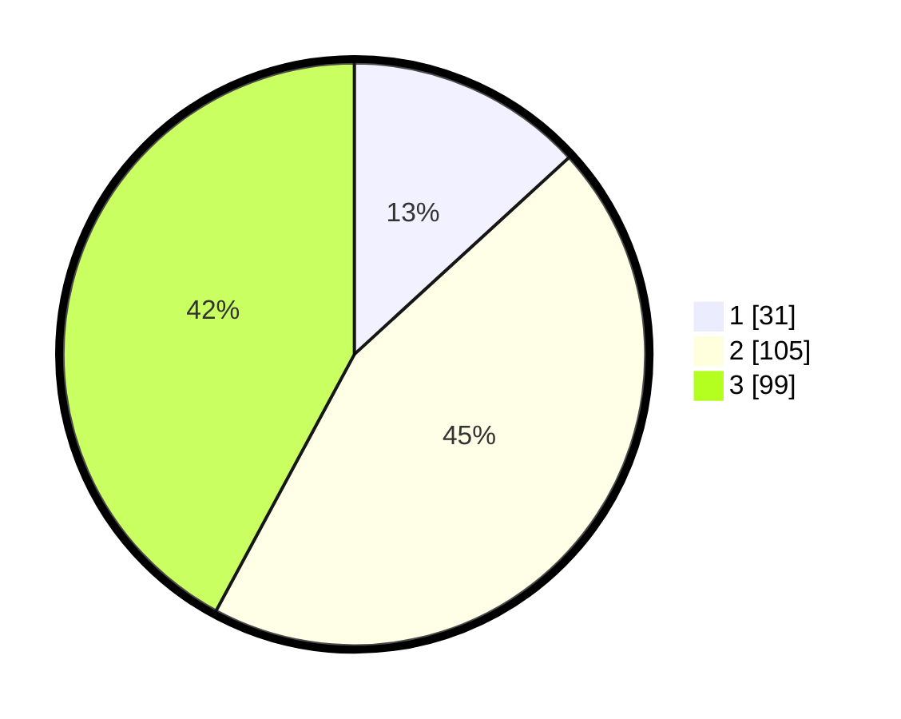

# Hasil

## Grafik

## Tabel

| No. | Nama Paslon    | Suara | Suara (raw) | Persentase |
|:--- |:-------------- | -----:| -----------:| ----------:|
| 1   | ANIES MUHAIMIN | 31    | [31][p-1]   | 13,19      |
| 2   | PRABOWO GIBRAN | 105   | [105][p-2]  | 44,68      |
| 3   | GANJAR MAHFUD  | 99    | [99][p-3]   | 42,13      |

[p-1]: https://github.com/gigit-pemilu/pemilu-2024/blob/main/pilpres/hitung-suara/sub/34-di-yogyakarta/sub/02-bantul/sub/12-banguntapan/sub/2002-banguntapan/sub/100-tps/sub/paslon-1.txt
[p-2]: https://github.com/gigit-pemilu/pemilu-2024/blob/main/pilpres/hitung-suara/sub/34-di-yogyakarta/sub/02-bantul/sub/12-banguntapan/sub/2002-banguntapan/sub/100-tps/sub/paslon-2.txt
[p-3]: https://github.com/gigit-pemilu/pemilu-2024/blob/main/pilpres/hitung-suara/sub/34-di-yogyakarta/sub/02-bantul/sub/12-banguntapan/sub/2002-banguntapan/sub/100-tps/sub/paslon-3.txt

## Foto C Plano

https://sirekap-obj-formc.kpu.go.id/1ce5/pemilu/ppwp/34/02/12/20/02/3402122002100-20240217-145610--20fe0c62-ce6d-435f-a897-2eed9962f4a9.jpg

https://sirekap-obj-formc.kpu.go.id/1ce5/pemilu/ppwp/34/02/12/20/02/3402122002100-20240214-190718--bd1d2a79-cb81-450c-a20d-c8ae5d9e785a.jpg

https://sirekap-obj-formc.kpu.go.id/1ce5/pemilu/ppwp/34/02/12/20/02/3402122002100-20240214-190959--4a5eeea3-0898-42f5-80c7-7077196d1fbf.jpg

## Metadata

| Key        | Value               |
| ---------- | ------------------- |
| Time Stamp | 2024-02-17 14:56:33 |

