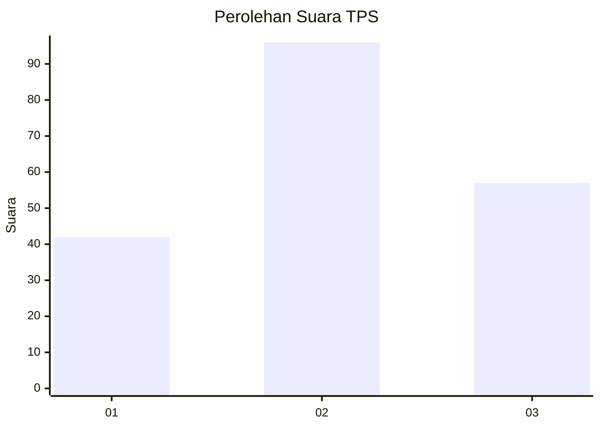
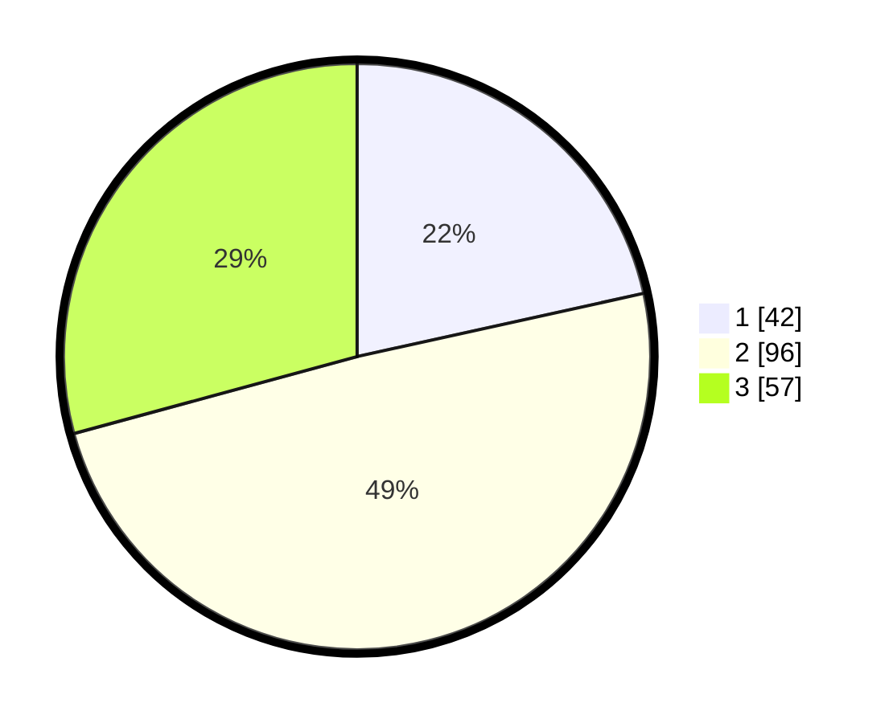

# Hasil

## Grafik

## Tabel

| No. | Nama Paslon    | Suara | Suara (raw) | Persentase |
|:--- |:-------------- | -----:| -----------:| ----------:|
| 1   | ANIES MUHAIMIN | 42    | [42][p-1]   | 21,54      |
| 2   | PRABOWO GIBRAN | 96    | [96][p-2]   | 49,23      |
| 3   | GANJAR MAHFUD  | 57    | [57][p-3]   | 29,23      |

[p-1]: https://github.com/gigit-pemilu/pemilu-2024-34-di-yogyakarta/blob/main/pilpres/hitung-suara/sub/34-di-yogyakarta/sub/02-bantul/sub/12-banguntapan/sub/2002-banguntapan/sub/101-tps/sub/paslon-1.txt
[p-2]: https://github.com/gigit-pemilu/pemilu-2024-34-di-yogyakarta/blob/main/pilpres/hitung-suara/sub/34-di-yogyakarta/sub/02-bantul/sub/12-banguntapan/sub/2002-banguntapan/sub/101-tps/sub/paslon-2.txt
[p-3]: https://github.com/gigit-pemilu/pemilu-2024-34-di-yogyakarta/blob/main/pilpres/hitung-suara/sub/34-di-yogyakarta/sub/02-bantul/sub/12-banguntapan/sub/2002-banguntapan/sub/101-tps/sub/paslon-3.txt

## Foto C Plano

https://sirekap-obj-formc.kpu.go.id/a777/pemilu/ppwp/34/02/12/20/02/3402122002101-20240214-141255--f2276165-85fa-4f07-a26f-8b1453be3c0b.jpg

https://sirekap-obj-formc.kpu.go.id/a777/pemilu/ppwp/34/02/12/20/02/3402122002101-20240214-141409--23450f57-de45-4dde-a60e-38ba525bd2ec.jpg

https://sirekap-obj-formc.kpu.go.id/a777/pemilu/ppwp/34/02/12/20/02/3402122002101-20240214-141926--f43b1a44-8596-4e8f-b8bf-dea8950f1c1d.jpg

## Metadata

| Key        | Value               |
| ---------- | ------------------- |
| Time Stamp | 2024-02-15 03:06:03 |

