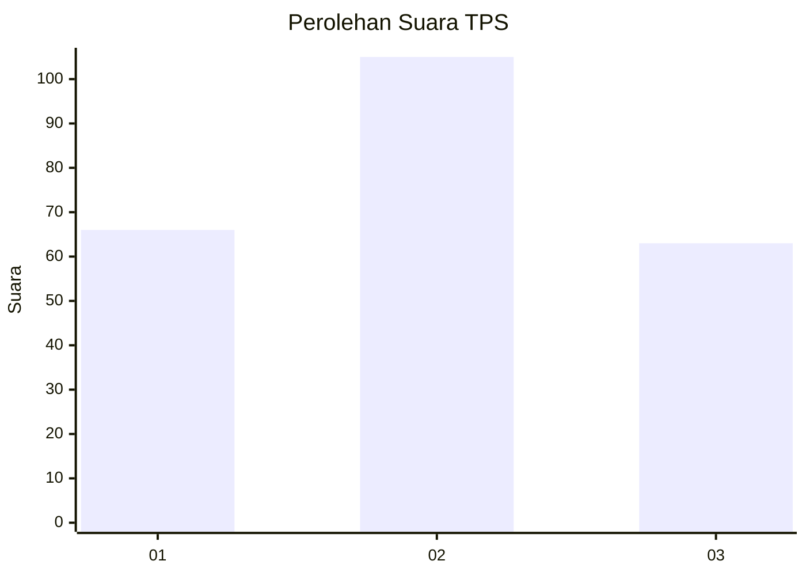
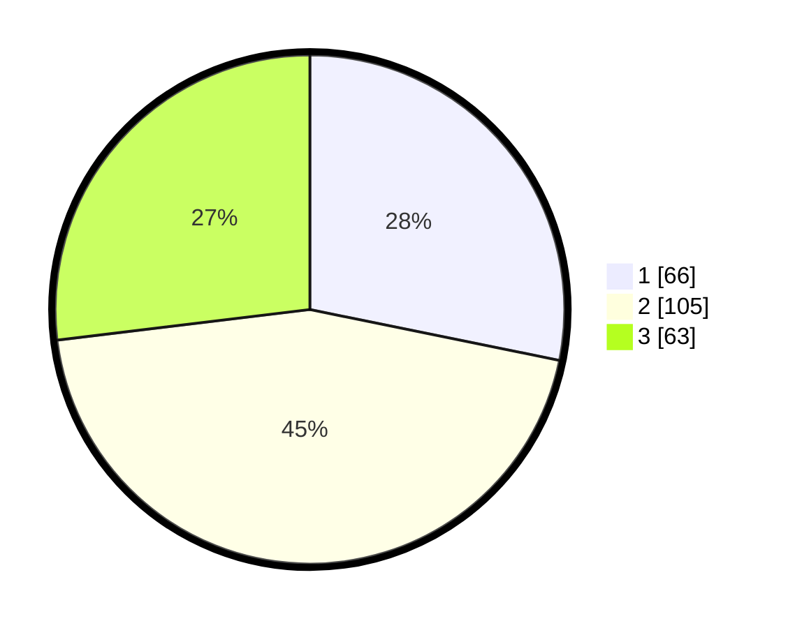

# Hasil

## Grafik

## Tabel

| No. | Nama Paslon    | Suara | Suara (raw) | Persentase |
|:--- |:-------------- | -----:| -----------:| ----------:|
| 1   | ANIES MUHAIMIN | 66    | [66][p-1]   | 28,21      |
| 2   | PRABOWO GIBRAN | 105   | [105][p-2]  | 44,87      |
| 3   | GANJAR MAHFUD  | 63    | [63][p-3]   | 26,92      |

[p-1]: https://github.com/gigit-pemilu/pemilu-2024-34-di-yogyakarta/blob/main/pilpres/hitung-suara/sub/34-di-yogyakarta/sub/02-bantul/sub/12-banguntapan/sub/2002-banguntapan/sub/107-tps/sub/paslon-1.txt
[p-2]: https://github.com/gigit-pemilu/pemilu-2024-34-di-yogyakarta/blob/main/pilpres/hitung-suara/sub/34-di-yogyakarta/sub/02-bantul/sub/12-banguntapan/sub/2002-banguntapan/sub/107-tps/sub/paslon-2.txt
[p-3]: https://github.com/gigit-pemilu/pemilu-2024-34-di-yogyakarta/blob/main/pilpres/hitung-suara/sub/34-di-yogyakarta/sub/02-bantul/sub/12-banguntapan/sub/2002-banguntapan/sub/107-tps/sub/paslon-3.txt

## Foto C Plano

https://sirekap-obj-formc.kpu.go.id/83f0/pemilu/ppwp/34/02/12/20/02/3402122002107-20240215-020106--c26d8fa3-2506-4e6a-85c5-28d46f342ac1.jpg

https://sirekap-obj-formc.kpu.go.id/83f0/pemilu/ppwp/34/02/12/20/02/3402122002107-20240215-015132--a02fabc5-5ff0-44ae-8ea8-b4a82b63c6bc.jpg

https://sirekap-obj-formc.kpu.go.id/83f0/pemilu/ppwp/34/02/12/20/02/3402122002107-20240215-020656--03164bcc-84c7-4790-a47f-cbcedbba5913.jpg

## Metadata

| Key        | Value               |
| ---------- | ------------------- |
| Time Stamp | 2024-02-24 22:31:28 |

