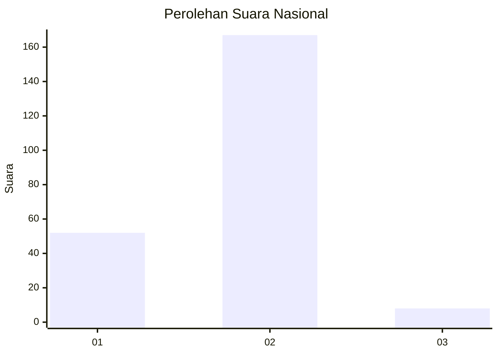

# Hasil

## Grafik

## Tabel

| No. | Nama Paslon    | Suara | Suara (raw) | Persentase |
|:--- |:-------------- | -----:| -----------:| ----------:|
| 1   | ANIES MUHAIMIN | 52    | [52][p-1]   | 22,91      |
| 2   | PRABOWO GIBRAN | 167   | [167][p-2]  | 73,57      |
| 3   | GANJAR MAHFUD  | 8     | [8][p-3]    | 3,52       |

[p-1]: https://github.com/gigit-pemilu/pemilu-2024/blob/main/pilpres/hitung-suara/sub/34-di-yogyakarta/sub/02-bantul/sub/12-banguntapan/sub/2002-banguntapan/sub/114-tps/sub/paslon-1.txt
[p-2]: https://github.com/gigit-pemilu/pemilu-2024/blob/main/pilpres/hitung-suara/sub/34-di-yogyakarta/sub/02-bantul/sub/12-banguntapan/sub/2002-banguntapan/sub/114-tps/sub/paslon-2.txt
[p-3]: https://github.com/gigit-pemilu/pemilu-2024/blob/main/pilpres/hitung-suara/sub/34-di-yogyakarta/sub/02-bantul/sub/12-banguntapan/sub/2002-banguntapan/sub/114-tps/sub/paslon-3.txt

## Foto C Plano

https://sirekap-obj-formc.kpu.go.id/bd98/pemilu/ppwp/34/02/12/20/02/3402122002114-20240214-201425--a7b9541f-4287-4f7e-9c2f-5e468882262f.jpg

https://sirekap-obj-formc.kpu.go.id/bd98/pemilu/ppwp/34/02/12/20/02/3402122002114-20240214-200550--b21218f8-9463-4400-a340-da34ceb9b4ae.jpg

https://sirekap-obj-formc.kpu.go.id/bd98/pemilu/ppwp/34/02/12/20/02/3402122002114-20240216-042714--ce45b88f-64f5-4613-9b29-ebd9eebcf270.jpg

## Metadata

| Key        | Value               |
| ---------- | ------------------- |
| Time Stamp | 2024-02-16 04:30:27 |

## DATA PEMILIH TETAP

Jumlah pemilih dalam DPT: **284**.
 * L: **77**.
 * P: **207**.

## DATA PENGGUNA HAK PILIH

Jumlah pengguna hak pilih dalam DPT: **217**.
 * L: **39**.
 * P: **178**.

Jumlah pengguna hak pilih dalam DPTb: **5**.
 * L: **1**.
 * P: **4**.

Jumlah pengguna hak pilih dalam DPK: **5**.
 * L: **1**.
 * P: **4**.

Jumlah pengguna hak pilih: **227**.
 * L: **41**.
 * P: **186**.

## JUMLAH SUARA SAH DAN TIDAK SAH

JUMLAH SELURUH SUARA SAH: **227**.

JUMLAH SUARA TIDAK SAH: **0**.

JUMLAH SELURUH SUARA SAH DAN SUARA TIDAK SAH: **227**.

